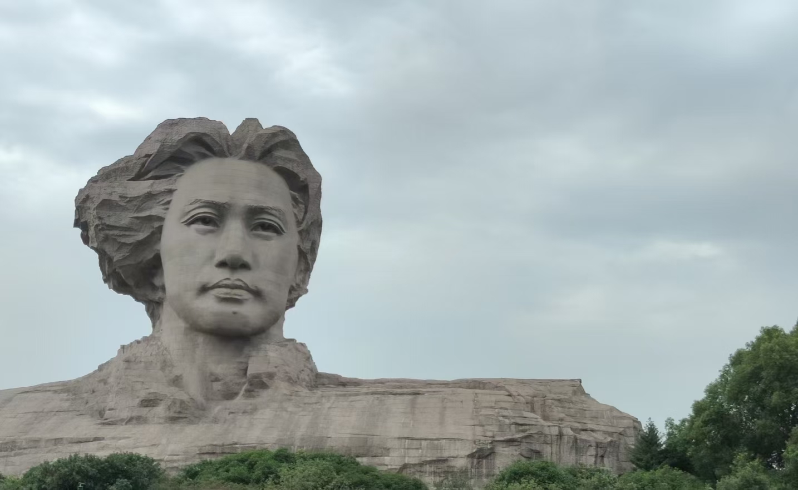

<h2 style="text-align: center;">七律·和郭沫若同志</h2>

<h6 style="text-align: center; color: red">近现代 · 毛泽东</h6>

<h3 style="text-align: center; color: red">一从大地起风雷，便有精生白骨堆。</h3>

<h3 style="text-align: center; color: red">僧是愚氓犹可训，妖为鬼蜮必成灾。</h3>

<h3 style="text-align: center; color: red">金猴奋起千钧棒，玉宇澄清万里埃。</h3>

<h3 style="text-align: center; color: red">今日欢呼孙大圣，只缘妖雾又重来。</h3>

