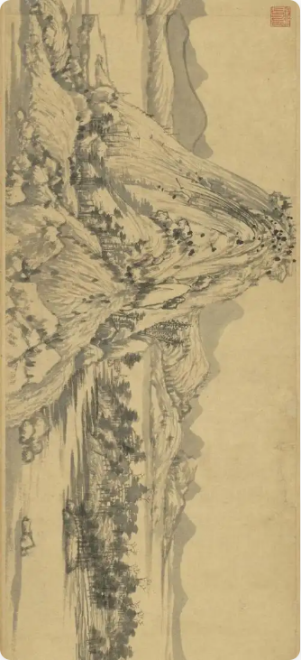
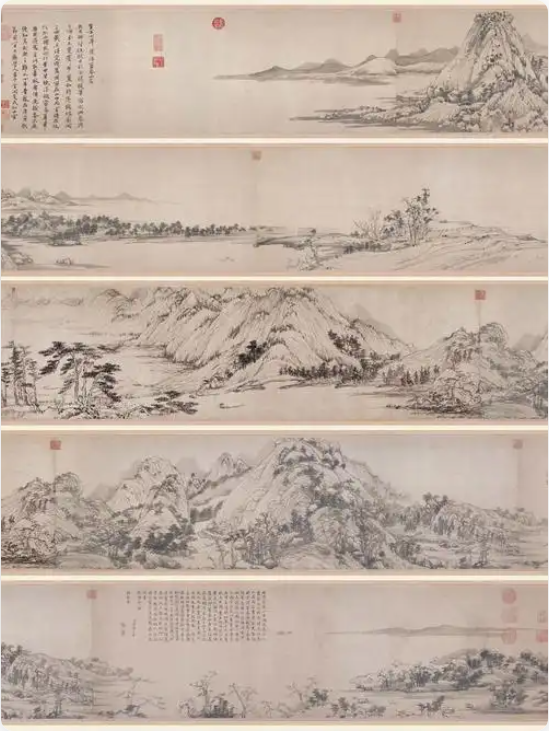
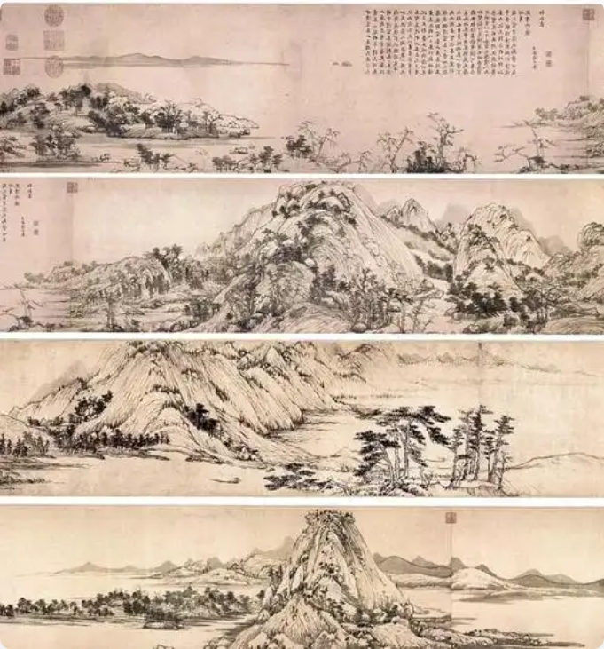
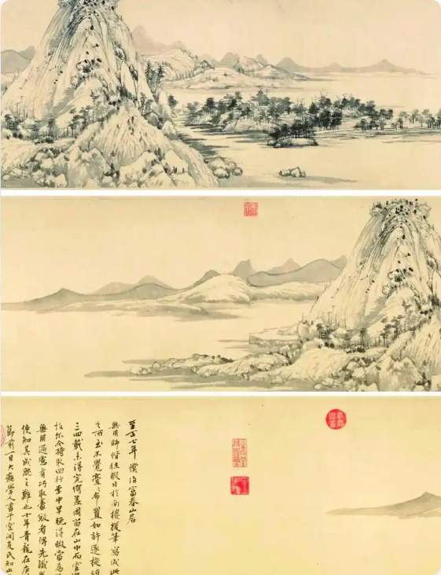
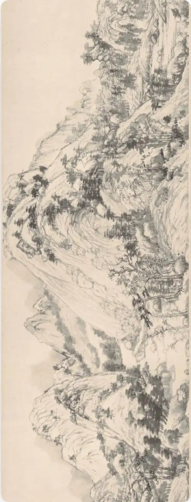
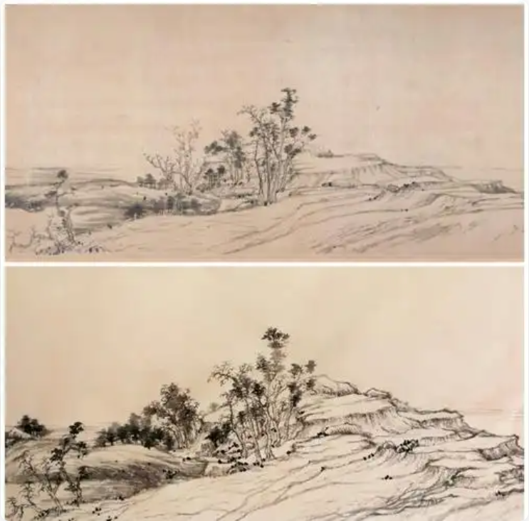
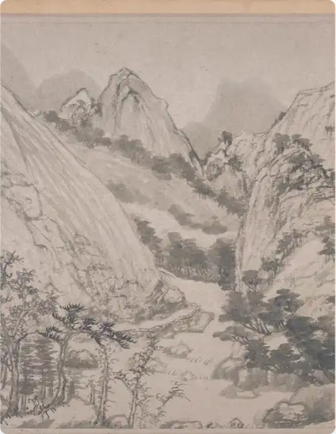
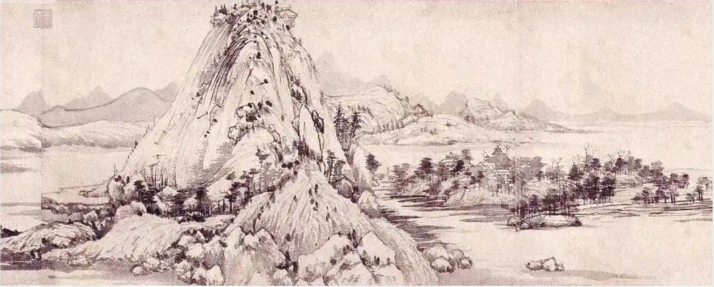
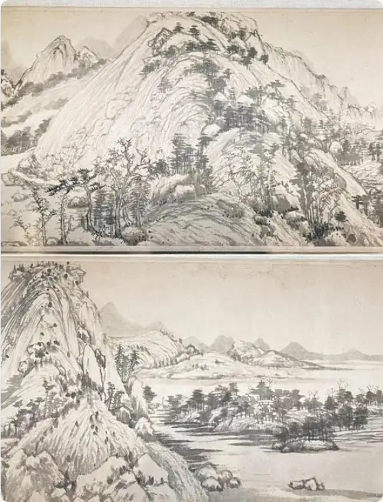
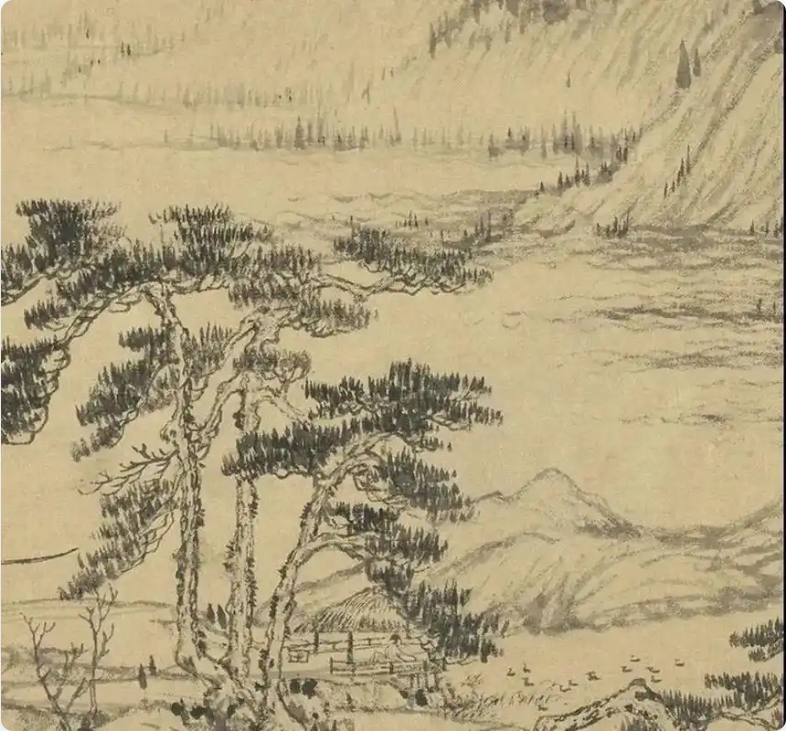

<h2 align="center">我们一直被困在棋局之中，但生命总有跳出局外的那一刻，那一刻是呼吸、是解脱。</h2>

<h1 align="center" style="color: red">跳出棋局，方见天地</h1>

《富春山居图》是元代画家黄公望于1350年创作的纸本水墨画，被誉为“画中之兰亭”，是中国十大传世名画之一‌。该画以富春江两岸山水为题材，采用长卷形式描绘了峰峦起伏、村舍错落的江南景致，展现了黄公望“长披麻皴”等独特技法，笔墨简远逸迈，风格苍劲高旷‌。

<h1 align="center" style="color: red">人生如山水，有起伏，有留白，但最终归于和谐与圆满</h1>

