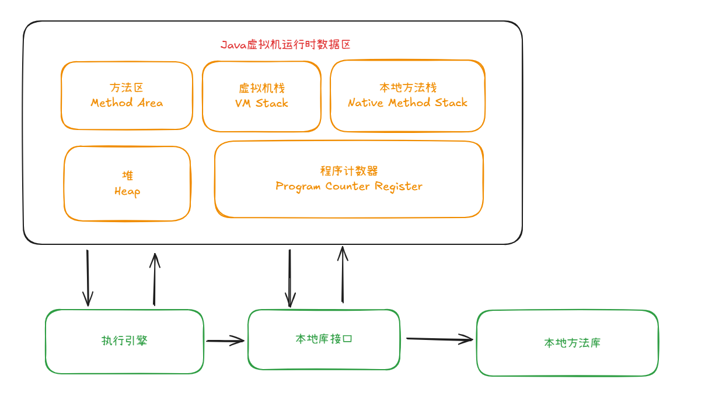

1. 程序计数器

   程序计数器是一块较小的内存空间，它可以看作是当前线程所执行的字节码的行号指示器。字节码解释器的工作就是通过改变这个计数器的值来选取下一条需要执行的字节码指令，分支、循环、跳转、异常处理、线程恢复等基础功能都需要依赖计数器来完成。

   由于Java虚拟机的多线程是通过线程轮流切换并分配处理器执行时间的方式来实现的，在任何一个确定时刻，一个处理器（对于多核处理器来说是一个内核）都`只会`执行一条线程中的指令。因此，为了线程切换后能恢复到正确的执行位置，每条线程都需要有一个`独立的程序计数器`，各条线程之间计数器互不影响，独立存储，即`线程私有的内存`。

   如果线程正在执行的是一个Java方法，这个计数器记录的是正在执行的虚拟机字节码指令的地址；如果正在执行的是Native方法，这个计数器则为空（Undefined）。此内存区域唯一一个在Java虚拟机规范中没有规定任何OutOfMemoryError情况的区域。

   

2. Java虚拟机栈

   `Java虚拟机栈也是线程私有的`，他的生命周期与线程相同。虚拟机栈描述的是`Java方法执行的内存模型`，每个 方法在执行的同时都会创建一个栈帧（Stack Frame） 用于存储局部变量表、操作数栈、动态链接、方法出口等信息。每一个方法从调用直至执行完成的过程，就对应着一个栈帧在虚拟机栈中入栈到出栈的过程。

3. 本地方法栈（Native Method Stack）与虚拟机所发挥的作用是非常相似的，他们之间的区别不过是虚拟机栈为虚拟机执行Java方法（也就是字节码）服务，而本地方法栈则为虚拟机使用到的Native方法服务。在Java虚拟机规范中对本地方法栈中使用的语言、使用方法与数据结构并没有强制规定，因此具体的虚拟机可以自由实现它。甚至有的虚拟机（譬如Sun HotSpot虚拟机）直接就把本地方法栈和虚拟机栈合二为一。与虚拟机栈一样，本地方法栈区域也会抛出StackOverflowError和OutMemoryError异常。

4. Java堆

   Java堆（Java Heap）是Java虚拟机所管理的内存中最大的一块。`Java堆是被所有线程共享的一块内存区域`，在虚拟机启动时创建。此内存区域的唯一目的就是存放对象实例，几乎所有的对象实例都在这里分配内存。这一点在Java虚拟机规范中的描述是：`所有的对象实例一级数组都要在堆上分配`，但是随着JIT编译器的发展与逃逸分析技术逐渐成熟，站上分配、标量替换优化技术将会导致一些微妙的变化发生，所有的对象都分配在堆上也渐渐变得不是那么绝对了。

   Java堆是垃圾收集器管理的主要区域，因此很多时候也被称为”GC堆“；

5. 方法区（Method Area）

   与Java堆一样，是各个线程共享的内存区域，他用于存储已被虚拟机加载的类信息、常量、静态变量、即时编译器编译后的代码等数据。虽然Java虚拟机规范把方法区描述为堆的一个逻辑部门，但是他却又一个别名叫做Non-Heap（非堆），目的应该是与Java堆区分开来。

6. 运行时常量池

   运行时常量池（Runtime Constant Pool）是方法区的一部分。Class文件中出了有类的版本、字段、方法、接口等描述信息外，还有一项是常量池，用于存放编译期生成的各种字面量和符号应用。这部分内存将在类加载后进入方法区的运行时常量池中存放。

   Java虚拟机对Class文件每一部分（自然也包括常量池）的格式都有严格的规定，每一个字节码用于存储哪种数据都必须符合规范上的要求才会被虚拟机认可、装载和执行，但对于运行时常量池，Java虚拟机规范没有做任何细节的要求，不同的提供商实现的虚拟机可以按照自己的需求来实现这个内存区域。不过，一般来说，除了保存Class文件中描述的符合引用外，还会把翻译出来的直接引用也存储在运行时常量池中。

   运行时常量池相对于Class文件常量池的另外一个重要特征是具备动态性，Java语言并不要求一定只有编译期才能产生，也就是并非预置入Class文件中常量池的内容才能进入方法区运行时常量池，运行期间也科恩那个将新的常量放入池中，这种 特性被开发人员利用的比较多的便是String类的intern()方法。

   既然运行时常量池是方法区的一部分，自然受到方法区内存的限制，当常量池无法再申请到内存时会抛出OutOfMemoryError异常。

7. 直接内存

   即本机的自己的内存