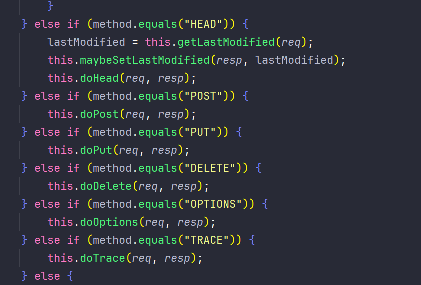

# Jakarta Servlet

*web组件，过滤器，监听器 这三大组件必须在容器启动之前注册。`必须必须必须`*

## 1. Servlet的定义

Servlet 是一种 Java 编程语言类，它直接或间接地实现 jakarta.servlet.Servlet 接口。jakarta.servlet 和 jakarta.servlet.http 包提供了用于编写 servlet 的接口和类。所有 Servlet 都必须实现 jakarta.servlet.Servlet 接口，该接口定义生命周期方法，例如 init、service 和 destroy。在实现通用服务时，您可以扩展已实现 Servlet 接口的 jakarta.servlet.GenericServlet 类。在实现 HTTP 服务时，您可以扩展 jakarta.servlet.http.HttpServlet 类，该类已经扩展了 GenericServlet 类。


在典型的基于 Jakarta Servlet 的 Web 应用程序中，该类必须扩展 `jakarta.servlet.http.HttpServlet` 并覆盖其中一个 `doXxx` 方法，其中 `Xxx` 表示 HTTP 方法。


## 2. Servlet的生命周期

```java
package jakarta.servlet;

import java.io.IOException;

public interface Servlet {
    void init(ServletConfig var1) throws ServletException;

    ServletConfig getServletConfig();

    void service(ServletRequest var1, ServletResponse var2) throws ServletException, IOException;

    String getServletInfo();

    void destroy();
}
```

1. Servlet要求被URL绑定，以使得在访问URL时能映射到对应servlet
2. init 方法 ：当servlet对象被创建后进行调用并可获得其配置
3. service方法： 每次执行到该servlet时总是调用service方法并获得当前请求、相应对象
4. destroy方法：当servlet对象被销毁前调用 执行清理操作


Servlet 的生命周期由部署了 Servlet 的 Servlet 容器控制。将请求映射到 Servlet 时，Servlet 容器将执行以下步骤：

1. 如果 Servlet 的实例不存在，则 Servlet 容器将：

   1. 加载 servlet 类
   2. 创建 servlet 类的实例
   3. 通过调用 `init` 方法初始化 servlet 实例

2. Servlet 容器调用`服务`方法，传递请求和响应对象。

   

如果需要删除 Servlet，则 Servlet 容器通过调用 Servlet 的 destroy 方法完成 Servlet的销毁


### 2.1 HttpServlet

>  jakarta.servelt.http.HttpServlet 是对 Servlet HTTP 协议的实现

HttpServlet 将根据生命周期执行到 service 生命周期方法后，根据当前的请求方式执行到（doGet, doPost, doPut, doDelete）,对应的Http请求的方法上。




## 3. Servlet的注册方式

Servlet支持三种注册方式：`web.xml` , `注解`， `api`

### 3.1 *web.xml*

```xml
<!-- 定义servlet -->
<servlet>
    <!-- 设置servlet名称 -->
    <servlet-name>servletName</servlet-name>
    <!-- 实现servlet接口的类 -->
    <servlet-class>x.y.z.servletClassName</servlet-class>
</servlet>

<!-- servlet 请求的路径映射 -->
<servlet-mapping>
    <!-- servlet名称 -->
    <servlet-name>servletName</servlet-name>
    <!-- servlet请求的url, 例如 /* 拦截所有请求，/a 拦截 xxx/xxx/a的请求 -->
    <url-pattern>/url</url-pattern>
</servlet-mapping>
```

### 3.2 *注解*

```java
package com.example.ideamabenjavaweb;


import jakarta.servlet.annotation.WebServlet;
import jakarta.servlet.http.HttpServlet;
import jakarta.servlet.http.HttpServletRequest;
import jakarta.servlet.http.HttpServletResponse;

import java.io.IOException;

@WebServlet(name = "someoneServlet", value = "/someoneServlet")
public class SomeoneServlet extends HttpServlet {

    public void doGet(HttpServletRequest request, HttpServletResponse response) 
        throws IOException {
        
        // do something for handling get request...
        
    }

}
```

使用 @WebServlet 注释在 Web 应用程序中定义 servlet 组件。此注释在类上指定，并包含有关正在声明的 Servlet 的元数据。带注释的 Servlet 必须至少指定一个 URL 模式。这是通过在 Comments 上使用 urlPatterns 或 value 属性来完成的。所有其他属性都是可选的，具有默认设置。当注释上的唯一属性是 URL 模式时，请使用 value 属性;否则，当同时使用其他属性时，请使用 urlPatterns 属性。

使用 @WebServlet 注释的类必须`扩展 jakarta.servlet.http.HttpServlet 类`.

Web 容器在加载和实例化 Servlet 类之后，在传递来自客户端的请求之前初始化 Servlet。要自定义此过程以允许 Servlet 读取持久性配置数据、初始化资源和执行任何其他一次性活动，可以覆盖 Servlet 接口的 init 方法或指定 @WebServlet 注释的 initParams 属性。initParams 属性包含 @WebInitParam 注释。如果 Servlet 无法完成其初始化过程，则会引发 UnavailableException


### 3.3 ServletContext

使用`ServletContext` 可注册 Servlet，注意！！！该注册方式必须要在web容器启动完成之前完成Servlet的注册，一旦web容器启动成功，再使用ServletContext注册就会报错。这是Servlet的一个机制。即一旦容器启动成功后续不允许再修改ServletContext。

简单示例：

```java
ServletContext servletContext = request.getServletContext();

ServletRegistration.Dynamic dynamic = servletContext.addServlet("servletName", "servletClassName");

dynamic.addMapping("/url");
```

如果想使用ServletContext注册Servlet，可通过Servlet的机制 `SCI引擎`来实现Servlet的注册。`（详见博客的SCI引擎文章）`