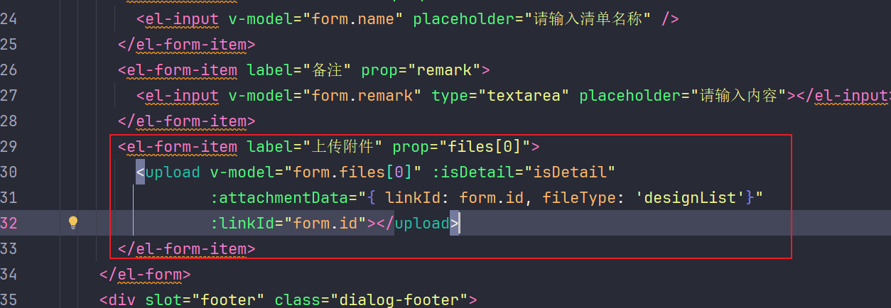
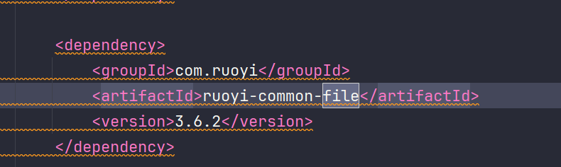
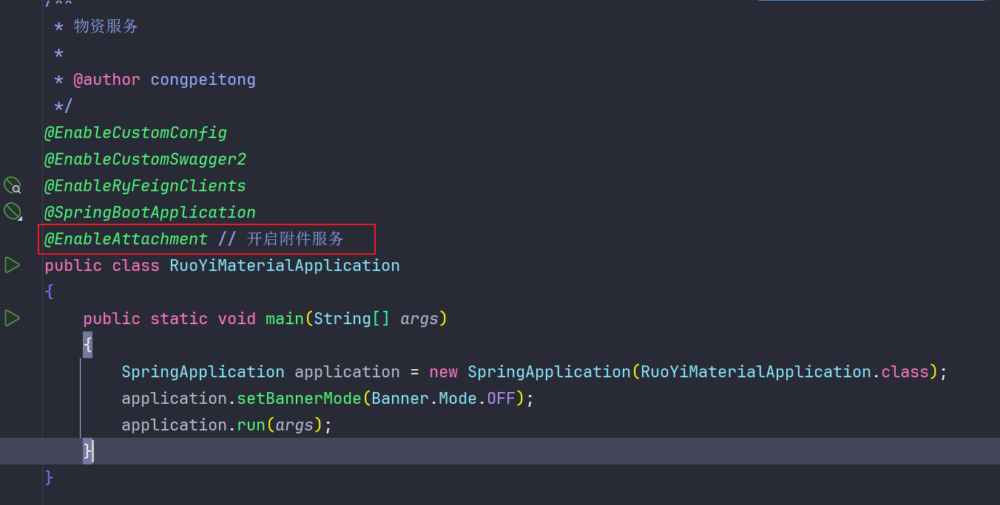
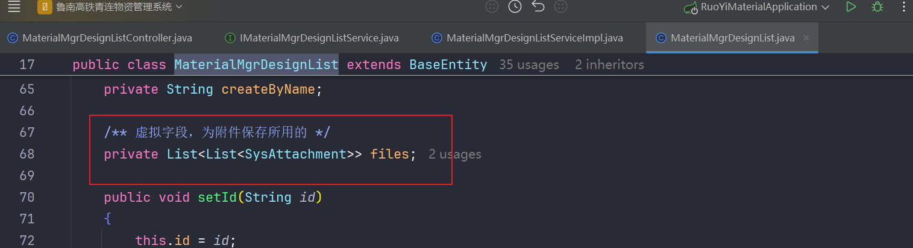
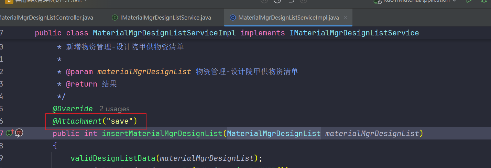
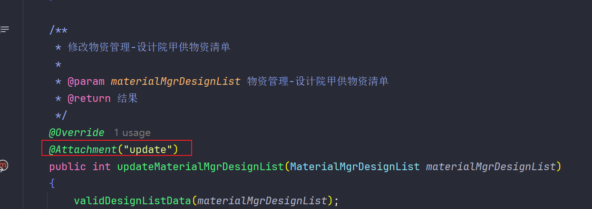

**该附件设计可以做到业务附件不依赖于业务的数据库，将业务数据库和附件信息隔离开，可以在每个需要保存附件的业务上打上注解，对注解的业务方法进行拦截，用以保存附件信息**

缺点：

1. 业务数据存储和附件存储是分离开的，还无法联动回滚。
2. controller层放在的common中有点不符合开发规范。*（规矩是死的，但是人是活的）*

## 1. 数据库设计

```sql
DROP TABLE IF EXISTS sys_attachment;
CREATE TABLE sys_attachment (
    id                     VARCHAR(64)         NOT NULL                   COMMENT '主键',
    file_name              VARCHAR(100)        NOT NULL                   COMMENT '附件名称',
    origin_file_name       VARCHAR(50)         NOT NULL                   COMMENT '源文件名称',
    file_suffix            VARCHAR(10)         NOT NULL                   COMMENT '文件扩展名 不带.',
    file_size_kb           INT                 DEFAULT NULL               COMMENT '文件所占存储的大小，单位KB',
    fileUrl                VARCHAR(100)        NOT NULL                   COMMENT '存储的文件路径',
    file_type              VARCHAR(40)         DEFAULT NULL               COMMENT '文件分类',
    link_id                VARCHAR(64)         NOT NULL                   COMMENT '关联业务id',
    delete_flag            BIT(1)              NOT NULL DEFAULT b'0'      COMMENT '是否删除(0：未删除 1：删除)',
    create_by              VARCHAR(64)         DEFAULT NULL               COMMENT '创建者',
    create_time 	       DATETIME            DEFAULT NULL               COMMENT '创建时间',
    update_user            VARCHAR(64)         DEFAULT NULL               COMMENT '更新者',
    update_time            DATETIME            DEFAULT NULL               COMMENT '更新时间',
    PRIMARY KEY (id)
) COMMENT = '附件信息';

```


## 2. 后端设计

目录结构如下：


### 2.1 @Attachment用以放在需要附件的业务方法上

```java
package com.ruoyi.file.annotation;

import org.springframework.stereotype.Component;
import java.lang.annotation.*;

/**
 * 附件注解,用于设置是否保存附件，用于service方法上
 * @author congpeitong
 * @date 2024-12-04 18:36:25
 */
@Inherited
@Documented
@Component
@Target(ElementType.METHOD) // 用在方法上
@Retention(RetentionPolicy.RUNTIME) // 保留至运行期
public @interface Attachment {

    // 保存:save / 编辑:update 类型区分  新建时 附件为空则不保存，编辑时附件为空则判断上一次是否有附件，有则删除，无则不处理
    String value();

    // 指定 id 字段名 默认为 id
    String idField() default "id" ;

    // 指定文件字段 字段名 默认为 files
    String fileField() default "files" ;

    // 包含附件数组的参数名称，如果不提供，则以第一个参数为准
    String filesParamName() default "";

}
```

### 2.2 @EnableAttachment 用于开启附件保存，通常用于SpringBoot的启动类上

```java
package com.ruoyi.file.annotation;

import com.ruoyi.file.aop.AttachmentAop;
import com.ruoyi.file.config.SysAttachmentConfig;
import com.ruoyi.file.controller.SysAttachmentController;
import org.springframework.context.annotation.Import;
import java.lang.annotation.*;

/**
 * 开启附件服务 注解
 * @author congpeitong
 * @date 2024-12-04 15:36:39
 */
@Documented
@Inherited
@Target(ElementType.TYPE) // 用在类上
@Retention(RetentionPolicy.RUNTIME) // 保留至运行期
@Import({SysAttachmentConfig.class, SysAttachmentController.class, AttachmentAop.class})
public @interface EnableAttachment {
}
```

### 2.3 附件保存拦截

```java
package com.ruoyi.file.aop;

import cn.hutool.core.util.ReflectUtil;
import com.ruoyi.file.annotation.Attachment;
import com.ruoyi.file.domain.SysAttachment;
import com.ruoyi.file.service.ISysAttachmentService;
import lombok.extern.slf4j.Slf4j;
import org.aspectj.lang.ProceedingJoinPoint;
import org.aspectj.lang.annotation.Around;
import org.aspectj.lang.annotation.Aspect;
import org.aspectj.lang.reflect.MethodSignature;
import org.springframework.beans.factory.annotation.Autowired;
import org.springframework.stereotype.Component;
import org.springframework.util.StringUtils;
import java.util.ArrayList;
import java.util.Arrays;
import java.util.List;

/**
 * @Author congpeitong
 * @Date 2024/4/19 14:51
 */
@Aspect
@Slf4j
@Component
public class AttachmentAop {

	@Autowired
	private ISysAttachmentService sysAttachmentService;

	/**
	 * 注解@Attachment方法的拦截
	 * @author congpeitong
	 * @date 2024-12-05 08:30:07
	 * @param point 切入点 及执行的方法（注解标注的方法）
 	 * @param attachment attachment 注解参数
	 * @return java.lang.Object
	 */
    @Around("@annotation(attachment)")
    public Object around(ProceedingJoinPoint point, Attachment attachment) throws Throwable {
		// 执行目标方法（即@Attachment注解标注的方法）
        Object result = point.proceed();

		// 获取参数列表
        Object[] args = point.getArgs();
		//没有参数即也没有附件，直接跳出
		if(args.length==0){
			return result;
		}
		try {
			Object includeFilesParam = null;
			//如果注解未设置方法中包含附件列表的参数名，则取第一个参数
			String filesParamName = attachment.filesParamName();
			if (filesParamName == null || filesParamName.isEmpty()) {
				includeFilesParam = args[0];
			}

			//设置过参数名
			if (includeFilesParam == null && filesParamName != null && !filesParamName.isEmpty()) {
				// 参数名列表   获取目标方法上的注解 MethodSignature methodSignature = (MethodSignature) point.getSignature();
				List<String> argNames = Arrays.asList(((MethodSignature) point.getSignature()).getParameterNames());
				// argNames  args 一一对应
				includeFilesParam = args[argNames.indexOf(filesParamName)];
			}
			//未取到参数对象
			if (includeFilesParam == null) {
				return result;
			}

			Object fieldValueTmp = null;//临时对象
			String bizId = "";//业务id
			List<SysAttachment> files = new ArrayList<>();

			fieldValueTmp = ReflectUtil.getFieldValue(includeFilesParam, attachment.idField());
			if (fieldValueTmp == null) {
				throw new RuntimeException("附件关联Id无效");
			}
			bizId = fieldValueTmp.toString();

			if (!StringUtils.hasLength(bizId)) {
				throw new IllegalArgumentException("参数错误，业务id未找到");
			}

			//文件列表整理
			fieldValueTmp = ReflectUtil.getFieldValue(includeFilesParam, attachment.fileField());
			if (fieldValueTmp == null) {
				return result; //文件列表属性不存在，不予保存
			}
			if (!(fieldValueTmp instanceof List)) {
				throw new RuntimeException("附件列表格式无效");
			}
			List<List<?>> tempFileList = (List<List<?>>) fieldValueTmp;
			for (List<?> fileList : tempFileList) {
				if(fileList!=null) {
					List<SysAttachment> filesTmp = (List<SysAttachment>) fileList;
					files.addAll(filesTmp);
				}
			}

			//保存附件
			if (("save".equals(attachment.value()) && files.size() != 0) || "update".equals(attachment.value())) {
				sysAttachmentService.saveOrUpdateAttachment(bizId,files);
			}
		} catch (Exception e) {
			// 捕获其他潜在异常，进行相应处理。
			e.printStackTrace();
			throw e;
		}
        return result;
    }
}
```

### 2.4 附件配置类

```java
package com.ruoyi.file.config;

import com.ruoyi.file.service.ISysAttachmentService;
import com.ruoyi.file.service.impl.SysAttachmentServiceImpl;
import org.mybatis.spring.annotation.MapperScan;
import org.springframework.context.annotation.Bean;
import org.springframework.context.annotation.Configuration;

/**
 * 附件配置类，配置 附件的保存/修改和查询
 * @author congpeitong
 * @date 2024-12-04 15:30:48
 */
@Configuration
@MapperScan(basePackages = "com.ruoyi.file.mapper") // 用于可扫描到附件的mapper文件
public class SysAttachmentConfig {

    /**
     * 注入附件服务
     * @author congpeitong
     * @date 2024-12-04 17:42:43
     */
    @Bean
    public ISysAttachmentService sysAttachmentService() {
        return new SysAttachmentServiceImpl();
    }
}

```

### 2.5 controller

```java
package com.ruoyi.file.controller;

import com.ruoyi.common.core.domain.R;
import com.ruoyi.file.pojo.AttachmentVo;
import com.ruoyi.file.pojo.QueryAttachmentQo;
import com.ruoyi.file.service.ISysAttachmentService;
import org.springframework.util.StringUtils;
import org.springframework.web.bind.annotation.*;
import java.util.List;

/**
 * 附件服务控制器
 * @author congpeitong
 * @date 2024-12-04 15:35:10
 */
@RestController
@RequestMapping("/attachment")
public class SysAttachmentController {

    private ISysAttachmentService iSysAttachmentService;
    public SysAttachmentController(ISysAttachmentService iSysAttachmentService) {
        this.iSysAttachmentService = iSysAttachmentService;
    }

    /**
     * 查询附件信息列表
     */
    @GetMapping("/queryAttachmentList")
    public R<List<AttachmentVo>> queryAttachmentList(QueryAttachmentQo attachmentQo)
    {
        String linkId = attachmentQo.getLinkId();
        if (!StringUtils.hasText(linkId)) {
            throw new IllegalArgumentException("未获取到业务，无法查询");
        }
        List<AttachmentVo> list = iSysAttachmentService.queryAttachmentList(attachmentQo);
        return R.ok(list);
    }
}
```

### 2.6实体类

```java
package com.ruoyi.file.domain;

import org.apache.commons.lang3.builder.ToStringBuilder;
import org.apache.commons.lang3.builder.ToStringStyle;
import com.ruoyi.common.core.annotation.Excel;
import com.ruoyi.common.core.web.domain.BaseEntity;

/**
 * 附件信息对象 sys_attachment
 *
 * @author congpeitong
 * @date 2024-12-04
 */
public class SysAttachment extends BaseEntity
{
    private static final long serialVersionUID = 1L;

    /** 主键 */
    private String id;

    /** 附件名称 */
    private String fileName;

    /** 源文件名称 */
    private String originFileName;

    /** 文件扩展名 不带. */
    private String fileSuffix;

    /** 文件所占存储的大小，单位KB */
    private Long fileSizeKb;

    /** 存储的文件路径 */
    private String fileUrl;

    /** 文件分类 */
    private String fileType;

    /** 关联业务id */
    private String linkId;

    /** 是否删除(0：未删除 1：删除) */
    private String deleteFlag;

    /** 更新者 */
    private String updateUser;

    public void setId(String id)
    {
        this.id = id;
    }

    public String getId()
    {
        return id;
    }
    public void setFileName(String fileName)
    {
        this.fileName = fileName;
    }

    public String getFileName()
    {
        return fileName;
    }
    public void setOriginFileName(String originFileName)
    {
        this.originFileName = originFileName;
    }

    public String getOriginFileName()
    {
        return originFileName;
    }
    public void setFileSuffix(String fileSuffix)
    {
        this.fileSuffix = fileSuffix;
    }

    public String getFileSuffix()
    {
        return fileSuffix;
    }
    public void setFileSizeKb(Long fileSizeKb)
    {
        this.fileSizeKb = fileSizeKb;
    }

    public Long getFileSizeKb()
    {
        return fileSizeKb;
    }
    public void setFileUrl(String fileUrl)
    {
        this.fileUrl = fileUrl;
    }

    public String getFileUrl()
    {
        return fileUrl;
    }
    public void setFileType(String fileType)
    {
        this.fileType = fileType;
    }

    public String getFileType()
    {
        return fileType;
    }
    public void setLinkId(String linkId)
    {
        this.linkId = linkId;
    }

    public String getLinkId()
    {
        return linkId;
    }
    public void setDeleteFlag(String deleteFlag)
    {
        this.deleteFlag = deleteFlag;
    }

    public String getDeleteFlag()
    {
        return deleteFlag;
    }
    public void setUpdateUser(String updateUser)
    {
        this.updateUser = updateUser;
    }

    public String getUpdateUser()
    {
        return updateUser;
    }

    @Override
    public String toString() {
        return new ToStringBuilder(this,ToStringStyle.MULTI_LINE_STYLE)
                .append("id", getId())
                .append("fileName", getFileName())
                .append("originFileName", getOriginFileName())
                .append("fileSuffix", getFileSuffix())
                .append("fileSizeKb", getFileSizeKb())
                .append("fileUrl", getFileUrl())
                .append("fileType", getFileType())
                .append("linkId", getLinkId())
                .append("deleteFlag", getDeleteFlag())
                .append("createBy", getCreateBy())
                .append("createTime", getCreateTime())
                .append("updateUser", getUpdateUser())
                .append("updateTime", getUpdateTime())
                .toString();
    }
}
```

### 2.7 Mapper.java

```java
package com.ruoyi.file.mapper;

import java.util.List;
import com.ruoyi.file.domain.SysAttachment;
import org.apache.ibatis.annotations.Mapper;
import org.apache.ibatis.annotations.Param;

/**
 * 附件信息Mapper接口
 *
 * @author congpeitong
 * @date 2024-12-04
 */
@Mapper
public interface SysAttachmentMapper
{
    /**
     * 查询附件信息
     *
     * @param id 附件信息主键
     * @return 附件信息
     */
    public SysAttachment selectSysAttachmentById(String id);

    /**
     * 查询附件信息列表
     *
     * @param sysAttachment 附件信息
     * @return 附件信息集合
     */
    public List<SysAttachment> selectSysAttachmentList(SysAttachment sysAttachment);

    /**
     * 新增附件信息
     *
     * @param entities 附件信息
     * @return 结果
     */
    public int insertSysAttachment(@Param("entities") List<SysAttachment> entities);


    /**
     * 删除附件信息
     *
     * @param id 附件信息主键
     * @return 结果
     */
    public int deleteSysAttachmentById(String id);

    /**
     * 根据业务id查询附件信息
     * @author congpeitong
     * @date 2024-12-09 14:38:42
     * @param linkId 业务id
     * @return int
     */
    int deleteSysAttachmentByLinkId(String linkId);

    /**
     * 批量删除附件信息
     *
     * @param ids 需要删除的数据主键集合
     * @return 结果
     */
    public int deleteSysAttachmentByIds(@Param("ids") String[] ids);
}

```


### 2.8 mapper文件

```xml
<?xml version="1.0" encoding="UTF-8" ?>
<!DOCTYPE mapper
        PUBLIC "-//mybatis.org//DTD Mapper 3.0//EN"
        "http://mybatis.org/dtd/mybatis-3-mapper.dtd">
<mapper namespace="com.ruoyi.file.mapper.SysAttachmentMapper">

    <resultMap type="com.ruoyi.file.domain.SysAttachment" id="SysAttachmentResult">
        <result property="id"    column="id"    />
        <result property="fileName"    column="file_name"    />
        <result property="originFileName"    column="origin_file_name"    />
        <result property="fileSuffix"    column="file_suffix"    />
        <result property="fileSizeKb"    column="file_size_kb"    />
        <result property="fileUrl"    column="fileUrl"    />
        <result property="fileType"    column="file_type"    />
        <result property="linkId"    column="link_id"    />
        <result property="deleteFlag"    column="delete_flag"    />
        <result property="createBy"    column="create_by"    />
        <result property="createTime"    column="create_time"    />
        <result property="updateUser"    column="update_user"    />
        <result property="updateTime"    column="update_time"    />
    </resultMap>

    <sql id="selectSysAttachmentVo">
        select id, file_name, origin_file_name, file_suffix, file_size_kb, fileUrl, file_type, link_id, delete_flag, create_by, create_time, update_user, update_time from sys_attachment
    </sql>

    <select id="selectSysAttachmentList" parameterType="com.ruoyi.file.domain.SysAttachment" resultMap="SysAttachmentResult">
        <include refid="selectSysAttachmentVo"/>
        <where>
            <if test="fileName != null  and fileName != ''"> and file_name like concat('%', #{fileName}, '%')</if>
            <if test="originFileName != null  and originFileName != ''"> and origin_file_name like concat('%', #{originFileName}, '%')</if>
            <if test="fileSuffix != null  and fileSuffix != ''"> and file_suffix = #{fileSuffix}</if>
            <if test="fileSizeKb != null "> and file_size_kb = #{fileSizeKb}</if>
            <if test="fileUrl != null  and fileUrl != ''"> and fileUrl = #{fileUrl}</if>
            <if test="fileType != null  and fileType != ''"> and file_type = #{fileType}</if>
            <if test="linkId != null  and linkId != ''"> and link_id = #{linkId}</if>
            <if test="deleteFlag != null  and deleteFlag != ''"> and delete_flag = #{deleteFlag}</if>
            <if test="updateUser != null  and updateUser != ''"> and update_user = #{updateUser}</if>
        </where>
        order by create_time desc
    </select>

    <select id="selectSysAttachmentById" parameterType="String" resultMap="SysAttachmentResult">
        <include refid="selectSysAttachmentVo"/>
        where id = #{id}
    </select>

    <insert id="insertSysAttachment">
        insert into sys_attachment (id,file_name,origin_file_name,file_suffix,file_size_kb,fileUrl,file_type
                                   ,link_id,create_by,create_time)
        values
        <foreach collection="entities" item="entity" separator=",">
            (#{entity.id},#{entity.fileName},#{entity.originFileName},#{entity.fileSuffix},#{entity.fileSizeKb},
                #{entity.fileUrl},#{entity.fileType},#{entity.linkId},#{entity.createBy},
                #{entity.createTime})
        </foreach>
    </insert>

    <delete id="deleteSysAttachmentById" parameterType="String">
        delete from sys_attachment where id = #{id}
    </delete>

    <delete id="deleteSysAttachmentByIds" parameterType="String">
        delete from sys_attachment where id in
        <foreach item="id" collection="ids" open="(" separator="," close=")">
            #{id}
        </foreach>
    </delete>
    <delete id="deleteSysAttachmentByLinkId" parameterType="String">
        delete from sys_attachment where link_id = #{linkId}
    </delete>
</mapper>

```


### 2.9 pojo 总共由三个类 这儿有点不规范，后续再改吧

```java
package com.ruoyi.file.pojo;

import com.ruoyi.common.core.annotation.Excel;

public class AttachmentDto {

    /** 主键 */
    private String id;

    /** 附件名称 */
    @Excel(name = "附件名称")
    private String fileName;

    /** 源文件名称 */
    @Excel(name = "源文件名称")
    private String originFileName;

    /** 文件扩展名 不带. */
    @Excel(name = "文件扩展名 不带.")
    private String fileSuffix;

    /** 文件所占存储的大小，单位KB */
    @Excel(name = "文件所占存储的大小，单位KB")
    private Long fileSizeKb;

    /** 存储的文件路径 */
    @Excel(name = "存储的文件路径")
    private String fileUrl;

    /** 文件分类 */
    @Excel(name = "文件分类")
    private String fileType;

    /** 关联业务id */
    @Excel(name = "关联业务id")
    private String linkId;
}


package com.ruoyi.file.pojo;

import com.ruoyi.common.core.annotation.Excel;

/**
 * 附件vo
 * @author congpeitong
 * @date 2024-12-04 17:20:03
 */
public class AttachmentVo {

    /** 主键 */
    private String id;

    /** 附件名称 */
    @Excel(name = "附件名称")
    private String fileName;

    /** 源文件名称 */
    @Excel(name = "源文件名称")
    private String originFileName;

    /** 文件扩展名 不带. */
    @Excel(name = "文件扩展名 不带.")
    private String fileSuffix;

    /** 文件所占存储的大小，单位KB */
    @Excel(name = "文件所占存储的大小，单位KB")
    private Long fileSizeKb;

    /** 存储的文件路径 */
    @Excel(name = "存储的文件路径")
    private String fileUrl;

    /** 文件分类 */
    @Excel(name = "文件分类")
    private String fileType;

    /** 关联业务id */
    @Excel(name = "关联业务id")
    private String linkId;

    public String getId() {
        return id;
    }

    public void setId(String id) {
        this.id = id;
    }

    public String getFileName() {
        return fileName;
    }

    public void setFileName(String fileName) {
        this.fileName = fileName;
    }

    public String getOriginFileName() {
        return originFileName;
    }

    public void setOriginFileName(String originFileName) {
        this.originFileName = originFileName;
    }

    public String getFileSuffix() {
        return fileSuffix;
    }

    public void setFileSuffix(String fileSuffix) {
        this.fileSuffix = fileSuffix;
    }

    public Long getFileSizeKb() {
        return fileSizeKb;
    }

    public void setFileSizeKb(Long fileSizeKb) {
        this.fileSizeKb = fileSizeKb;
    }

    public String getFileUrl() {
        return fileUrl;
    }

    public void setFileUrl(String fileUrl) {
        this.fileUrl = fileUrl;
    }

    public String getFileType() {
        return fileType;
    }

    public void setFileType(String fileType) {
        this.fileType = fileType;
    }

    public String getLinkId() {
        return linkId;
    }

    public void setLinkId(String linkId) {
        this.linkId = linkId;
    }

    @Override
    public String toString() {
        return "AttachmentVo{" +
                "id='" + id + '\'' +
                ", fileName='" + fileName + '\'' +
                ", originFileName='" + originFileName + '\'' +
                ", fileSuffix='" + fileSuffix + '\'' +
                ", fileSizeKb=" + fileSizeKb +
                ", fileUrl='" + fileUrl + '\'' +
                ", fileType='" + fileType + '\'' +
                ", linkId='" + linkId + '\'' +
                '}';
    }
}


package com.ruoyi.file.pojo;

import java.util.List;

/**
 * 附件查询对象
 * @author congpeitong
 * @date 2024-12-04 17:15:43
 */
public class QueryAttachmentQo {

    // 关联的业务id
    private String linkId;
    // 文件类型
    private String fileType;

    public String getLinkId() {
        return linkId;
    }

    public void setLinkId(String linkId) {
        this.linkId = linkId;
    }

    public String getFileType() {
        return fileType;
    }

    public void setFileType(String fileType) {
        this.fileType = fileType;
    }


}

```


### 2.10 service

```java
package com.ruoyi.file.service;

import java.util.List;
import com.ruoyi.file.domain.SysAttachment;
import com.ruoyi.file.pojo.AttachmentVo;
import com.ruoyi.file.pojo.QueryAttachmentQo;

/**
 * 附件信息Service接口
 *
 * @author congpeitong
 * @date 2024-12-04
 */
public interface ISysAttachmentService {
    /**
     * 查询附件信息
     *
     * @param id 附件信息主键
     * @return 附件信息
     */
    public SysAttachment selectSysAttachmentById(String id);

    /**
     * 查询附件信息列表
     *
     * @param sysAttachment 附件信息
     * @return 附件信息集合
     */
    public List<SysAttachment> selectSysAttachmentList(SysAttachment sysAttachment);

    /**
     * 批量删除附件信息
     *
     * @param ids 需要删除的附件信息主键集合
     * @return 结果
     */
    public int deleteSysAttachmentByIds(String[] ids);

    /**
     * 删除附件信息信息
     *
     * @param id 附件信息主键
     * @return 结果
     */
    public int deleteSysAttachmentById(String id);

    /**
     * 查询附件列表
     * @author congpeitong
     * @date 2024-12-04 17:24:59
     */
    List<AttachmentVo> queryAttachmentList(QueryAttachmentQo attachmentQo);

    /**
     * 保存或更新附件信息
     * @author congpeitong
     * @date 2024-12-04 18:50:08
     * @param attachments 附件列表
     * @return void
     */
    void saveOrUpdateAttachment(String bizId, List<SysAttachment> attachments);
}


package com.ruoyi.file.service.impl;

import com.ruoyi.common.core.utils.DateUtils;
import com.ruoyi.common.core.utils.uuid.IdUtils;
import com.ruoyi.common.security.utils.SecurityUtils;
import com.ruoyi.file.domain.SysAttachment;
import com.ruoyi.file.mapper.SysAttachmentMapper;
import com.ruoyi.file.pojo.AttachmentVo;
import com.ruoyi.file.pojo.QueryAttachmentQo;
import com.ruoyi.file.service.ISysAttachmentService;
import org.springframework.beans.BeanUtils;
import org.springframework.beans.factory.annotation.Autowired;
import org.springframework.stereotype.Service;
import org.springframework.transaction.annotation.Transactional;
import org.springframework.util.CollectionUtils;
import org.springframework.util.StringUtils;
import java.util.ArrayList;
import java.util.HashSet;
import java.util.List;
import java.util.Set;
import java.util.stream.Collectors;

/**
 * 附件信息Service业务层处理
 *
 * @author congpeitong
 * @date 2024-12-04
 */
@Service
public class SysAttachmentServiceImpl implements ISysAttachmentService
{
    @Autowired
    private SysAttachmentMapper sysAttachmentMapper;

    /**
     * 查询附件信息
     *
     * @param id 附件信息主键
     * @return 附件信息
     */
    @Override
    public SysAttachment selectSysAttachmentById(String id)
    {
        return sysAttachmentMapper.selectSysAttachmentById(id);
    }

    /**
     * 查询附件信息列表
     *
     * @param sysAttachment 附件信息
     * @return 附件信息
     */
    @Override
    public List<SysAttachment> selectSysAttachmentList(SysAttachment sysAttachment)
    {
        return sysAttachmentMapper.selectSysAttachmentList(sysAttachment);
    }

    /**
     * 批量删除附件信息
     *
     * @param ids 需要删除的附件信息主键
     * @return 结果
     */
    @Override
    public int deleteSysAttachmentByIds(String[] ids)
    {
        return sysAttachmentMapper.deleteSysAttachmentByIds(ids);
    }

    /**
     * 删除附件信息信息
     *
     * @param id 附件信息主键
     * @return 结果
     */
    @Override
    public int deleteSysAttachmentById(String id)
    {
        return sysAttachmentMapper.deleteSysAttachmentById(id);
    }

    /**
     * 查询附件列表 linkId：业务id, fileType：业务类型
     * @author congpeitong
     * @date 2024-12-04 17:25:21
     */
    @Override
    public List<AttachmentVo> queryAttachmentList(QueryAttachmentQo attachmentQo) {
        List<AttachmentVo> resultList = new ArrayList<>();
        SysAttachment sysAttachment = new SysAttachment();
        BeanUtils.copyProperties(attachmentQo, sysAttachment);
        sysAttachment.setDeleteFlag("0");
        List<SysAttachment> sysAttachments = sysAttachmentMapper.selectSysAttachmentList(sysAttachment);

        for (SysAttachment attachment : sysAttachments) {
            AttachmentVo attachmentVo = new AttachmentVo();
            BeanUtils.copyProperties(attachment, attachmentVo);
            resultList.add(attachmentVo);
        }
        return resultList;
    }

    /**
     * 保存附件信息，由于不存在更新所以只进行保存和删除操作
     * @author congpeitong
     * @date 2024-12-04 18:50:36
     * @param bizId 业务id
     * @param attachments 附件信息列表
     */
    @Override
    @Transactional
    public void saveOrUpdateAttachment(String bizId, List<SysAttachment> attachments) {
        if (!StringUtils.hasText(bizId)) {
            throw new IllegalArgumentException("业务id为空，附件未成功保存");
        }
        // 附件列表为空，则根据业务id删除所有的该业务相关的附件
        if (CollectionUtils.isEmpty(attachments)) {
            this.sysAttachmentMapper.deleteSysAttachmentByLinkId(bizId);
            return;
        }
        /* 当保存的附件不为空时，查询旧附件信息，保存的附件信息和旧附件信息作对比 */
        // 查询已存在的附件
        SysAttachment exitFileQuery = new SysAttachment();
        exitFileQuery.setLinkId(bizId);
        List<SysAttachment> exitFiles = this.sysAttachmentMapper.selectSysAttachmentList(exitFileQuery);
        // 数据库中不存在附件直接批量新增
        if (CollectionUtils.isEmpty(exitFiles)) {
            List<SysAttachment> saveList = attachments.stream()
                    .peek(attachment -> setAttachmentInfo(bizId, attachment))
                    .collect(Collectors.toList());
            this.sysAttachmentMapper.insertSysAttachment(saveList);
            return;
        }
        // 对比 接口传过来的附件数据和数据库中存在的数据，该新增新增，该删除删除
        processAttachments(bizId, attachments, exitFiles);
    }

    /**
     * 比对新旧数据保存至数据库，由于只有新增和删除，因此对比比较简单
     * 先根据 附件url对比出 共有的数据
     *      接口中过来的数据中去除共有的数据即为新增的数据
     *      数据库中已存在的数据去除共有数据即为删除的数据
     * @author congpeitong
     * @date 2024-12-05 10:51:12
     * @param bizId 业务id
     * @param newAttachments 接口传过来的数据
     * @param existingAttachments 数据库中已经存在的数据
     */
    private void processAttachments(String bizId,List<SysAttachment> newAttachments, List<SysAttachment> existingAttachments) {
        // 1. 查找共同部分
        Set<String> fileUrls = new HashSet<>();
        for (SysAttachment newAttachment : newAttachments) {
            fileUrls.add(newAttachment.getFileUrl());
        }
        // 共同部分
        List<SysAttachment> commonAttachments = existingAttachments.stream()
                .filter(existingAttachment -> fileUrls.contains(existingAttachment.getFileUrl()))
                .collect(Collectors.toList());
        List<SysAttachment> saveList;
        List<String> deleteIds;
        //  如果有共同部分，接口数据中除去共同部分的数据为新增的数据，数据库中存在的数据除去共同部分为删除的数据
        if (!CollectionUtils.isEmpty(commonAttachments)) {
            List<String> commonUrls = commonAttachments.stream()
                    .map(SysAttachment::getFileUrl)
                    .collect(Collectors.toList());
            saveList = newAttachments.stream()
                    .filter(attachment -> !commonUrls.contains(attachment.getFileUrl()))
                    .peek(attachment -> setAttachmentInfo(bizId, attachment))
                    .collect(Collectors.toList());

            deleteIds = existingAttachments.stream()
                    .filter(attachment -> !commonUrls.contains(attachment.getFileUrl()))
                    .map(SysAttachment::getId)
                    .collect(Collectors.toList());
        } else { // 如果无共同部分，则接口传过来的数据全部新增，数据库中存在的数据全部删除
            saveList = newAttachments.stream()
                    .peek(attachment -> setAttachmentInfo(bizId, attachment))
                    .collect(Collectors.toList());
            deleteIds = existingAttachments.stream().map(SysAttachment::getId).collect(Collectors.toList());
        }

        // 操作数据库数据
        if (!CollectionUtils.isEmpty(saveList)) {
            this.sysAttachmentMapper.insertSysAttachment(saveList);
        }
        if (!CollectionUtils.isEmpty(deleteIds)) {
            this.sysAttachmentMapper.deleteSysAttachmentByIds(deleteIds.toArray(new String[0]));
        }
    }

    /**
     * 设置附件信息
     * @author congpeitong
     * @date 2024-12-05 09:22:13
     * @param linkId 业务id
     * @param sysAttachment 附件信息
     */
    private void setAttachmentInfo(String linkId, SysAttachment sysAttachment) {
        if (sysAttachment == null || !StringUtils.hasText(linkId)) return;
        // 设置id
        sysAttachment.setId(IdUtils.simpleUUID());
        // 设置业务id
        sysAttachment.setLinkId(linkId);
        String fileName = sysAttachment.getFileName();
        if (!StringUtils.hasText(fileName)) return;
        /* 文件保存后的文件名命名规则为 原文件名_一串日期时间编码.扩展名  例如 附件_202412050950.png  即原文件名为 附件.png */
        // 原文件名称，不带扩展名的
        String originFileName;
        // 文件扩展名 不带 . 的
        String fileExtName;
        int _index = fileName.indexOf("_");
        int dotIndex = fileName.lastIndexOf(".");
        if (_index == -1 || dotIndex == -1) return;
        fileExtName = fileName.substring(dotIndex + 1);
        // 原文件名如果前端传值了按照前端传值的保存，没传值则截取上传后的文件名第一个_前面的然后拼接扩展名
        if (!StringUtils.hasText(sysAttachment.getOriginFileName())){
            originFileName = fileName.substring(0, _index);
            sysAttachment.setOriginFileName(originFileName + "." + fileExtName);
        }
        sysAttachment.setFileSuffix(fileExtName);
        // 设置创建时间
        sysAttachment.setCreateTime(DateUtils.getNowDate());
        // 设置创建人
        sysAttachment.setCreateBy(SecurityUtils.getUsername());
    }
}

```


## 3. 前端

前端使用的是vue2做了一个组件

```vue

<!--文件上传/查看组件-->
<template>
  <div class="upload-file">
    <el-upload
        ref="fileUpload"
        :action="uploadFileUrl"
        :before-upload="handleBeforeUpload"
        :file-list="fileList"
        :headers="headers"
        :on-exceed="handleExceed"
        :on-error="handleUploadError"
        :on-remove="handleRemove"
        :on-preview="handlePreview"
        :auto-upload="autoUpload"
        :on-progress="handleProgress"
        :on-success="handleUploadSuccess"
        class="myupload"
        multiple
        :limit="limit"
        list-type="picture-card"
        :disabled="isDetail"
    >
      <i slot="default" class="el-icon-plus" v-if="!isDetail && !isScreenshot"></i>
      <div slot="default" class="screenshot" v-if="!isDetail && isScreenshot">
        <div class="s-btn"><el-button type="primary" style="padding:5px 10px;">上传文件</el-button></div>
        <div class="s-btn" @click.stop="screenshotUpload"><el-button type="primary" style="padding:5px 10px;">上传截图</el-button></div>
      </div>

      <div slot="file" slot-scope="{file}" style="text-align: center;">
        
        <div class="filetext el-upload-list__item-file-name">{{file.originFileName}}</div>
        <div class="el-upload-list__item-actions"
             v-if="['png','jpg','jpeg','gif','PNG','JPG','JPEG','GIF','mp4','MP4'].indexOf(file.fileSuffix) != -1" >
          <span class="el-upload-list__item-preview" @click="preview(file)">
                <i class="el-icon-zoom-in"></i>
          </span>
          <span @click="handlePreview(file)">
                 <i class="el-icon-download"></i>
			    </span>
          <span class="el-upload-list__item-delete" @click="remove(file)" v-if="!isDetail">
                <i class="el-icon-delete"></i>
          </span>
        </div>
        <div class="el-upload-list__item-actions" v-else>
          <span @click="handlePreview(file)">
				         <i class="el-icon-download"></i>
			    </span>
          <span class="el-upload-list__item-delete" @click="remove(file)" v-if="!isDetail">
				         <i class="el-icon-delete"></i>
          </span>
        </div>
      </div>
      <div slot="tip" v-if="!isDetail">
        <div v-if="isShowTip" class="divline">
          <slot></slot>
          <template v-if="fileSize">
            大小不超过 <b style="color: #f56c6c">{{ fileSize }}MB</b></template>
          <template v-if="fileType">
            格式为 <b style="color: #f56c6c">{{ fileType.join('/') }}</b>的文件
          </template>
          <slot name="afterbody-tip"></slot>
        </div>
      </div>
    </el-upload>
    <!-- 图片预览-->
    <el-dialog :visible.sync="dialogVisible" width="50%" append-to-body>
      <el-image :src="dialogImageUrl" :zoon-rate="1.2" :max-scale="7" :preview-src-list="dialogImageUrlList" style="width:100%;"></el-image>
    </el-dialog>
    <!-- 视频预览-->
    <el-dialog :visible.sync="videoDialogVisible" width="50%" append-to-body>
      <video :src="dialogImageUrl" controls  style="width:100%;height:600px;" autoPlay></video>
    </el-dialog>
    <!-- 粘贴截图-->
    <el-dialog :visible.sync="screenshotDialogVisible" width="50%" title="上传截图" destroy-on-close :before-close="pasteBeforeClose" append-to-body>
      <div v-if="!pasteimgSrc">
        <textarea ref="pasteRef" rows="30" class="area" placeholder="粘贴截图" @paste="pasteInput"></textarea>
      </div>
      <div v-if="pasteimgSrc">
        <el-image :src="pasteimgSrc" :zoon-rate="1.2" :max-scale="7" :preview-src-list="pasteimgSrcList" ></el-image>
      </div>
      <div slot="footer">
        <div class="dialog-footer">
          <el-input v-model="screenshotName" placeholder="输入截图名称" style="width: 240px;margin-right:20px;"></el-input>
          <el-button type="primary" @click="handleHttpUpload(screenshotFile)">
            上传
          </el-button>
          <el-button type="primary" @click="cancelImage">清除截图</el-button>
          <el-button @click="cancel">取消</el-button>
        </div>
      </div>
    </el-dialog>
  </div>
</template>

<script>
import { getToken } from "@/utils/auth";
import { Loading } from 'element-ui';
import request from "@/utils/request";
import {getListByReview,downBlobFile} from "@/api/material/attachment";
export default {
  name: 'upload-file',
  props: {
    // 值
    value: [Array],
    // 数量限制
    limit: {
      type: Number,
      default: 9,
    },
    // 大小限制(MB)
    fileSize: {
      type: Number,
      default: 20,
    },
    fileType: {
      type: Array,
      default: () => ['png', 'jpg', 'jpeg', 'doc', 'xls', 'ppt', 'txt', 'pdf', 'docx', 'xlsx', 'pptx', 'mp4','zip','rar'],
    },
    // 是否显示提示
    isShowTip: {
      type: Boolean,
      default: true,
    },
    uploadFileUrl: {
      type: String,
      default: process.env.VUE_APP_BASE_API + "/file/upload", // 此处自己的微服务有自己的API上下文/服务路由（process.env.VUE_APP_BASE_API）
    },
    autoUpload: {
      type: Boolean,
      default: true,
    },
    attachmentData:{
      type: Object,
      default: () => {},
    },//外面传过来的附件详情的请求参数
    linkId:{ // 业务id
      type: String,
      default: '',
    },
    isDetail:{
      type: Boolean,
      default: false,
    }, //外面页面如果是查看详情传true,
    isScreenshot: {
      type: Boolean,
      default: false,
    }, //是否显示截图上传按钮
  },
  data() {
    return {
      number: 0,
      uploadList: [],
      headers: {
        认证key: "认证前缀 " + getToken(),
      },
      fileList: this.value,
      dialogImageUrl: '',
      dialogVisible: false,
      videoDialogVisible: false,
      screenshotDialogVisible: false,
      dialogImageUrlList: [],
      loadingInstance:null,
      pasteimgSrc: '',
      pasteimgSrcList: [],
      screenshotFile: null,
      screenshotName: '',
      //静态图片
      word: require('@/assets/upload/docx.png'),
      ppt: require('@/assets/upload/ppt.png'),
      excel: require('@/assets/upload/excel.png'),
      pdf: require('@/assets/upload/pdf.png'),
      img: require('@/assets/upload/img.png'),
      txt: require('@/assets/upload/txt.png'),
      mp4: require('@/assets/upload/mp4.png'),
      file: require('@/assets/upload/file.png'),
      zip: require('@/assets/upload/zip.png'),
    }
  },
  watch: {
    value: {
      handler(newVal) {
        this.fileList = newVal
      },
      deep: true,
      immediate: true
    },
    linkId: {
      handler(newValue, oldValue) {
        this.fileList = this.fileList ? this.fileList : []
        if(newValue !== oldValue ) {
          if(!newValue){
            this.fileList.splice(0,this.fileList.length)
          }
          this.getAttachmentList();
        } else {
          if(this.fileList.length==0){
            this.getAttachmentList();
          }
        }
      },
      deep: true,
      immediate: true
    },
    fileList : {
      handler(val) {
        if(!val){
          this.fileList = []
        }
        this.$nextTick(() => {
          let fileElementList = document.getElementsByClassName('el-upload-list__item is-success');
          if (fileElementList && fileElementList.length > 0) {
            for (let ele of fileElementList) {
              let fileName = ele.innerText;
              //获取文件名后缀
              let fileType = fileName.substring(fileName.lastIndexOf(".") + 1);
              let iconElement = ele.getElementsByClassName('el-upload-list__item-thumbnail')[0];
              if (['doc','docx','DOC','DOCX'].indexOf(fileType) != -1) {
                iconElement.src = this.word // 文档
              } else if (['xls','xlsx','XLS','XLSX'].indexOf(fileType) != -1) {
                iconElement.src = this.excel // 表格
              } else if (['ppt','pptx','PPT','PPTX'].indexOf(fileType) != -1) {
                iconElement.src = this.ppt // PPT
              }  else if (['pdf','PDF'].indexOf(fileType) != -1) {
                iconElement.src = this.pdf // PDF
              } else if (['txt'].indexOf(fileType) != -1) {
                iconElement.src = this.txt // PDF
              } else if (['mp4'].indexOf(fileType) != -1) {
                iconElement.src = this.mp4 // mp4视频
              } else if (['zip','rar'].indexOf(fileType) != -1) {
                iconElement.src = this.zip // 压缩
              } else if (['jpg','JPG', 'png', 'PNG', 'jpeg', 'JPEG'].indexOf(fileType) != -1) {

              }else {
                iconElement.src = this.file
              }
            }
          }
        })
      },
      deep: true,
      immediate: true
    },
    screenshotDialogVisible: {
      handler(newValue, oldValue) {
        if (newValue) {
          this.$nextTick(() => {
            this.$nextTick(() => {
              this.$refs.pasteRef.focus();
            })
          })
        }
      },
      deep: true,
      immediate: true
    },
  },
  methods: {
    // //删除当前文件
    async remove(file) {
      await this.$modal.confirm('您确定要删除该文件?')
      let index = this.fileList.indexOf(file)
      this.fileList.splice(index, 1)
      this.$emit("input",this.fileList);
    },
    // 上传前校检格式和大小
    handleBeforeUpload(file) {
      // 校检文件类型
      if (this.fileType.length) {
        const fileName = file.name.split('.');
        const fileExt = fileName[fileName.length - 1];
        const isTypeOk = this.fileType.indexOf(fileExt) >= 0;
        if (!isTypeOk) {
          this.$modal.msgError(`文件类型错误， 请上传${this.fileType.join("/")}格式文件!`);
          return false;
        }
      }
      // 校检文件大小
      if (this.fileSize) {
        const isLt = file.size / 1024 / 1024 < this.fileSize;
        if (!isLt) {
          this.$modal.msgError(`文件大小不超过${this.fileSize}MB!`);
          return false;
        }
      }
      this.number++;
      return true;
    },
    //文件上传时的回调
    handleProgress(event, file) {
      this.loadingInstance = Loading.service({
        text:'附件正在上传中...'
      })
    },
    // 上传成功回调
    handleUploadSuccess(res, file) {
      try {
        this.loadingInstance.close()
        if (res.code === 200) {
          let fileName = file.name.split('.');
          this.uploadList.push({
            originFileName: file.name,
            fileName: res.data.name,
            fileUrl: res.data.url,
            fileSizeKb: file.size / 1024,
            fileType: this.attachmentData.fileType,
            fileSuffix: fileName[fileName.length - 1]
          });
          this.uploadedSuccessfully();
        } else {
          this.number--;
          this.$modal.msgError(res.msg);
          this.$refs.fileUpload.handleRemove(file);
          this.uploadedSuccessfully();
        }
      } catch(e) {
        this.loadingInstance.close()
      }
    },
    // 上传结束处理
    uploadedSuccessfully(res) {
      if (this.number > 0 && this.uploadList.length === this.number) {
        //this.uploadList.forEach(item => item.dir = props.dir);
        this.fileList = this.fileList.filter((f) => f.fileUrl !== undefined).concat(this.uploadList);
        this.uploadList = [];
        this.number = 0;
        this.$emit("input", this.fileList);
      }
    },
    //文件列表移除文件时的钩子
    handleRemove(file) {
      this.fileList = this.fileList.filter((f) => !(f === file.fileUrl));
    },
    // 文件个数限制提示
    handleExceed() {
      this.$modal.msgError(`只允许上传${this.limit}个文件!`);
    },
    //文件上传失败构子
    handleUploadError() {
      this.$modal.msgError('上传文件失败');
    },
    //文件下载
    async handlePreview(file) {
      console.log('files',file)
      try {
        this.loadingInstance = Loading.service({
          text:'附件下载中...'
        })
        await downBlobFile(file.fileUrl, {}, file.fileName);
        this.loadingInstance.close()
      } catch(e) {
        this.loadingInstance.close()
      }
    },
    //文件预览
    preview(file) {
      this.dialogImageUrlList.splice(0,this.dialogImageUrlList.length)
      //let fileType = file.fileUrl.substring(file.fileUrl.lastIndexOf(".") + 1);
      if(['png','jpg','jpeg',".gif",'PNG','JPG','JPEG',"GIF"].indexOf(file.fileSuffix) != -1){
        this.dialogVisible = true
        this.dialogImageUrl =  file.fileUrl
        this.dialogImageUrlList.push(this.dialogImageUrl)
      } else if(['mp4','MP4'].indexOf(fileType) != -1) {
        this.dialogImageUrl =  file.fileUrl
        this.videoDialogVisible = true
      }
    },
    //截图上传弹框
    screenshotUpload() {
      this.screenshotDialogVisible = true
    },
    //生成A-Z加数字 随机数
    gdCode() {
      let str = 'ABCDEFGHIJKLMNOPQRSTUVWXYZ';
      let arr = str.split("")
      let n = Math.round(Math.random() * (arr.length -1))
      return arr[n] + Math.floor(Math.random() * 10)
    },
    //截图粘贴上传
    pasteInput(event) {
      this.pasteimgSrcList.splice(0,this.pasteimgSrcList.length)
      let item =  event.clipboardData?.items[0];
      if(!item) {
        return
      }
      if(item &&(item.type.indexOf('image') > -1 )){
        let file =  item.getAsFile()
        this.screenshotFile = file
        const reader = new FileReader(); // 创建新的读取文件 FileReader 实例
        reader.onload = (e) => {
          this.pasteimgSrc = e.target.result  // 获取文件内容
          this.pasteimgSrcList.push(e.target.result)
        }
        reader.readAsDataURL(file)  // 读取文件内容二进制数据，并将其编码为 base64 的 data url
      }
    },
    //截图上传请求
    async handleHttpUpload (file) {
      let formData = new FormData();
      formData.append('file', file);
      //formData.append('dir', props.dir);
      try {
        const res = await request({
          url:  "/file/upload",
          method: 'post',
          headers: this.headers,
          data: formData,
        });
        let fileName = file.name.split('.');
        let screenshotFileName = ''
        if(this.screenshotName){
          screenshotFileName = this.screenshotName + '.' + fileName[fileName.length - 1]
        } else {
          screenshotFileName = '截图' + this.gdCode() + '.' + fileName[fileName.length - 1]
        }
        this.fileList.push({
          originFileName: screenshotFileName,
          fileName: res.data.name,
          fileUrl: res.data.url,
          fileSizeKb: file.size / 1024,
          fileType: this.attachmentData.fileType,
          fileSuffix: fileName[fileName.length - 1]
        });
        this.$emit("input", this.fileList);
        this.pasteimgSrc = null
        this.screenshotName = ''
      } catch (error) {
        this.$modal.msgError("上传文件失败");
        this.pasteimgSrc = null
        this.screenshotName = ''
      }
      this.screenshotDialogVisible = false
    },
    //清除粘贴内容和粘贴板
    cancelImage() {
      this.pasteimgSrc = null
      this.screenshotName = ''
      navigator.clipboard.writeText('')
    },
    cancel() {
      this.pasteimgSrc = null
      this.screenshotName = ''
      this.screenshotDialogVisible = false
    },
    pasteBeforeClose(done) {
      this.pasteimgSrc = null
      this.screenshotName = ''
      done()
    },
    //获取附件列表
    getAttachmentList() {
      if(this.attachmentData.linkId) {
        let params = {
          linkId:this.attachmentData.linkId,
          fileType:this.attachmentData.fileType,
        }
        getListByReview(params).then((res) => {
          this.fileList.splice(0,this.fileList.length)
          res.data.forEach(item => {
            this.fileList.push(item)
          })
        })
      }
    },
  }
}
</script>

<style scoped lang="scss">
.upload-file{
  width:100%;
}
.f-position{
  position: relative;
  cursor: pointer;
  .f-icon{
    position: absolute;
    top:0;
    right:0;
  }
}
::v-deep .el-upload-list--picture-card .el-upload-list__item {
  width: 130px;
  height:130px;
}
::v-deep .el-dialog__header {
  padding-bottom: 0 !important;
}
::v-deep .el-dialog__body {
  padding:15px 20px;
}
::v-deep .el-upload-list--picture-card .el-upload-list__item-thumbnail {
  height:105px;
  width:95%;
}
::v-deep .el-upload--picture-card {
  width:130px;
  height:130px;
}

.filetext{
  margin-top:-7px;
}
.divline{
  line-height: 24px;
}
.d-auto{
  width: 80%;
  margin: 0 auto;
  margin-top: 11px;
}
.d-auto1{
  width: 80%;
  margin: 0 auto;
  margin-top: 40px;
}
.screenshot{
  width: 100%;
  display: flex;
  flex-direction: column;
}
.s-btn{
  width: 100%;
  height: 44px;
  display: flex;
  justify-content: center;
  align-items: center;
  margin-top:10px;
}
.area {
  width:100%;
  border:1px solid #dcdfe6;
}
</style>
```


## 4. 具体使用方式

### 4.1 前端使用



说明：

1. form.files[0]:实际上这儿设置的二维数组，存储的是上传的附件信息，如果有多个upload组件引用则是files[1], files[2] ......
2. linkId:及业务id
3. fileType: 附件的业务类型，只是语义上的意义，其实没有太大的实际意义。用于为业务附件分类的

### 4.2 后端的使用

1. 引入附件 common

   

2. 开启附件服务

   

3. 首先入参必须有二维数组，且名字是files，如果不想用files想看注解代码的释义

   

4. 在保存附件的service方法上打上@Attachment注解，标注 是新增 save 还是 更新 update

   

   


## 5. 最终的释义说明**(mybatis xml的配置相当重要)**

````md
### 数据库xml配置
```yml
# mybatis配置
mybatis:
    # 搜索指定包别名
    typeAliasesPackage: com.ruoyi.material
    # 配置mapper的扫描，找到所有的mapper.xml映射文件
    mapperLocations: classpath*:mapper/**/*.xml

```
~注意~：在 `mapperLocation` 中的 `classpath` 后面需要配置 *，否则服务之扫描本服务的xml文件，不会扫描引入的xml文件

正确：classpath*:mapper/**/*.xml
错误：classpath:mapper/**/*.xml

### 开启使用
如果想要使用ruoyi-common-file 需要 在启动类上加上 @EnableAttachment

### 附件保存和更新
需要在相应的server类中添加@Attachment注解，具体使用详见注解文件中的注释
````

