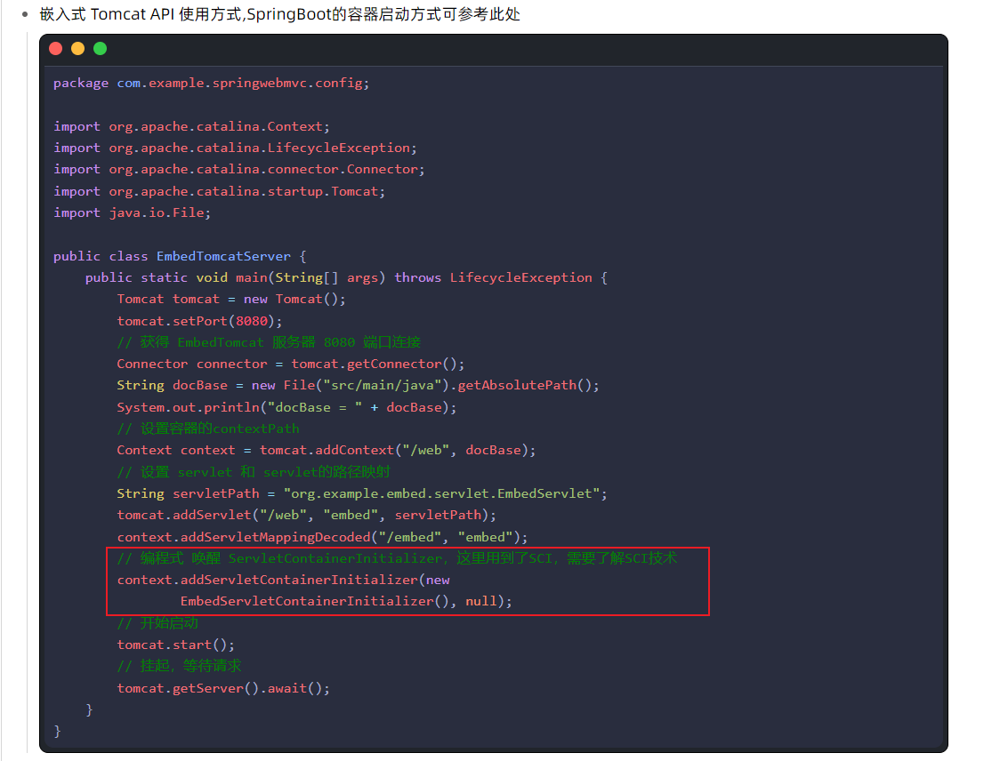
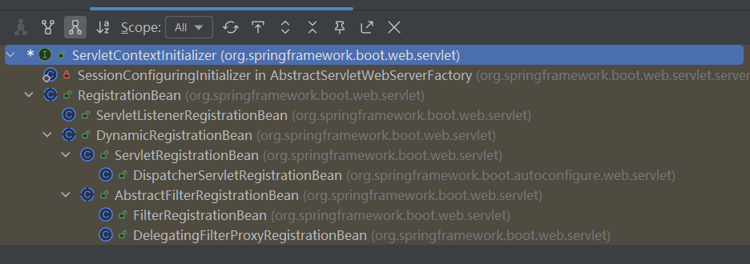

# ServletContextInitializer

> ServletContextInitializer 是 SpringBoot 针对嵌入式容器的 顶层监听

```java
@FunctionalInterface
public interface ServletContextInitializer {

	/**
	 * Configure the given {@link ServletContext} with any servlets, filters, listeners
	 * context-params and attributes necessary for initialization.
	 * @param servletContext the {@code ServletContext} to initialize
	 * @throws ServletException if any call against the given {@code ServletContext}
	 * throws a {@code ServletException}
	 */
	void onStartup(ServletContext servletContext) throws ServletException;

}
```


1. ServletContextInitializer 生命周期由 Spring 进行管理而非  容器
2. ServletContextInitializer 是由 TomcatStarter 桥接过来

`以下都是以Tomcat容器为例`


## 1. TomcatStarter

在SpringBoot中使用的是嵌入式容器，他提供了SCI引擎的直接实现，就是TomcatStarter

```java
class TomcatStarter implements ServletContainerInitializer {

	private static final Log logger = LogFactory.getLog(TomcatStarter.class);

	private final ServletContextInitializer[] initializers;

	private volatile Exception startUpException;

    // 重要的接口  ServletContextInitializer
	TomcatStarter(ServletContextInitializer[] initializers) {
		this.initializers = initializers;
	}

	@Override
    // 显然这个SCI没有@HandleTypes注解，因此classes中永远都是空，因此这个SCI只是为了拿到容器的ServletContext传递给	   ServletContextInitializer，ServletContextInitializer中拿到ServletContext可以做任何想要做的事情（必须是容器启动完成之前）
	public void onStartup(Set<Class<?>> classes, ServletContext servletContext) throws ServletException {
		try {
			for (ServletContextInitializer initializer : this.initializers) {
				initializer.onStartup(servletContext);
			}
		}
		catch (Exception ex) {
			this.startUpException = ex;
			// Prevent Tomcat from logging and re-throwing when we know we can
			// deal with it in the main thread, but log for information here.
			if (logger.isErrorEnabled()) {
				logger.error("Error starting Tomcat context. Exception: " + ex.getClass().getName() + ". Message: "
						+ ex.getMessage());
			}
		}
	}

	Exception getStartUpException() {
		return this.startUpException;
	}

}
```


## 2. web嵌入式容器的启动方式

详细了解请看web嵌入式容器



当编程式启动容器时会添加一个SCI，因此在SpringBoot中启动时会传入TomcatStarter,在传入之前会拿到所有实现了ServletContextinitializer的类，new TomcatStarter(ServletContextinitializer实现的类)。

然后Tomcat容器一开始启动就会将ServletContext上下文传入到ServletContextinitializer实现类中。然后ServletContextinitializer实现类就可以干一些自己相干的事情（`必须在容器启动完成之前，因为Servlet的机制就是在容器启动之后不允许在对ServletContext进行修改`）。

因此在SpringBoot中如果要添加过滤器，`监听器等组件时可以利用ServletContextinitializer接口或者ServletContextinitializer接口的实现类`


## 3. SpringBoot中提供的ServletContextinitializer接口实现类




1. RegistrationBean 实现 Ordered 接口、可用于维护内部机制排序支持
2. ServletListenerRegistrationBean - 注册 Listener
3. FilterRegistrationBean - 注册 Filter
4. ServletRegistrationBean - 注册 Servlet
5. DispatcherServletRegistrationBean - 专用注册 DispatcherServlet

`以上 ServletContextInitializer 是被 SpringBoot 手动调用的`