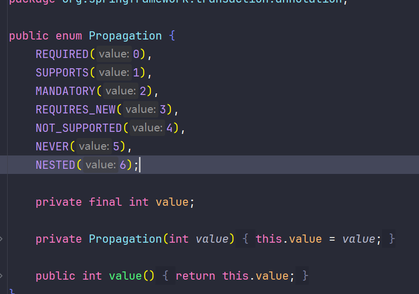

#### 1. 作用

定义和管理事务边界，尤其是一个事务方法调用另一个事务方法时，事务如何传播的问题。他解决了多个事务方法嵌套执行时，是否要开启新事物、复用现有事务或者挂起事务等复杂的情况。

+ 用途
  1. 控制事务的传播和嵌套：根据具体的业务需求，可以执行是否使用现有事务或开启新的事务，解决事务的传播问题。
  2. 确保独立操作的事务隔离：某些操作（如日志记录、发送通知）应当独立于主事务执行，即使主事务失败，这些才做也可以成功完成
  3. 控制事务的边界和一致性：不同的业务场景可能需要不通的事务边界，例如强制某个方法必须在事务中执行，或者确保某个方法永远不在事务中执行。

#### 2. 传播行为

1. PROPAGATION_REQUIRED（默认） 如果当前存在事务，则用当前事务，如果没有事务则新起一个事务
2. PROPAGATION_SUPPORTS 支持当前事务，如果不存在，则以非事务方式执行
3. PROPAGATION_MANDATORY 支持当前事务，如果不存在，则抛出异常
4. PROPAGATION_REQUIRES_NEW 创建一个新事务，如果存在当前事务，则挂起当前事务
5. PROPAGATION_NOT_SUPPORTED 不支持当前事务，始终以非事务方式执行
6. PROPAGATION_NEVER 不支持当前事务，如果当前存在事务，则抛出异常
7. PROPAGATION_NESTED 如果当前事务存在，则在嵌套事务中执行，内层事务依赖外层事务，如果外层失败，则会回滚内层，内层失败不影响外层。

