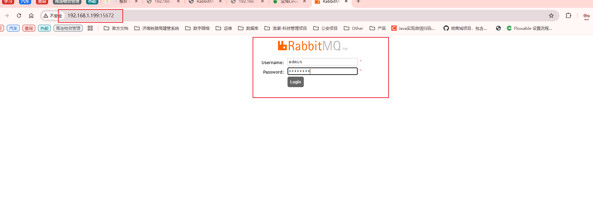

# 那些年使用docker版rabbitmq踩过的坑


## 1. 拉取rabbitmq镜像

```sh
docker pull rabbitmq
```


如果拉取失败可配置镜像加速器，`亲测第一个可用，测试时间（2025年3月7日）`

```sh
{
	"registry-mirrors": [
		"https://proxy.1panel.live",
		"https://docker.1panel.top",
		"https://docker.m.daocloud.io",
		"https://docker.1ms.run",
		"https://docker.ketches.cn"
	]
}
```


## 2. 使用命令行启动

```sh
# -d 参数：后台运行 Docker 容器
# --name 参数：设置容器名称
# -p 参数：映射端口号，格式是“宿主机端口号:容器内端口号”。5672供客户端程序访问，15672供后台管理界面访问
# -e 参数：设置容器内的环境变量，这里我们设置了登录RabbitMQ管理后台的默认用户和密码
docker run -d \
--name rabbitmq \
-p 5672:5672 \
-p 15672:15672 \
-e RABBITMQ_DEFAULT_USER=admin \
-e RABBITMQ_DEFAULT_PASS=admin123 \
rabbitmq
```


## 3. 访问rabbitmq界面

ip:15672




如果无法访问需要进入容器内部用命令启用管理插件


```sh
rabbitmq-plugins enable rabbitmq_management
```

执行以下命令，查看已启用的插件

```sh
rabbitmq-plugins list
```

需要确保 rabbitmq_management插件已在列表中。

再次访问即可看到界面