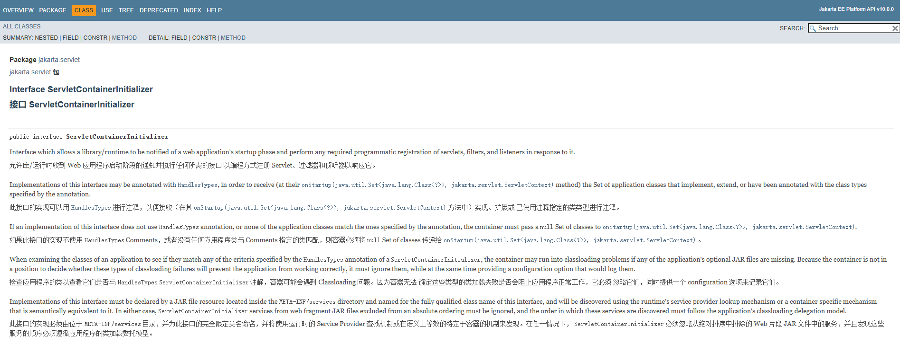
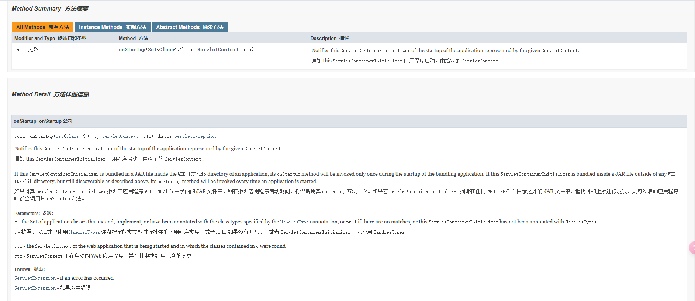

## 1. 什么是SCI

ServletContainerInitializer 是 Jakarta EE (Servlet API) 规范预留的监听入口，当容器启动时会进行SCI的扫描，比监听器、过滤器这些更顶层。将 ServletContext进行回调，可以让我们自己拿着项目的ServletContext去做一些事情（未完成项目启动之前）。


## 2. 官方

[Jakarta ServletContainerInitializer 官网](https://jakarta.ee/specifications/platform/10/apidocs/jakarta/servlet/servletcontainerinitializer)







## 3. SCI机制


### 3.1 *ServletContainerInitializer.java*

```java
package jakarta.servlet;
import java.util.Set;
public interface ServletContainerInitializer {
	// Servlet 容器 [如:Tomcat] 启动项目时传递 此项目的 ServletContext
	void onStartup(Set<Class<? > classes, ServletContext servletContext) throws ServletException;
}
```


> 1. ServletContainerInitializer 带有特殊引擎机制可被扫描注册和编程式注册
>
> 2. 扫描注册由 Tomcat 这样的 Servlet 容器内置支持
>
> 3. 编程式注册 需要 Tomcat 内部API支持、而非 servlet.api
>
> 4. 未配置 @HandlesTypes 注解时、Set<Class<? > classes 总是为空
>
> 5. 扫描注册须声明: META-INF/services/jakarta.servlet.ServletContainerInitializer


### 3.2 *@HandlesTypes*

对于实现了SCI接口的类来说，在实现类上打上该注解，并设置接口类，在容器启动时SCI机制则将@HandlesTypes中参数的类放入Set 中。

**CustomServletContainerInitializer**

```java
import jakarta.servlet.ServletContainerInitializer;
import jakarta.servlet.ServletContext;
import jakarta.servlet.ServletException;
import jakarta.servlet.annotation.HandlesTypes;
import java.util.Set;
@HandlesTypes(ApplicationServletContainerInitializer.class)
public class CustomServletContainerInitializer implements ServletContainerInitializer {
    @Override
    public void onStartup(Set<Class<? > waiClasses, ServletContext servletContext) throws ServletException
    {
        // 此处 Set<Class<?>> 为 所有的 ApplicationServletContainerInitializer 类型 class
        // 一般处理逻辑为: 遍历 waiClasses
        // 1. 判断是不是接口类型
        // 2. 判断是不是抽象类类型
        // 3. 再次严格确认 是不是该 ApplicationServletContainerInitializer 类型
        // 4. new ApplicationServletContainerInitializer 对象
        // 5. 调用 其中约定的方法
        // 6. ApplicationServletContainerInitializer::onStartup(servletContext)
    }
}
```

**ApplicationServletContainerInitializer**

```java
import jakarta.servlet.ServletContext;
import jakarta.servlet.ServletException;
public interface ApplicationServletContainerInitializer {
	void onStartup(ServletContext servletContext) throws ServletException;
}
```


## 4. 示例

**CustomServletContainerInitializer**

```java
package com.example.springtomcat;
import jakarta.servlet.ServletContainerInitializer;
import jakarta.servlet.ServletContext;
import jakarta.servlet.ServletException;
import jakarta.servlet.annotation.HandlesTypes;
import java.lang.reflect.Constructor;
import java.lang.reflect.Modifier;
import java.util.Set;
@HandlesTypes(SystemServiceInitializer.class)
public class CustomServletContainerInitializer implements ServletContainerInitializer {
    @Override
    public void onStartup(Set<Class<? > scInitializerClasses, ServletContext ctx) throws ServletException {
        for (Class<?> c : scInitializerClasses) {
            if (!c.isInterface() & !Modifier.isAbstract(c.getModifiers())) {
                try {
                    Constructor<?> constructor = c.getDeclaredConstructor();
                    SystemServiceInitializer initializer = (SystemServiceInitializer) constructor.newInstance();
                    initializer.onStartup(ctx);
                } catch (Exception e) {
                throw new RuntimeException(e);
                }
            }
        }
    }
}
```


**SystemServiceInitializer**

```java
package com.example.springtomcat;
import jakarta.servlet.ServletContext;
public interface SystemServiceInitializer {
	void onStartup(ServletContext servletContext);
}
```


**CustomServiceInitializerImpl**

```java
package com.example.springtomcat;
import jakarta.servlet.ServletContext;
public class CustomServiceInitializerImpl implements SystemServiceInitializer {
    @Override
    public void onStartup(ServletContext servletContext) {
        System.out.println("执行初始化操作 . ");
    }
}
```


