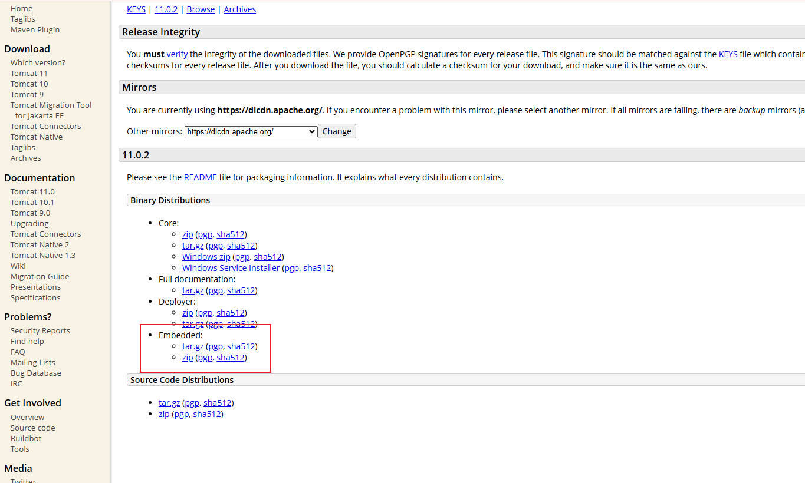

## 1. 什么是web嵌入式的容器

**Web嵌入式容器**‌是指在应用程序内部嵌入一个完整的Web服务器，使得应用程序可以直接运行而不需要依赖外部的Web服务器。这种设计简化了部署过程，提高了开发效率和灵活性。

嵌入式容器是一种将Web服务器功能嵌入到应用程序中的技术。通过这种方式，应用程序可以直接启动和管理自己的Web服务器，而不需要依赖外部的Web服务器。这种设计使得开发、测试和部署变得更加简单和快捷。


## 2. 常见的嵌入式容器

首先说明一点，我们在SpringBoot中使用的web嵌入式容器技术并不是SpringBoot提供的，而是容器的开发者提供的。

SpringBoot可以打成jar包独立进行运行正式得益于嵌入式容器的技术（`他不是SpringBoot的技术\他不是SpringBoot的技术\他不是SpringBoot的技术`）。

1. ‌**[Tomcat](https://tomcat.apache.org/)**‌：Tomcat是一个广泛使用的Servlet容器，支持Servlet 3.0和Java EE 6规范。它通常用于生产环境，因其稳定性和高性能而受到青睐‌,下面就以tomcat为例
2. ‌**[Jetty]()**‌：Jetty是一个轻量级的servlet容器，适合开发环境使用。它启动快、配置简单，特别适合快速开发和测试‌。
3. ‌**[Undertow]()**‌：Undertow是JBoss团队开发的一个高性能Web服务器，支持异步处理和事件驱动模型，适合需要高并发处理的应用‌。
4. ‌**[Netty]()**‌：Netty是一个基于Java NIO的异步事件驱动的网络应用框架，用于开发高性能、高可靠性的网络服务器和客户端程序。它通常用于Reactive Web应用‌。

### 嵌入式容器的优缺点

‌**优点**‌：

- ‌**简化部署**‌：不需要单独部署Web服务器，减少了配置和维护的复杂性。
- ‌**提高开发效率**‌：开发人员可以更快地迭代和测试代码，无需等待外部服务器的启动。
- ‌**更好的集成**‌：嵌入式容器可以更好地与应用程序的其他部分集成，提供更灵活的控制。

‌**缺点**‌：

- ‌**资源消耗**‌：嵌入式容器可能会消耗更多的内存和CPU资源，尤其是在生产环境中。
- ‌**性能限制**‌：与专业的Web服务器相比，嵌入式容器的性能可能有所不足，特别是在高并发场景下。


## 3. Tomcat容器

1. [官网](https://tomcat.apache.org/download-11.cgi)

2. 嵌入式容器

   

3. 使用示例

   + 基本运行环境(dependency)**[embed-core** **模块支持基本环境运行**

     ```xml
     <dependency>
         <groupId>org.apache.tomcat.embed</groupId>
         <artifactId>tomcat-embed-core</artifactId>
         <version>10.1.18</version>
     </dependency>
     ```

   + 嵌入式 Tomcat API 使用方式,SpringBoot的容器启动方式可参考此处

     ```java
     package com.example.springwebmvc.config;
     
     import org.apache.catalina.Context;
     import org.apache.catalina.LifecycleException;
     import org.apache.catalina.connector.Connector;
     import org.apache.catalina.startup.Tomcat;
     import java.io.File;
     
     public class EmbedTomcatServer {
         public static void main(String[] args) throws LifecycleException {
             Tomcat tomcat = new Tomcat();
             tomcat.setPort(8080);
             // 获得 EmbedTomcat 服务器 8080 端口连接
             Connector connector = tomcat.getConnector();
             String docBase = new File("src/main/java").getAbsolutePath();
             System.out.println("docBase = " + docBase);
             // 设置容器的contextPath
             Context context = tomcat.addContext("/web", docBase);
             // 设置 servlet 和 servlet的路径映射
             String servletPath = "org.example.embed.servlet.EmbedServlet";
             tomcat.addServlet("/web", "embed", servletPath);
             context.addServletMappingDecoded("/embed", "embed");
             // 编程式 唤醒 ServletContainerInitializer，这里用到了SCI，需要了解SCI技术
             context.addServletContainerInitializer(new
                     EmbedServletContainerInitializer(), null);
             // 开始启动
             tomcat.start();
             // 挂起，等待请求
             tomcat.getServer().await();
         }
     }
     ```

   + EmbedServlet.java

     ```java
     package com.example.springwebmvc.config;
     
     import jakarta.servlet.ServletException;
     import jakarta.servlet.http.HttpServlet;
     import jakarta.servlet.http.HttpServletRequest;
     import jakarta.servlet.http.HttpServletResponse;
     
     import java.io.IOException;
     
     public class EmbedServlet extends HttpServlet {
         @Override
         protected void doGet(HttpServletRequest req, HttpServletResponse resp) throws ServletException, IOException {
             resp.getWriter().println("EmbedServlet . ");
         }
     }
     ```

     

   + EmbedServletContainerInitializer.java

     ```java
     package com.example.springwebmvc.config;
     
     import jakarta.servlet.ServletContainerInitializer;
     import jakarta.servlet.ServletContext;
     import jakarta.servlet.ServletException;
     import java.util.Set;
     
     // 这里需要了解SCI技术
     public class EmbedServletContainerInitializer implements ServletContainerInitializer {
         @Override
         public void onStartup(Set<Class<?>> initializer
                 , ServletContext servletContext) throws ServletException {
             assert initializer == null;
             assert servletContext == null;
             String contextPath = servletContext.getContextPath();
             System.out.println("contextPath = " + contextPath);
             // 逻辑是 获得 ServletContext 然后做点儿什么 ？[通常是高端操作]
         }
     }
     ```

     
