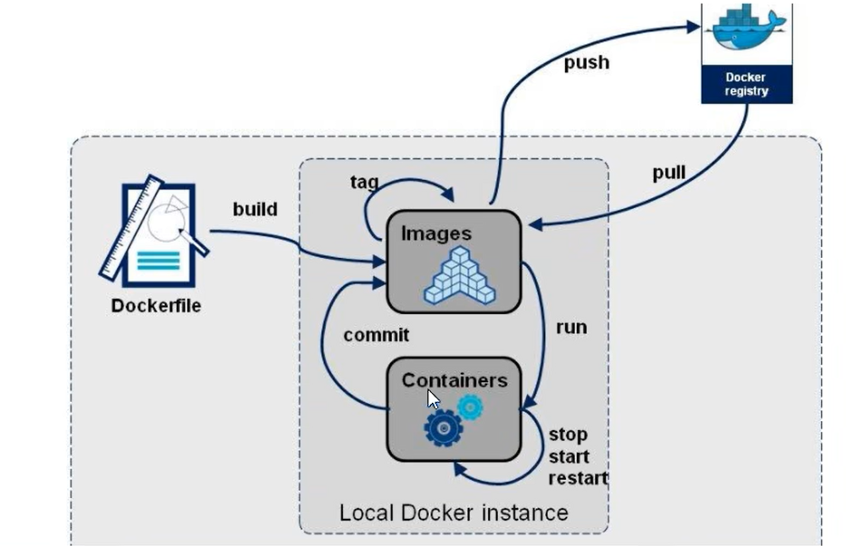
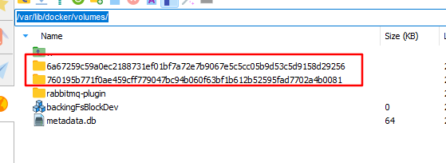

# Dockerfile

官网（需要翻墙）：https://docs.docker.com/reference/dockerfile/

中文网： http://www.dockerinfo.net/dockerfile%e4%bb%8b%e7%bb%8d

## 1. 概述

> === Dockerfile 是用来构建 Docker 镜像的文本文件，是由一条条构建镜像所需的指令和参数构成的脚本



示例

```dockerfile
FROM centos:7

# 配置Java17环境变量
ADD jdk-17_linux-x64_bin.tar /usr/lib/
ENV JAVA_HOME /usr/lib/jdk-17.0.11
ENV CLASSPATH .:${JAVA_HOME}/jre/lib/rt.jar:${JAVA_HOME}/lib/dt.jar:${JAVA_HOME}/lib/tools.jar
ENV PATH $PATH:${JAVA_HOME}/bin

CMD /bin/bash


FROM centos
  
MAINTAINER Linkaiqiang

COPY readme.txt /usr/local/readme.txt

ADD jdk1.8.0_291.tar.gz /usr/local/
ADD tomcat.tar.gz /usr/local/

RUN cd /etc/yum.repos.d/

RUN sed -i 's/mirrorlist/#mirrorlist/g' /etc/yum.repos.d/CentOS-*
RUN sed -i 's|#baseurl=http://mirror.centos.org|baseurl=http://vault.centos.org|g' /etc/yum.repos.d/CentOS-*

RUN yum -y install vim wget

VOLUME ["/data1","/data2"]


ENV MYPATH /usr/local
WORKDIR $MYPATH

ENV JAVA_HOME /usr/local/jdk1.8.0_291
ENV CLASSPATH $JAVA_HOME/lib/dt.jar:$JAVA_HOME/lib/tools.jar
ENV CATALINA_HOME /usr/local/tomcat
ENV CATALINA_BASE /usr/local/tomcat
ENV PATH $PATH:$JAVA_HOME/bin:$CLASSPATH:$CATALINA_HOME/lib:$CATALINA_HOME/bin

EXPOSE 8080

CMD /usr/local/tomcat/bin/startup.sh && tail -f /usr/local/tomcat/logs/catalina.out
```

### 1.2 构建格式

1. 格式

    docker build [选项] PATH | URL | -

2. 选项

    -t: 打标签

    -c: -cpu-shares int: cpu份额（相对权重）

    -m: -memory bytes: 内存限制

    --build-arg: 设置构建时的变量，就是构建时候修改ARG指令的参数


## 2. 常用的指令

> === 必须大写

### 2.1 FROM

Dockerfile文件的第一个非注释的指令。

基础镜像，当前新镜像是基于哪个镜像来生成新镜像的，指定一个已经存在的镜像作为模板。

默认情况下，当执行 **docker build** 命令时会在docker主机上查找镜像，如果镜像不存在，则会自动从Docker仓库pull下来，当然了，再找不到镜像就会报错了。

```dockerfile
FROM 镜像名:镜像标签
# 默认镜像标签为 latest, 即最新的镜像
```


### 2.2 MAINTAINER

用于提供镜像维护者的姓名和邮箱地址

```dockerfile
MAINTAINER 'zhangsan<zhangsan@163.com>'
```

### 2.3 RUN

容器构建时需要运行的命令（build）

#### 2.3.1 两种格式

##### 2.3.1.1 shell格式

```sh
RUN yum -y install vim
```

##### 2.3.1.2 exec格式

```sh
RUN ['可执行文件','参数1','参数2']
```

> === RUN 命令时build构建镜像时执行的。

### 2.4 EXPOSE

当前容器对外暴露出的端口

### 2.5 WORKDIR

指定在容器创建以后，终端默认登录进来的目录，一个落脚点

### 2.6 USER

指定该镜像以什么样的的用户去执行它，如果没有指定默认为root

### 2.7 ENV

用于在构建镜像过程中设置环境变量

```sh
ENV MY_PATH /usr/mytest

这个环境变量可以在后续的任何 RUN 指令中使用，这就如同在命令前面环境变量前缀一样；
它可以在其它指令中直接使用这些环境变量；

比如： WORKDIR $MY_PATH
```


### 2.8 COPY

用于从docker主机赋值文件或目录至创建的新镜像指定的路径中

```dockerfile
COPY [源] [目标]
COPY ["源", "目标"]
```

文件复制准则

+ 必须是build上下文中的路径，即当前工作目录中的路径，不能是其父目录中的文件；
+ 如果是目录，则其内部文件或子目录会被递归复制，但目录自身不会被复制；
+ 如果指定了多个，或在中使用了通配符，则必须是一个目录，且必须以/结尾；
+ 如果事先不存在，他将会被自动创建，这包括父目录路径

示例

```dockerfile
# copy 文件
COPY index.html /data/web/html/      //要确保Dockerfile同级路径下有index.html文件

# copy 目录  如果是复制目录，则其内部文件或子目录会被递归复制，但目录自身不会被复制；需要把复制目录名字也写在容器中要复制的路径下！
COPY yum.repos.d /etc/yum.repos.d/
```


### 2.9 ADD

同 copy 只是提供了URL 和 解压压缩包的功能

将宿主机目录下的文件拷贝至镜像且会自动处理URL和解压tar压缩包

### 2.10 VOLUME

> [!note]
>
> 容器数据卷，用于数据保存和持久化工作

使用方式：

​    VOLUME /home/data /home2/data

​    VOLUMN ["/home/data","/home2/data"]

如果使用 docker run xx  命令启动容器时若没有使用 -v 挂载 VOLUME指定的目录，则会在创建容器时自动在Docker安装目录生成从一个匿名目录用以存储VOLUME声明的文件夹内的内容。一般是在 **/var/lib/docker/volumes/** 下



一个目录会生成一个文件夹，例如 VOLUME /home/data /home2/data 则会生成两个文件夹。

如果使用 -v 声明了，则会被 -v 声明的覆盖。

### 2.11 CMD

类似于RUN命令，只不过运行时机不同，指定容器启动后要做的事情

> [!warning]
>
> Dockerfile中可以有多个CMD指令，但只有最后一个生效，CMD会被docker run之后的参数替换。

### 2.12 ENTRYPOINT

ENTRYPOINT可以和CMD一起使用，一般是变参时才会使用CMD,这里的CMD等于是在给ENTRYPOINT传参。

当指定了ENTRYPOINT之后，CMD的含义就发生了变化，不再是直接运行其命令而是将CMD的内容作为参数传递给ENTRYPOINT指令，两个组合之后就会变成 `<ENTIRYPOINT><CMD>`

`ENTRYPOINT <command>`

`ENTRYPOINT ["<executable>", "<param1>", "<param2>"]`

案例：假设有一个nginx:test镜像

Dockerfile:

```dockerfile
FROM nginx
ENTRYPOINT ['nginx','-c'] #定参
CMD ["/etc/nginx/nginx.conf"] #变参
```

| 是否传参         | 按照Dockerfile执行编写         | 传参运行                                     |
| ---------------- | ------------------------------ | -------------------------------------------- |
| Docker命令       | docker run nginx:test          | docker run nginx:test -c /etc/nginx/new.conf |
| 衍生出的实际命令 | nginx -c /etc/nginx/nginx.conf | nginx -c /etc/nginx/new.conf                 |


> [!note]
>
> + docker run命令传入的命令参数会覆盖CMD指令的内容并且附加到ENTRYPOINT命令最后做为其参数使用
> + Dockerfile文件中也可以存在多个ENTRYPOINT指令，但仅有最后一个会生效


+ 类似CMD指令的功能，用于为容器指定默认运行程序，从而使容器像是一个单独的可执行程序
+ 与CMD不同的是，由ENTRYPOINT启动的程序不会被docker run命令行指定的参数所覆盖，而且，这些命令行参数会被当作参数传递给ENTRYPOINT指定指定的程序

