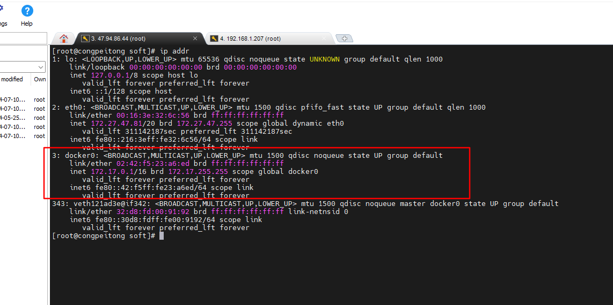
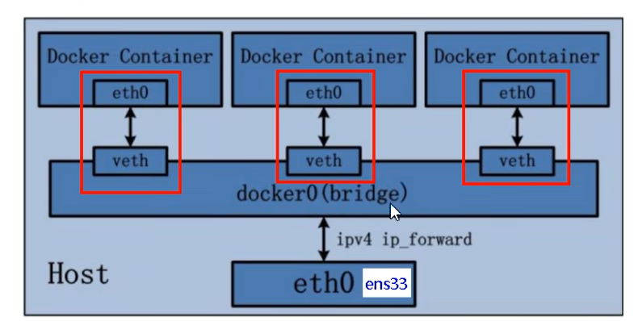
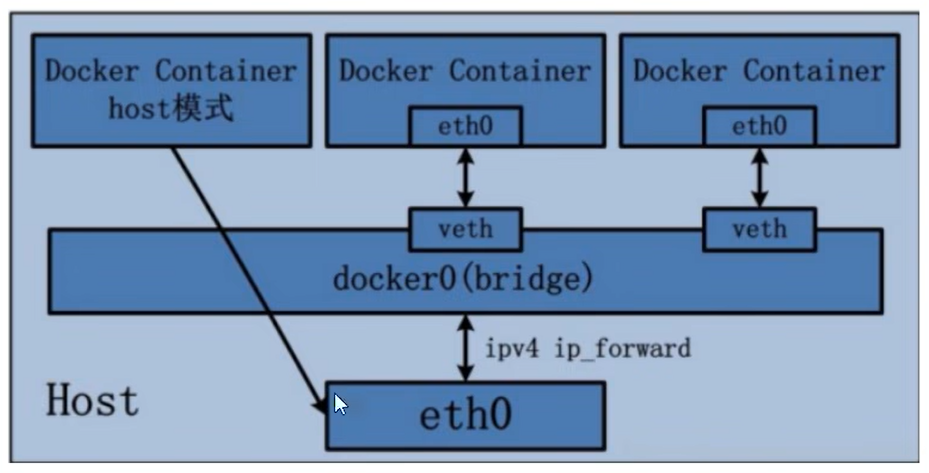
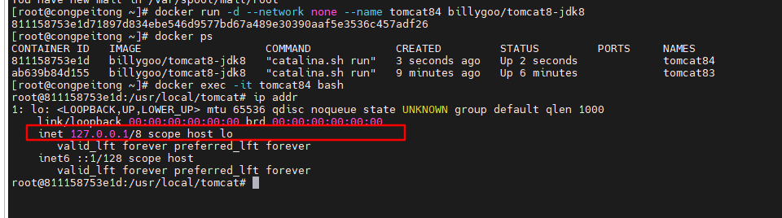
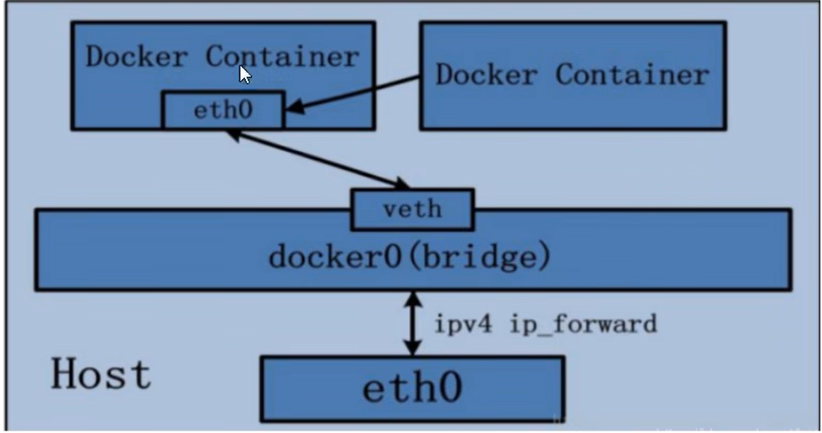
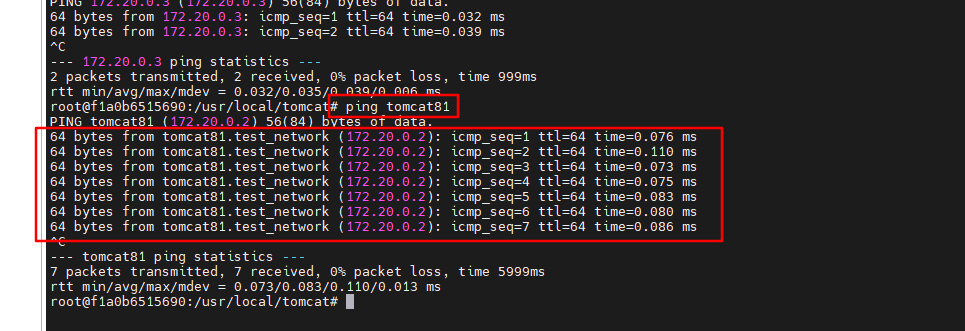

# Docker 网络

网络模式：

| 网络模式  | 简介                                                         | 指定方式                           |
| --------- | ------------------------------------------------------------ | ---------------------------------- |
| bridge    | 为每个容器分配、设置IP等，并将容器连接到一个叫做docker0的虚拟网桥，默认为该模式 | --network bridge                   |
| host      | 容器将不会虚拟出自己的网卡，配置自己的IP等，而是使用宿主机的IP和端口 | --network host                     |
| none      | 容器有独立的Network namespace,但并没有对其进行任何网络设置，如分配veth pair和网桥连接，IP等 | --network none                     |
| container | 新创建的容器不会创建自己的网卡和配置自己的IP，而是和一个指定的容器共享IP,端口范围 | --network container:name或者容器id |

> [!note]
>
> 1. 查看网络模式：docker netword ls
> 2. 查看网络模式详情： docker inspect network bridge/host/自定义网络模式
> 3. 查看容器网络：docker inspect 容器name或容器id

## 1. bridge

**Docker 服务默认会创建一个docker0的虚拟网桥，该桥接网络的名称就是docker0,它在内核层联通了其它的物理或虚拟网卡，这就将所有的容器和本地主机都放在了同一个物理网络。Docker默认指定了docker0接口的ip地址和子网掩码，让主机和容器之间可以通过网桥相互通信。**

### 1.1 虚拟网桥

当启动docker时会产生一个名字为docker0的虚拟网桥

docker就是通过docker0这个虚拟网桥和宿主机之间以及容器和容器之间进行网络通信的。

**测试镜像： docker run -d -p 8083:8080 --name tomcat83 billygoo/tomcat8-jdk8**

### 1.2. 模型

1. 整个宿主机的网桥模式都是docker0,类似于一个交换机有一堆接口，每个接口叫veth,在本地主机和容器内分别创建一个虚拟接口，并让他们彼此之间可以联通（这样一对接口叫做veth pair）

2. 每个容器实例内部也有一块网卡，每个接口叫做eth0;

3. docker0上面的每个veth匹配某个容器实例内部的eth0,两两配对、一一匹配。

    

    > [!note]
    >
    > 综述：将宿主机上的所有容器都连接到这个内部网络上，两个容器在同一个网络下，会从这个网关下拿到各自分配的ip,此时两个容器之间的网络是相通的。

## 2. host

> === 直接使用宿主机的IP地址与外界进行通信，不再需要额外的进行NAT转换.

**测试镜像： docker run -d --network host --name tomcat83 billygoo/tomcat8-jdk8**

> [!warning]
>
> docker 启动时如果指定了 -p 映射端口，会出现警告。
>
> host 模式下 -p  指定的端口将不会起到任何作用，端口号会以主机端口号为主。重复时则递增。

### 2.1 模型

容器将不会获得一个独立的Network Namespace,而是和宿主机共用一个Network Namespace。容器将不会虚拟出自己的网卡，而是使用宿主机的IP和端口。

## 3. none

> === 禁用了网络功能，只有lo标识（就是127.0.0.1标识本地回环）

> [!note]
>
> 在none模式下，并不为Docker容器进行任何的网络配置
>
> Docker容器没有网卡、IP、路由配置等信息，只有lo

## 4. container	

> === 新创建的容器不会创建自己的网卡和配置自己的IP,而是和一个指定容器共享IP、端口范围等。
>
> 两个容器除了网络方面，其它的如文件系统、进程列表等还是隔离的。

### 4.1 模型

**docker run -d --network container:tomcat81 --name tomcat82 billygoo/tomcat8-jdk8**

这里如果两个容器都是tomcat不适合，因为8080端口会产生冲突。

## 5. 自定义网络模式

> === 可以保证容器之间通过服务名访问
>
> ！！！！！ 自定义网络本身就维护好了主机名和ip的对应关系，ip和域名都能通

### 5.1 新建自定义网络

docker network create test_network

### 5.2 新建容器

docker run -d -p 8081:8080 --network test_network --name tomcat81 billygoo/tomcat8-jdk8

docker run -d -p 8082:8080 --network test_network --name tomcat82 billygoo/tomcat8-jdk8

### 5.3 通过服务名测试服务通信

## 6. 主要用途

1. 容器之间的互联和通信以及端口映射
2. 容器IP变动时可以通过服务名连接网络通信而不受影响

