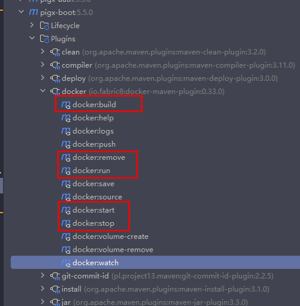

# 使用Docker部署方式

## 1. 不使用Harbor仓库部署

> 本地可以连接远程Docker，以Dcoker进行构建镜像（该Docker需为部署自己服务程序的服务器上的Docker,因为构建镜像时是直接构建到远程Docker上的）。

### 1.1 前提准备

#### 1.1.1 maven docker打包插件：fabric8及远程Docker配置

```xml
<!--maven  docker 打包插件 -->
<plugin>
    <groupId>io.fabric8</groupId>
    <artifactId>docker-maven-plugin</artifactId>
    <version>${docker.plugin.version}</version>
    <configuration>
        <dockerHost>${docker.host}</dockerHost>
        <registry>${docker.registry}</registry>
        <authConfig>
            <push>
                <username>${docker.username}</username>
                <password>${docker.password}</password>
            </push>
        </authConfig>
        <images>
            <image>
                <name>${docker.registry}/${docker.namespace}/${project.name}:${project.version}</name>
                <build>
                    <dockerFile>${project.basedir}/Dockerfile</dockerFile>
                </build>
            </image>
        </images>
    </configuration>
</plugin>
```


#### 1.1.2 构建镜像的Dockerfile文件

```dockerfile
FROM ubuntu

MAINTAINER congpeitong@shundesoft.com

# 设置工作目录
WORKDIR /pigx-boot
# 设置JAR位置
ARG JAR_FILE=target/pigx-boot.jar
# 将本地的Java源代码赋值到容器内
COPY ${JAR_FILE} app.jar
# 暴露端口给物理机映射
EXPOSE 9999

ENV TZ=Asia/Shanghai JAVA_OPTS="-Xms512m -Xmx1024m -Djava.security.egd=file:/dev/./urandom"
# 运行编译后的Java程序
CMD sleep 60; java $JAVA_OPTS -jar app.jar
```

#### 1.1.3 生成好的程序jar包


### 1.2 部署

#### 1.2.1 maven命令部署

```sh
mvn clean package docker:stop docker:remove docker:build docker:run
```

+ docker:stop 停止并删除docker容器
+ docker:remove 删除镜像
+ docker:build 构建镜像
+ docker:run 创建并启动docker容器

#### 1.2.2 idea部署



## 2. 使用Harbor仓库部署

### 2.1 前提准备

和不使用Harbor的前提准备一致，配置好Harbor信息就行了

### 2.2 部署

本地使用build生成镜像-》通过push将生成的镜像上传到Harbor仓库-》部署服务器通过docker pull命令从Harbor仓库拉取然后run启动就行了。