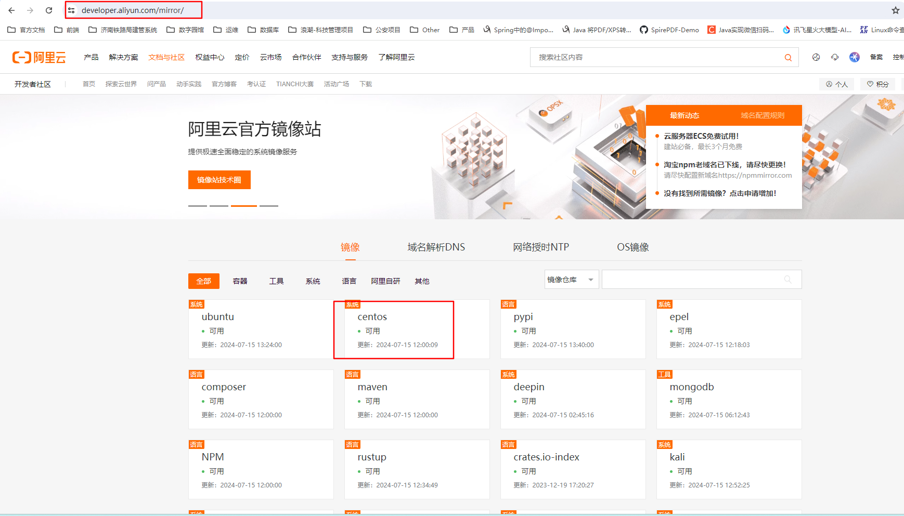

# 使用Dockerfile制作基础镜像

> === 这里基础镜像使用的时centos:7

## 1. 制作java17的Dockerfile

### 1.1 Dockerfile文件

```dockerfile
FROM centos:7

# 配置Java17环境变量
ADD jdk-17_linux-x64_bin.tar.gz /usr/lib/
ENV JAVA_HOME=/usr/lib/jdk-17.0.10
ENV CLASSPATH=.:${JAVA_HOME}/jre/lib/rt.jar:${JAVA_HOME}/lib/dt.jar:${JAVA_HOME}/lib/tools.jar
ENV PATH=$PATH:${JAVA_HOME}/bin

CMD /bin/bash
```

> [!warning]
>
> jdk17 tar包要跟Dockerfile在同一个目录下，如果tar包使用绝对路径生成镜像的时候会报错

### 1.2 执行构建命令

> === 安装包、Dockerfile文件、命令执行 都在同一个目录下

```sh
docker build -t [镜像名] .

# 例如
docker build -t centos7_jdk17 .
```

## 2. 配置镜像

> === 进入镜像配置Java环境所必须的一些依赖

### 2.1 配置yum

可看阿里云官方的设置方式



#### 2.1.1 备份自带的yum配置

```sh
cd /etc/yum.conf.d

mkdir bak

mv *.repo bak
```


#### 2.1.2 设置新的yum源

```sh
vi Centos-base.repo
```

设置阿里基础镜像源

```sh
# CentOS-Base.repo
#
# The mirror system uses the connecting IP address of the client and the
# update status of each mirror to pick mirrors that are updated to and
# geographically close to the client.  You should use this for CentOS updates
# unless you are manually picking other mirrors.
#
# If the mirrorlist= does not work for you, as a fall back you can try the 
# remarked out baseurl= line instead.
#
#
 
[base]
name=CentOS-8.5.2111 - Base - mirrors.aliyun.com
baseurl=http://mirrors.aliyun.com/centos-vault/8.5.2111/BaseOS/$basearch/os/
        http://mirrors.aliyuncs.com/centos-vault/8.5.2111/BaseOS/$basearch/os/
        http://mirrors.cloud.aliyuncs.com/centos-vault/8.5.2111/BaseOS/$basearch/os/
gpgcheck=0
gpgkey=http://mirrors.aliyun.com/centos/RPM-GPG-KEY-CentOS-Official
 
#additional packages that may be useful
[extras]
name=CentOS-8.5.2111 - Extras - mirrors.aliyun.com
baseurl=http://mirrors.aliyun.com/centos-vault/8.5.2111/extras/$basearch/os/
        http://mirrors.aliyuncs.com/centos-vault/8.5.2111/extras/$basearch/os/
        http://mirrors.cloud.aliyuncs.com/centos-vault/8.5.2111/extras/$basearch/os/
gpgcheck=0
gpgkey=http://mirrors.aliyun.com/centos/RPM-GPG-KEY-CentOS-Official
 
#additional packages that extend functionality of existing packages
[centosplus]
name=CentOS-8.5.2111 - Plus - mirrors.aliyun.com
baseurl=http://mirrors.aliyun.com/centos-vault/8.5.2111/centosplus/$basearch/os/
        http://mirrors.aliyuncs.com/centos-vault/8.5.2111/centosplus/$basearch/os/
        http://mirrors.cloud.aliyuncs.com/centos-vault/8.5.2111/centosplus/$basearch/os/
gpgcheck=0
enabled=0
gpgkey=http://mirrors.aliyun.com/centos/RPM-GPG-KEY-CentOS-Official
 
[PowerTools]
name=CentOS-8.5.2111 - PowerTools - mirrors.aliyun.com
baseurl=http://mirrors.aliyun.com/centos-vault/8.5.2111/PowerTools/$basearch/os/
        http://mirrors.aliyuncs.com/centos-vault/8.5.2111/PowerTools/$basearch/os/
        http://mirrors.cloud.aliyuncs.com/centos-vault/8.5.2111/PowerTools/$basearch/os/
gpgcheck=0
enabled=0
gpgkey=http://mirrors.aliyun.com/centos/RPM-GPG-KEY-CentOS-Official


[AppStream]
name=CentOS-8.5.2111 - AppStream - mirrors.aliyun.com
baseurl=http://mirrors.aliyun.com/centos-vault/8.5.2111/AppStream/$basearch/os/
        http://mirrors.aliyuncs.com/centos-vault/8.5.2111/AppStream/$basearch/os/
        http://mirrors.cloud.aliyuncs.com/centos-vault/8.5.2111/AppStream/$basearch/os/
gpgcheck=0
gpgkey=http://mirrors.aliyun.com/centos/RPM-GPG-KEY-CentOS-Official

```

使用 **yum list** 测试一下，如果包列表则是成功


## 3. 配置Java运行所需要的依赖

### 3.1 配置 **libfreetype.so.6** 库

> [!note]
>
> libfreetype.so.6是一个在Linux系统中的动态链接库文件，它是由FreeType字体渲染引擎提供的
>
> 功能：
>
> 1. 字体文件支持
> 2. 文字渲染

```sh
# 对于Debain的系统，如ubuntu
sudo apt-get update
sudo apt-get install libfreetype6

# 对于RHEL系统， 如centos, fedora
sudo yum install freetype
```

> [!note]
>
> 如果未安装则运行Java时报错如下：
>
> Caused by: java.lang.ExceptionInInitializerError: Exception java.lang.UnsatisfiedLinkError: /usr/lib/jdk-17.0.10/lib/libfontmanager.so: libfreetype.so.6: cannot open shared object file: No such file or directory [in thread "main"]


### 3.2 配置 字体

> === 如果缺少字体，对于访问验证码时会出现问题

报错如下：

```sh
jakarta.servlet.ServletException: Handler dispatch failed: java.lang.InternalError: java.lang.reflect.InvocationTargetException
	at org.springframework.web.servlet.DispatcherServlet.doDispatch(DispatcherServlet.java:1096)
	at org.springframework.web.servlet.DispatcherServlet.doService(DispatcherServlet.java:974)
	at org.springframework.web.servlet.FrameworkServlet.processRequest(FrameworkServlet.java:1011)
	at org.springframework.web.servlet.FrameworkServlet.doGet(FrameworkServlet.java:903)
	at jakarta.servlet.http.HttpServlet.service(HttpServlet.java:564)
	at org.springframework.web.servlet.FrameworkServlet.service(FrameworkServlet.java:885)
	at jakarta.servlet.http.HttpServlet.service(HttpServlet.java:658)
	at org.apache.catalina.core.ApplicationFilterChain.internalDoFilter(ApplicationFilterChain.java:205)
	at org.apache.catalina.core.ApplicationFilterChain.doFilter(ApplicationFilterChain.java:149)
	at org.apache.tomcat.websocket.server.WsFilter.doFilter(WsFilter.java:51)
	at org.apache.catalina.core.ApplicationFilterChain.internalDoFilter(ApplicationFilterChain.java:174)
	at org.apache.catalina.core.ApplicationFilterChain.doFilter(ApplicationFilterChain.java:149)
	at org.springframework.web.filter.OncePerRequestFilter.doFilter(OncePerRequestFilter.java:110)
	at org.apache.catalina.core.ApplicationFilterChain.internalDoFilter(ApplicationFilterChain.java:174)
	at org.apache.catalina.core.ApplicationFilterChain.doFilter(ApplicationFilterChain.java:149)
	at org.springframework.security.web.FilterChainProxy.lambda$doFilterInternal$3(FilterChainProxy.java:231)
	at org.springframework.security.web.ObservationFilterChainDecorator$FilterObservation$SimpleFilterObservation.lambda$wrap$1(ObservationFilterChainDecorator.java:479)
	……
```

解决方式

```sh
yum install fontconfig -y && cd /usr/share/fonts && fc-cache

重启应用(jar)服务
```


