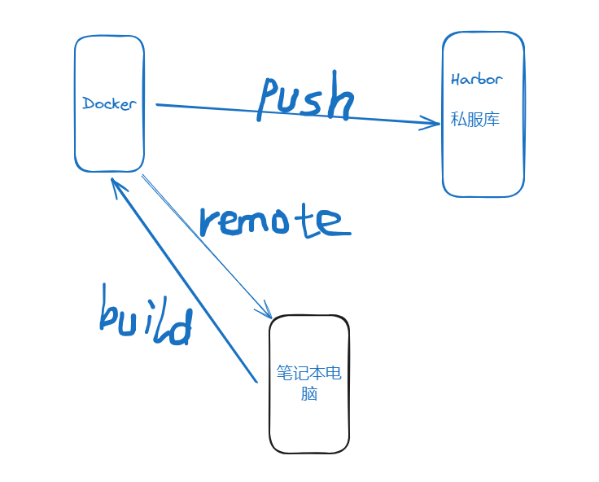
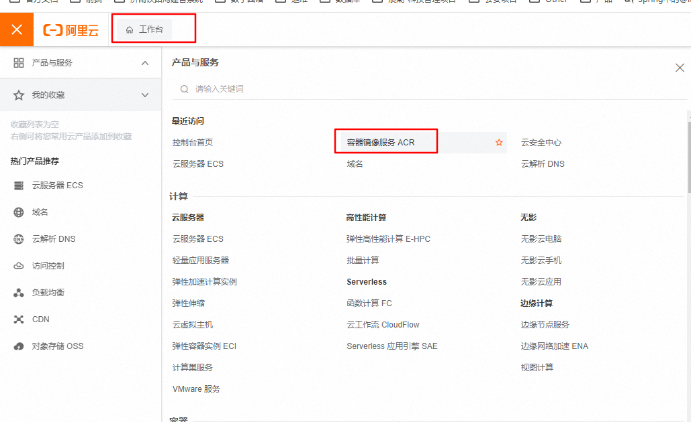
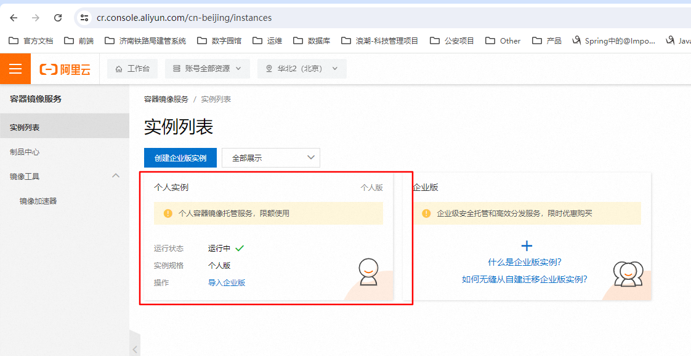
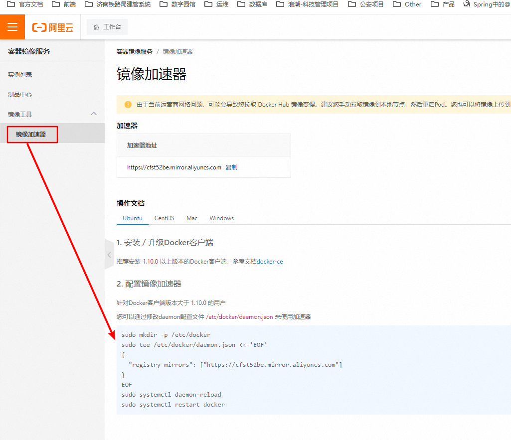
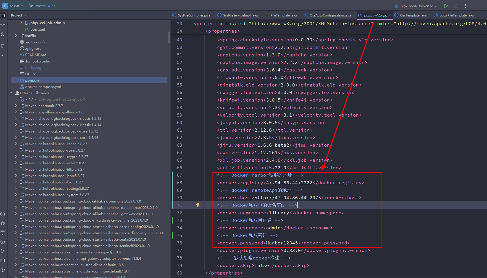
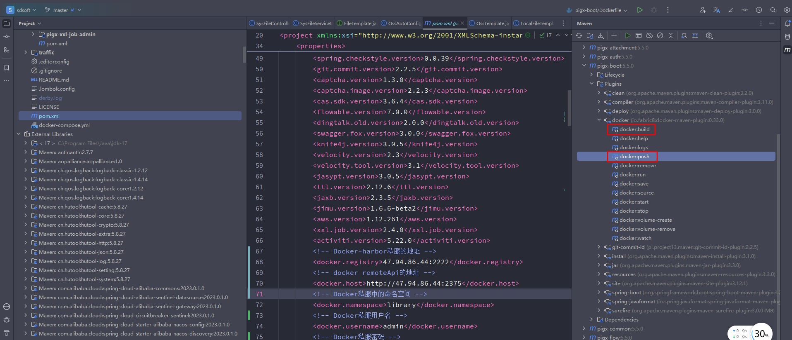

# 搭建Docker仓库私服（Harbor）

> === Docker私服使用Docker环境搭建的，首先需要有Docker环境

很多时候，开发者本地是没有Docker的，但是可以使用远程的Docker服务来build镜像，通过远程Docker服务将本地镜像推送到 **Harbor** 仓库私服。



## 1. 安装Docker

> === 保证机器可以访问外网

1. 安装gcc
    yum -y install gcc

2. 安装c++
    yum -y install gcc-c++

3. 安装包管理
    sudo yum install -y yum-utils

4. 设置仓库
    yum-config-manager --add-repo http://mirrors.aliyun.com/docker-ce/linux/centos/docker-ce.repo

5. 更新yum软件包索引
    yum makecache fast

6. 安装docker 引擎
    sudo yum install docker-ce docker-ce-cli containerd.io docker-buildx-plugin docker-compose-plugin

7. 启动Docker
    systemctl start docker

8. 查看Docker版本
    docker version

9. 校验Docker Engine 是否安装成功
    docker run hello-world

10. 配置阿里云镜像加速器 https://cr.console.aliyun.com/cn-beijing/instances/mirrors
    阿里云中有容器镜像服务，创建一个个人版本的就可以,针对Docker客户端版本大于 1.10.0 的用户,您可以通过修改daemon配置文件/etc/docker/daemon.json来使用加速器

    

    

    

    ```sh
    sudo mkdir -p /etc/docker
    sudo tee /etc/docker/daemon.json <<-'EOF'
    {
      "registry-mirrors": ["https://cfst52be.mirror.aliyuncs.com"]
    }
    EOF
    sudo systemctl daemon-reload
    sudo systemctl restart docker # 感觉restart不管用，最好是stop之后再start
    ```


## 2. 开启Docker Remote Api

> === Docker RemoteAPI是为了保证其它机器能够通过url访问到Docker提供的服务（例如：build、push）

```sh
vim /usr/lib/systemd/system/docker.service

#14 行 修改为

ExecStart=/usr/bin/dockerd -H tcp://0.0.0.0:2375 -H unix://var/run/docker.sock

# 重新加载配置
systemctl daemon-reload

# 重启Docker
systemctl restart docker
```

初始化镜像（pigx官方给的，应该不初始化也行）

```sh
docker pull java:8-jre
docker pull pig4cloud/java:8-jre
```


## 3. 安装docker-compose

将提供的 **docker-compose-Linux-x86_64** 文件拷贝至相应位置即可

```sh
mv docker-compose-Linux-x86_64 /usr/local/bin/docker-compose
chmod +x /usr/local/bin/docker-compose
```

## 4. 安装Harbor

> === 前提：已经安装完成docker-compose

```sh
# 前提条件 已安装docker-compose

 # 解压harbor 离线包
 tar -zxvf harbor-offline-installer-v1.9.3.tgz

 # 修改 harbor.yml hostname配置
 vim harbor.yml

 # 执行安装
 sh install.sh
 
 # 重启 docker
 systemctl restart docker
 # 重启 harbor 建议先关闭再重启
 docker-compose stop
 docker-compose start
 
```

> [!warning]
>
> hostname配置不能是 localhost 或者 127.0.0.1 必须是具体的ip地址或者域名
>
> **harbor.yml** 也可配置端口（默认80），登录密码等信息，可自行调整

> [!note]
>
> sh install.sh 其实是安装了harbor所需的docker镜像

> [!note]
>
> **建议重启时使用docker-compose命令**

## 5. 配置Docker连接私服

```sh
vim /etc/docker/daemon.json

# 修改insecure-registries 的IP, insecure-registries 即为 harbor的地址，如果安装时更改了端口则是:  ip:端口

{"registry-mirrors":["https://3wzyb32e.mirror.aliyuncs.com"],"insecure-registries":["192.168.1.100"]}

# 更新配置
systemctl daemon-reload
# 重启docker
systemctl restart docker
# 重启harbor
docker-compose stop
docker-compose start
```


> [!note]
>
> 正常来说，Docker服务 和 Harbor仓库 可以不在一个服务器，通过该配置将Docker连接到Harbor私服，为了可以push到Harbor仓库


## 6. 具体操作生成镜像，推送私服（仅对于pigx这个框架来说）

> === 首先得配置好 **Dockerfile** , 这里不作阐述，我也没研究过

配置 Docker 服务地址 和 Harbor地址



### 6.1 IDEA方式



### 6.2 maven fabric8 docker 构建插件

> === 即命令行的方式，需要构建哪个模块，相应的目录就是对应模块的pom.xml同一个目录（biz）

```sh
cd pigx-upms/pigx-upms-biz/

mvn install docker:build
mvn docker:push
```

> [!warning]
>
> 使用远程服务的前提是远程Docker服务必须登录至Harbor才能进行push操作
>
> 需要在Docker端服务器登录Harbor,登录方式如下：
>
> ​	docker login harbor的ip地址:harbor的端口
>
> 然后输入harbor的登录用户和密码即可
