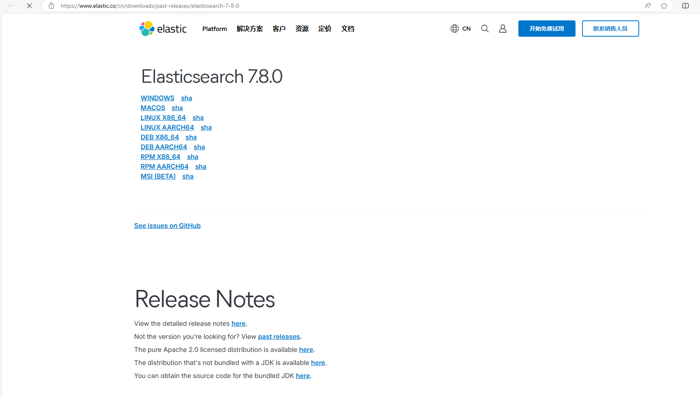
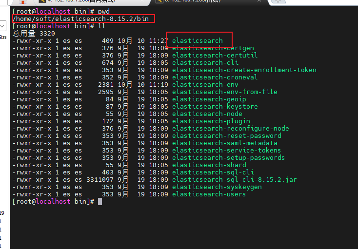
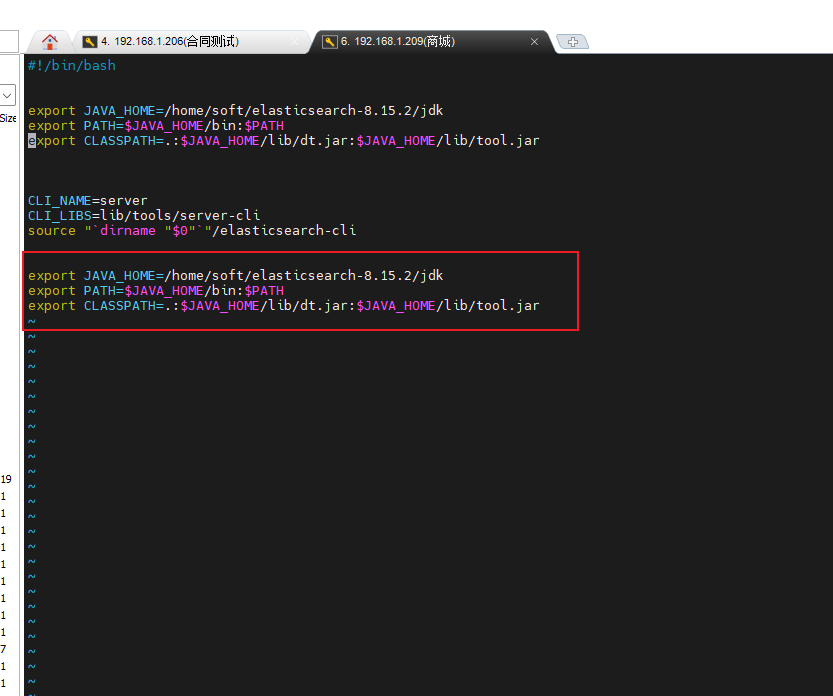
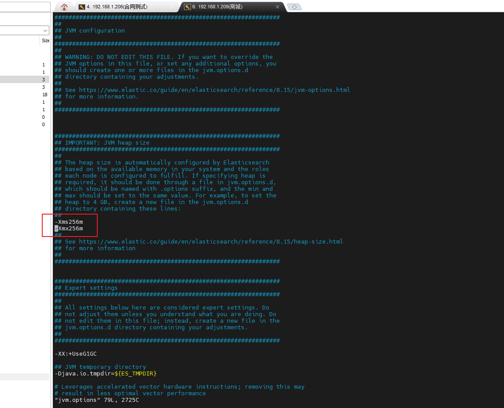
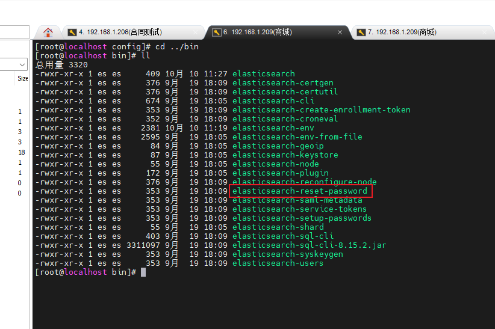
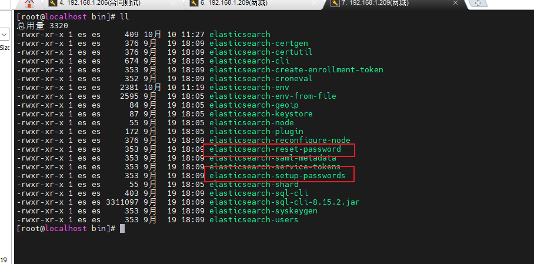
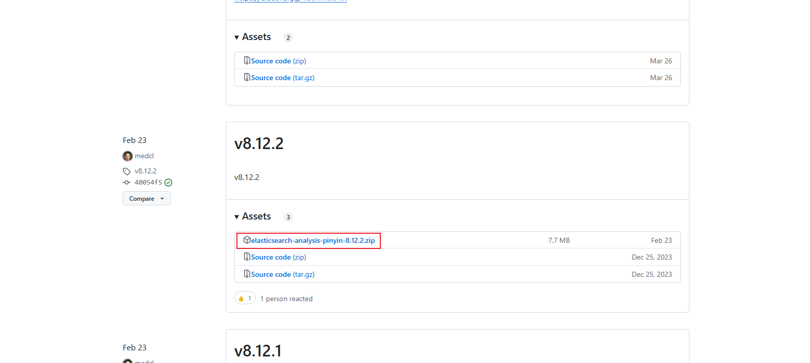
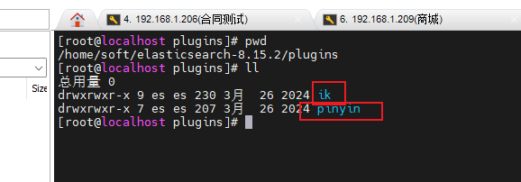

# Centos下安装Elasticsearch记录

## 1. 下载ES

下载地址：https://www.elastic.co/cn/downloads/past-releases

相应的版本对应相应地址规则，例如：https://www.elastic.co/cn/downloads/past-releases/elasticsearch-7-8-0

如图：



ES版本和jdk版本对应关系：https://www.elastic.co/cn/support/matrix#matrix_jvm

> [!warning]
>
> 需要下载和Linux系统架构一致的ES安装包

## 2. 解压tar包并放在安装的目录

## 3. 创建Linux用户

在es中`超级管理员`用户是不允许操作es的，因此需要添加其他用户来操作es

```sh
useradd es #新增 es 用户
passwd es #为 es 用户设置密码
userdel -r es #如果错了，可以删除再加
chown -R es:es /opt/module/es #文件夹所有者,即给es用户设置可操作的目录权限
```


## 4. JDK设置


ES的启动需要jdk环境，默认情况下，如果Linux系统中安装了Java环境，ES会直接去找系统的jdk。

ES自己也带有jdk，默认情况下，如果Linux系统中没有Java环境，ES会使用自己的jdk。


> [!note]
>
> 建议在启动ES时使用ES自己的jdk，因为ES版本和jdk版本是有关联的，正常情况下，Linux系统级的jdk版本是不可修改的，不能因为要使用ES就修改系统级的jdk版本。


## 5. 设置ES使用ES自己的jdk


个人尝试了三个ES版本：`8.15.1`,`8.15.2`,`7.17.18`

### 5.1  `8.x版本`

对应 `8.15.1`,`8.15.2` 版本或者说 `8.x`版本（8.x其他版本没试，只是猜测）的变化不大，设置方式如下：

进入到es安装包目录的`bin` 目录下找到`elasticsearch` 文件



编辑文件 `vim elasticsearch`，设置ES自己的jdk环境，`一定要把设置放在最下边`




```sh
# JAVA_HOME 目录需要改成自己的es的jdk目录
export JAVA_HOME=/home/soft/elasticsearch-8.15.2/jdk
export PATH=$JAVA_HOME/bin:$PATH
export CLASSPATH=.:$JAVA_HOME/lib/dt.jar:$JAVA_HOME/lib/tool.jar
```

### 5.2  对于`7.17.18` 版本

`7.17.18`版本的`elasticsearch`文件和`8.15.x`版本的`elasticsearch`文件差别很大，我也没做研究

我的环境是jdk17,没有修改jdk就可以，所以这里就不赘述了


## 6. 设置参数配置

### 6.1 设置ES配置文件(elasticsearch.yml)

位置：`ES包/config/elasticsearch.yml`

内容如下：

```yaml
# ======================== Elasticsearch Configuration =========================
#
# NOTE: Elasticsearch comes with reasonable defaults for most settings.
#       Before you set out to tweak and tune the configuration, make sure you
#       understand what are you trying to accomplish and the consequences.
#
# The primary way of configuring a node is via this file. This template lists
# the most important settings you may want to configure for a production cluster.
#
# Please consult the documentation for further information on configuration options:
# https://www.elastic.co/guide/en/elasticsearch/reference/index.html
#
# ---------------------------------- Cluster -----------------------------------
#
# Use a descriptive name for your cluster:
# 集群名称
cluster.name: elasticsearch
#
# ------------------------------------ Node ------------------------------------
#
# Use a descriptive name for the node:
# 节点名
node.name: node-1
#
# Add custom attributes to the node:
#
#node.attr.rack: r1
#
# ----------------------------------- Paths ------------------------------------
#
# Path to directory where to store the data (separate multiple locations by comma):
# 数据存放位置
path.data:  /home/soft/elasticsearch-7.17.18/data
#
# Path to log files:
# 日志存放位置
path.logs: /home/soft/elasticsearch-7.17.18/logs
#
# ----------------------------------- Memory -----------------------------------
#
# Lock the memory on startup:
#
#bootstrap.memory_lock: true
#
# Make sure that the heap size is set to about half the memory available
# on the system and that the owner of the process is allowed to use this
# limit.
#
# Elasticsearch performs poorly when the system is swapping the memory.
#
# ---------------------------------- Network -----------------------------------
#
# By default Elasticsearch is only accessible on localhost. Set a different
# address here to expose this node on the network:
# 设置所有机器都可以访问
network.host: 0.0.0.0
#
# By default Elasticsearch listens for HTTP traffic on the first free port it
# finds starting at 9200. Set a specific HTTP port here:
# 设置端口
http.port: 9200
#
# For more information, consult the network module documentation.
#
# --------------------------------- Discovery ----------------------------------
#
# Pass an initial list of hosts to perform discovery when this node is started:
# The default list of hosts is ["127.0.0.1", "[::1]"]
#
#discovery.seed_hosts: ["host1", "host2"]
#
# Bootstrap the cluster using an initial set of master-eligible nodes:
#
cluster.initial_master_nodes: ["node-1"]
#
# For more information, consult the discovery and cluster formation module documentation.
#
# ---------------------------------- Various -----------------------------------
#
# Require explicit names when deleting indices:
#
#action.destructive_requires_name: true
#
# ---------------------------------- Security ----------------------------------
#
#                                 *** WARNING ***
#
# Elasticsearch security features are not enabled by default.
# These features are free, but require configuration changes to enable them.
# This means that users don’t have to provide credentials and can get full access
# to the cluster. Network connections are also not encrypted.
#
# To protect your data, we strongly encourage you to enable the Elasticsearch security features. 
# Refer to the following documentation for instructions.
#
# https://www.elastic.co/guide/en/elasticsearch/reference/7.16/configuring-stack-security.html


# 开启es跨域
http.cors.enabled: true
http.cors.allow-origin: "*"
http.cors.allow-headers: Authorization
# # # 开启安全控制
xpack.security.enabled: true
xpack.security.transport.ssl.enabled: true
```


### 6.2 修改jvm启动参数

防止撑满内存

位置：`es包/config/jvm.options`




### 6.3 修改/etc/security/limits.conf

vim /etc/security/limits.conf

```sh
# 在文件末尾中增加下面内容
# 每个进程可以打开的文件数的限制
es soft nofile 65536
es hard nofile 65536
```


### 6.4 修改/etc/security/limits.d/20-nproc.conf

vim /etc/security/limits.d/20-nproc.conf

```sh
# 在文件末尾中增加下面内容
# 每个进程可以打开的文件数的限制
es soft nofile 65536
es hard nofile 65536
# 操作系统级别对每个用户创建的进程数的限制
* hard nproc 4096
# 注： * 带表 Linux 所有用户名称
```


### 6.5 修改/etc/sysctl.conf

```sh
# 在文件中增加下面内容
# 一个进程可以拥有的 VMA(虚拟内存区域)的数量,默认值为 65536
vm.max_map_count=655360
```


### 6.6 重新加载或重启Linux系统

```sh
sysctl -p
```


## 7. 启动

进入：`es包/bin`

```sh
# 切换到上面添加的es用户
su es

# 非后台启动，关闭命令行则es关闭,建议安装测试阶段使用该方式，也容易查看报错记录
./elasticsearch

# 后台启动
./elasticsearch -d

```


## 8. 设置或修改 ES密码


进入 `es包/bin`

7.x版本和8.x版本有些不同，7.x版本没有设置密码只有重置密码

7.x




8.x




设置密码方式：

```sh
# 设置密码
 ./elasticsearch-setup-passwords interactive

# 重置密码
 ./elasticsearch-reset-passwords interactive
```


## 9. 访问测试是否成功

使用默认的9200（上面配置文件设置的端口）端口访问，如下则表示启动成功


## 10. 安装插件


> [!warning]
>
> ES插件需要和ES版本号相对应


拼音插件地址：https://github.com/infinilabs/analysis-pinyin/releases
分词插件地址：https://github.com/infinilabs/analysis-ik/releases

下载这个zip




然后解压放到 `es包/plugins`下，重启es即可




