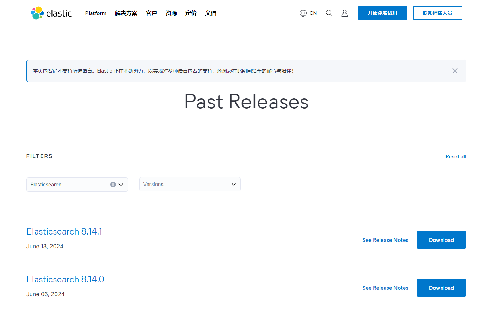
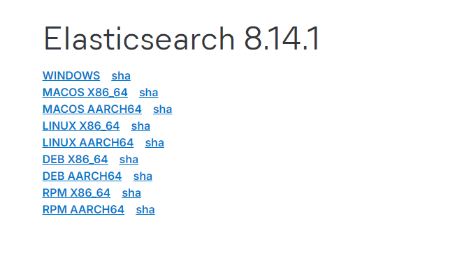
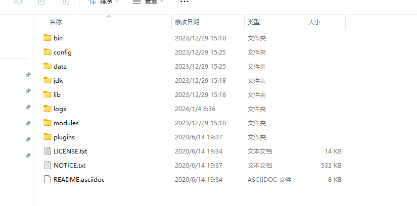
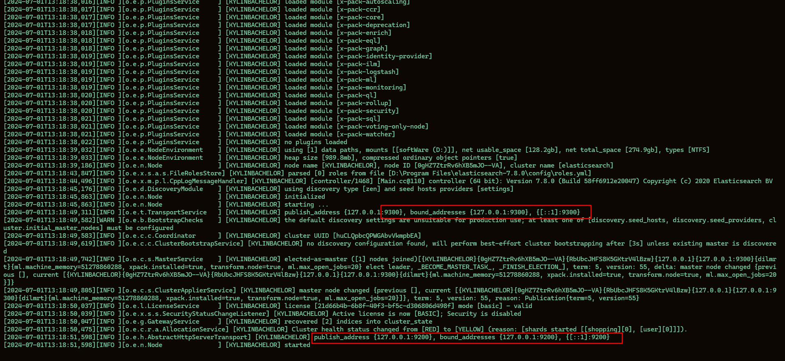
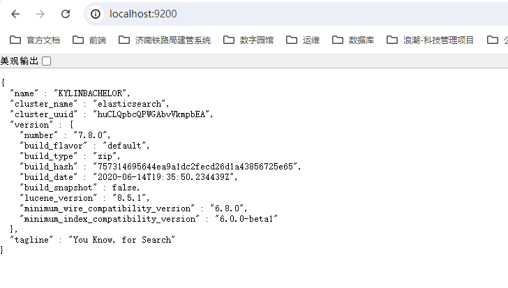

# Elasticsearch

### 作者:丛培通

### 时间:2024-07-01

**Elaticsearch，简称为 ES，ES 是一个开源的高扩展的分布式全文搜索引擎，是整个 Elastic Stack 技术栈的核心。它可以近乎实时的存储、检索数据；本身扩展性很好，可以扩展到上百台服务器，处理 PB 级别的数据。**

##　１.　入门

### 1.1 说明

+ 官方地址:https://www.elastic.co/cn/
+ 下载地址:https://www.elastic.co/cn/downloads/past-releases#elasticsearch



Elasticsearch 支持 Windows, Macos,Linux




### 1.2 Windows安装

Windows安装比较简单,几乎是开箱即用,下载好后目录结构如下:




目录说明:

| 目录    | 含义           |
| ------- | -------------- |
| bin     | 可执行脚本目录 |
| config  | 配置目录       |
| jdk     | 内置jdk目录    |
| lib     | 类库           |
| log     | 日志目录       |
| modules | 模块目录       |
| plugins | 插件目录       |


解压之后进入 **bin** 目录,找到 **elasticsearch.bat** 文件双击启动服务



> [!warning]
>
> **9300** 端口为 **Elasticsearch** 集群间组件的通信端口，**9200** 端口为浏览器访问的 http 协议 **RESTful** 口。


打开浏览器测试结果如下:




### 1.3 Linux下安装

#### 1.3.1 下载地址

```sh
https://www.elastic.co/cn/downloads/past-releases/elasticsearch-7-14-0
```

#### 1.3.2 步骤

1. 检查jdk版本 建议 7.14.0 使用jdk17版本
2. 上传至服务器并解压
3. 更改文件夹所属者,不能用root用户启动,需用普通用户启动

### 1.4 存在的以下问题

1. Elasticsearch 是 Java 开发的,且 7.8 版本的 ES 需要 JDK 版本 1.8 以上，默认安装包带有 jdk 环境，如果系统配置 JAVA_HOME，那么使用系统默认的 JDK，如果没有配置使用自带的 JDK，一般建议使用系统配置的 JDK。

2.  双击启动窗口闪退, 通过路径追踪访问错误,如果是 **空间不足** 请修改 **config/jvm.options** 配置文件.

    ```options 
    # Xms represents the initial size of total heap space
    # Xmx represents the maximum size of total heap space
    
    -Xms1g
    -Xmx1g
    
    
    ## GC configuration
    8-13:-XX:+UseConcMarkSweepGC
    8-13:-XX:CMSInitiatingOccupancyFraction=75
    8-13:-XX:+UseCMSInitiatingOccupancyOnly
    
    ## 解决中文乱码问题
    -Dfile.encoding=GBK
    ```

### 1.5 jdk版本说明

| elasticsearch版本                                 | jdk版本       |
| ------------------------------------------------- | ------------- |
| 7.14.0(由于pigx框架给的是这个版本,所以我们用这个) | 17.0.1        |
| 8.14.1(目前最新版本,该版本需要登录校验)           | 22            |
| 7.8.0                                             | 1.8版本就可以 |


## 2. 基本操作

### 2.1 RESTful

REST 指的是一组架构约束条件和原则。满足这些约束条件和原则的应用程序或设计就是 RESTful。Web 应用程序最重要的 REST 原则是，客户端和服务器之间的交互在请求之间是无状态的。从客户端到服务器的每个请求都必须包含理解请求所必需的信息。如果服务器在请求之间的任何时间点重启，客户端不会得到通知。此外，无状态请求可以由任何可用服务器回答，这十分适合云计算之类的环境。客户端可以缓存数据以改进性能。

在服务器端，应用程序状态和功能可以分为各种资源。资源是一个有趣的概念实体，它向客户端公开。资源的例子有：应用程序对象、数据库记录、算法等等。每个资源都使用 URI (Universal Resource Identifier) 得到一个唯一的地址。所有资源都共享统一的接口，以便在客户端和服务器之间传输状态。使用的是标准的 HTTP 方法，比如 GET、PUT、POST 和DELETE。

在 REST 样式的 Web 服务中，每个资源都有一个地址。资源本身都是方法调用的目标，方法列表对所有资源都是一样的。这些方法都是标准方法，包括 HTTP GET、POST、PUT、DELETE，还可能包括 HEAD 和 OPTIONS。简单的理解就是，如果想要访问互联网上的资源，就必须向资源所在的服务器发出请求，请求体中必须包含资源的网络路径，以及对资源进行的操作(增删改查)。