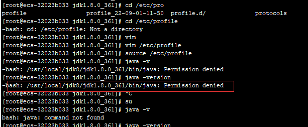

#### 参考文章

https://blog.csdn.net/job_csdn/article/details/128136490

#### 1. 下载Linux版本的JDK1.8

 https://www.oracle.com/java/technologies/downloads/#java8

一定要下载***对应操作架构***的JDK，否则会报错：可通过uname -a 命令查看


#### 2. 将下载好的安装包xx.tar.gz放到安装目录

```sh
# 例如放到如下目录
/usr/local/jdk8
```

#### 3. 配置环境变量

```sh
# 1. 打开/etc/profile文件
vim /etc/profile
# 2. 配置环境变量
export JAVA_HOME = /usr/local/jdk8/jdk1.8.0_361
export PATH = ${JAVA_HOME}/bin:$PATH
export CLASSPATH = .:${JAVA_HOME}/lib
```

#### 4. 测试

```SH
java -version
```


如果出现如下情况




需要设置文件/目录权限

```sh
# 提升权限命令  【用于改变文件或目录的访问权限】
chmod 775 [提示Permission denied的目录路径] 
# 权限详解 ： https://developer.aliyun.com/article/19350
```

再次测试

```sh
java -version;
java;
javac;
```
