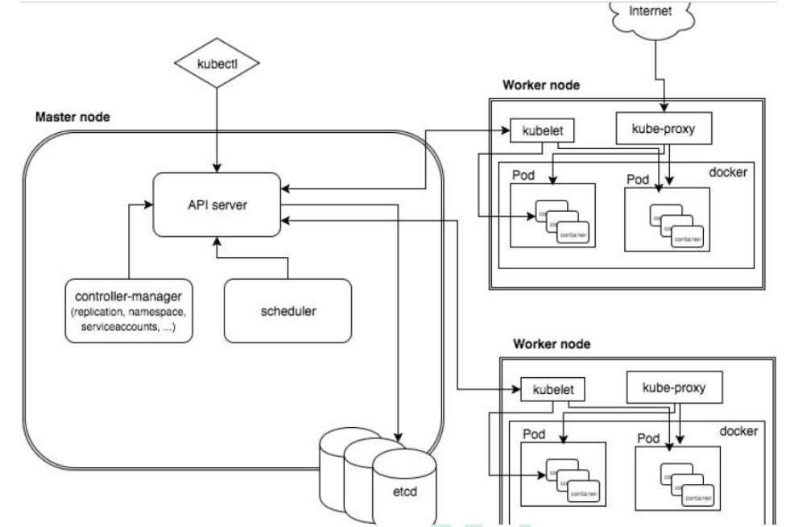

# k8s集群架构组件

## 1. 集群架构节点角色功能

### 1.1 Master Node（主控节点）

k8s集群控制节点，对集群进行调度管理，接受集群外的用户去集群操作请求。

Master Node 由 API Server、Scheduler、ClusterState Store（ETCD 数据库）和 Controller ManagerServer 所组成。

#### 1.1.1 API Server

集群统一入口，以Restful方式交给etcd存储。

#### 1.1.2 Scheduler

做节点调度，选择Node节点进行一个部署。

#### 1.1.3 Controller ManagerServer

做资源的控制，处理集群中常规的后台任务，一个资源对应一个控制器。

####  1.1.4 ETCD

主要做数据存储，用于保存集群相关的数据。

### 1.2 Work Node（工作节点）

集群工作节点，运行用户业务应用容器；

Worker Node 包含 kubelet、kube-proxy 和 ContainerRuntime;

#### 1.2.1 kubelet

管理本机容器，生命周期。。。。。

#### 1.2.2 kube-proxy

提供网络代理、负载均衡。

## 2. 核心概念

### 2.1 pod

+ k8s中最小的部署单元
+ 一组容器的集合
+ 共享网络的
+ 生命周期时短暂的

### 2.2 Controller

创建pod

+ 确保预期的pod副本数量
+ 无状态应用部署
+ 有状态的应用部署
+ 确保所有的node运行同一个pod
+ 一次性任务和定时任务

### 2.3 Service

+ 定义一组pod的访问规则
+ Master
