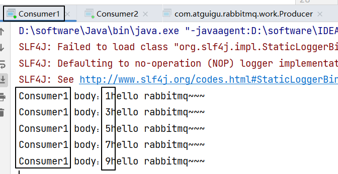
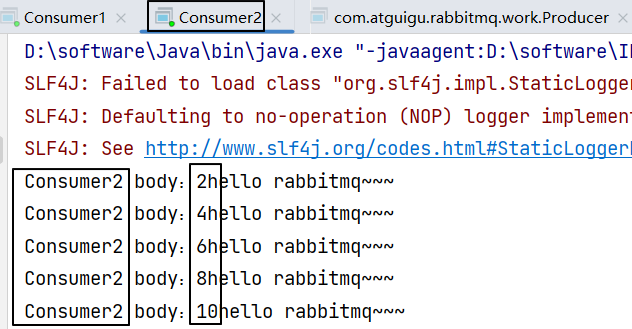

1. 生产者只有一个。
2. 发送一个消息。
3. 消费者只有一个，消息也只能被这个消费者消费。
4. 多个消费者监听同一个队列，则各消费者之间对同一个消息是竞争关系，谁抢到是谁的。
5. Work Queues 工作模式适用于任务较重或任务较多的情况，多消费者分摊任务可以提高消息处理的效率。
# 一、生产者代码
## 1、封装工具类
```java
package com.atguigu.rabbitmq.util;  
  
import com.rabbitmq.client.Connection;  
import com.rabbitmq.client.ConnectionFactory;  
  
public class ConnectionUtil {  
  
    public static final String HOST_ADDRESS = "192.168.200.100";  
  
    public static Connection getConnection() throws Exception {  
  
        // 定义连接工厂  
        ConnectionFactory factory = new ConnectionFactory();  
  
        // 设置服务地址  
        factory.setHost(HOST_ADDRESS);  
  
        // 端口  
        factory.setPort(5672);  
  
        //设置账号信息，用户名、密码、vhost  
        factory.setVirtualHost("/");  
        factory.setUsername("guest");  
        factory.setPassword("123456");  
  
        // 通过工程获取连接  
        Connection connection = factory.newConnection();  
  
        return connection;  
    }  
  
  
  
    public static void main(String[] args) throws Exception {  
  
        Connection con = ConnectionUtil.getConnection();  
  
        // amqp://guest@192.168.200.100:5672/  
        System.out.println(con);  
  
        con.close();  
  
    }  
  
}
```


## 2、编写代码

```java
package com.atguigu.rabbitmq.work;  
  
import com.atguigu.rabbitmq.util.ConnectionUtil;  
import com.rabbitmq.client.Channel;  
import com.rabbitmq.client.Connection;  
  
public class Producer {  
  
    public static final String QUEUE_NAME = "work_queue";  
  
    public static void main(String[] args) throws Exception {  
  
        Connection connection = ConnectionUtil.getConnection();  
  
        Channel channel = connection.createChannel();  
  
        channel.queueDeclare(QUEUE_NAME,true,false,false,null);  
  
        for (int i = 1; i <= 10; i++) {  
  
            String body = i+"hello rabbitmq~~~";  
  
            channel.basicPublish("",QUEUE_NAME,null,body.getBytes());  
  
        }  
  
        channel.close();  
  
        connection.close();  
  
    }  
  
}
```


## 3、发送消息效果


# 二、消费者代码

## 1、编写代码

创建Consumer1和Consumer2。Consumer2只是类名和打印提示不同，代码完全一样。
```java
package com.atguigu.rabbitmq.work;  
  
import com.atguigu.rabbitmq.util.ConnectionUtil;  
import com.rabbitmq.client.*;  
  
import java.io.IOException;  
  
public class Consumer1 {  
  
    static final String QUEUE_NAME = "work_queue";  
  
    public static void main(String[] args) throws Exception {  
  
        Connection connection = ConnectionUtil.getConnection();  
  
        Channel channel = connection.createChannel();  
  
        channel.queueDeclare(QUEUE_NAME,true,false,false,null);  
  
        Consumer consumer = new DefaultConsumer(channel){  
  
            @Override  
            public void handleDelivery(String consumerTag, Envelope envelope, AMQP.BasicProperties properties, byte[] body) throws IOException {  
  
                System.out.println("Consumer1 body："+new String(body));  
  
            }  
  
        };  
  
        channel.basicConsume(QUEUE_NAME,true,consumer);  
  
    }  
  
}
```

**注意**：运行的时候先启动两个消费端程序，然后再启动生产者端程序。<br/>
如果已经运行过生产者程序，则手动把work_queue队列删掉。<br/>


## 2、运行效果

最终两个消费端程序竞争结果如下：<br/>



<br/>

