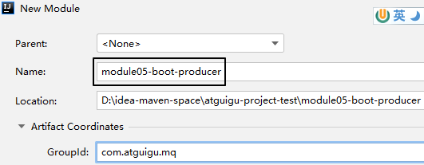

## 1、消费者工程

### ①创建module


### ②配置POM

```xml
<parent>
    <groupId>org.springframework.boot</groupId>
    <artifactId>spring-boot-starter-parent</artifactId>
    <version>3.1.5</version>
</parent>

<dependencies>
    <dependency>
        <groupId>org.springframework.boot</groupId>
        <artifactId>spring-boot-starter-amqp</artifactId>
    </dependency>
    <dependency>
        <groupId>org.springframework.boot</groupId>
        <artifactId>spring-boot-starter-web</artifactId>
    </dependency>
    <dependency>
        <groupId>org.projectlombok</groupId>
        <artifactId>lombok</artifactId>
    </dependency>
</dependencies>
```


### ③YAML

增加日志打印的配置：

```yaml
spring:
  rabbitmq:
    host: 192.168.200.100
    port: 5672
    username: guest
    password: 123456
    virtual-host: /
logging:
  level:
    com.atguigu.mq.listener.MyMessageListener: info
```


### ④主启动类

仿照生产者工程的主启动类，改一下类名即可

```java
package com.atguigu.mq;

import org.springframework.boot.SpringApplication;
import org.springframework.boot.autoconfigure.SpringBootApplication;

@SpringBootApplication
public class RabbitMQConsumerMainType {

    public static void main(String[] args) {
        SpringApplication.run(RabbitMQConsumerMainType.class, args);
    }

}
```


### ⑤监听器

```java
package com.atguigu.mq.listener;

import lombok.extern.slf4j.Slf4j;
import com.rabbitmq.client.Channel;
import org.springframework.amqp.core.Message;
import org.springframework.amqp.rabbit.annotation.Exchange;
import org.springframework.amqp.rabbit.annotation.Queue;
import org.springframework.amqp.rabbit.annotation.QueueBinding;
import org.springframework.amqp.rabbit.annotation.RabbitListener;
import org.springframework.stereotype.Component;

@Component
@Slf4j
public class MyMessageListener {
  
    public static final String EXCHANGE_DIRECT = "exchange.direct.order";  
    public static final String ROUTING_KEY = "order";  
    public static final String QUEUE_NAME  = "queue.order";  
  
    @RabbitListener(bindings = @QueueBinding(
            value = @Queue(value = QUEUE_NAME, durable = "true"),
            exchange = @Exchange(value = EXCHANGE_DIRECT),
            key = {ROUTING_KEY}
    ))
    public void processMessage(String dateString,
                               Message message,
                               Channel channel) {
        log.info(dateString);
    }
  
}
```


## 2、@RabbitListener注解属性对比

### ①bindings属性

- 表面作用：
  - 指定交换机和队列之间的绑定关系
  - 指定当前方法要监听的队列
- 隐藏效果：如果RabbitMQ服务器上没有这里指定的交换机和队列，那么框架底层的代码会创建它们


### ②queues属性

```java
@RabbitListener(queues = {QUEUE_ATGUIGU})
```

- 作用：指定当前方法要监听的队列
- <span style="color:blue;font-weight:bolder;">注意</span>：此时框架不会创建相关交换机和队列，必须提前创建好


## 3、生产者工程

### ①创建module




### ②配置POM

```xml
<parent>
    <groupId>org.springframework.boot</groupId>
    <artifactId>spring-boot-starter-parent</artifactId>
    <version>3.1.5</version>
</parent>

<dependencies>
    <dependency>
        <groupId>org.springframework.boot</groupId>
        <artifactId>spring-boot-starter-amqp</artifactId>
    </dependency>
    <dependency>
        <groupId>org.springframework.boot</groupId>
        <artifactId>spring-boot-starter-test</artifactId>
    </dependency>
</dependencies>
```


### ③YAML

```yaml
spring: 
  rabbitmq: 
    host: 192.168.200.100
    port: 5672 
    username: guest 
    password: 123456 
    virtual-host: /
```


### ④主启动类

```java
package com.atguigu.mq;  
  
import org.springframework.boot.SpringApplication;  
import org.springframework.boot.autoconfigure.SpringBootApplication;  
  
@SpringBootApplication
public class RabbitMQProducerMainType {

    public static void main(String[] args) {
        SpringApplication.run(RabbitMQProducerMainType.class, args);  
    }

}
```


### ⑤测试程序

```java
package com.atguigu.mq.test;
  
import org.junit.jupiter.api.Test;
import org.springframework.amqp.rabbit.core.RabbitTemplate;
import org.springframework.beans.factory.annotation.Autowired;
import org.springframework.boot.test.context.SpringBootTest;

@SpringBootTest  
public class RabbitMQTest {  
  
    public static final String EXCHANGE_DIRECT = "exchange.direct.order";  
    public static final String ROUTING_KEY = "order";
  
    @Autowired  
    private RabbitTemplate rabbitTemplate;
  
    @Test  
    public void testSendMessage() {  
        rabbitTemplate.convertAndSend(  
                EXCHANGE_DIRECT,   
                ROUTING_KEY,   
                "Hello atguigu");  
    }  
  
}
```


