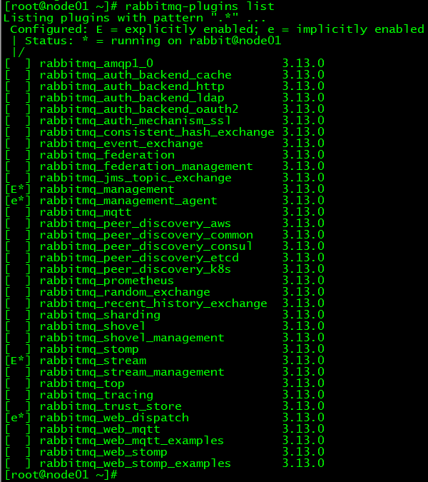
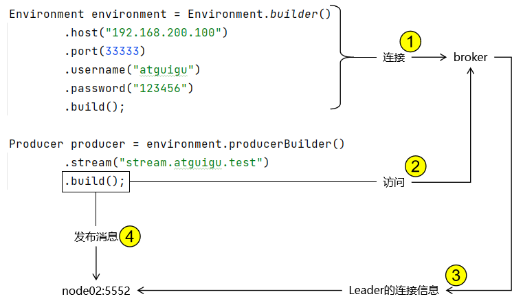
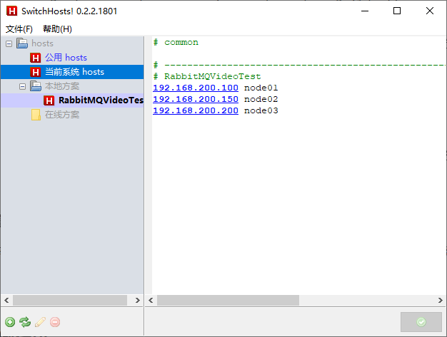

# 一、启用插件

> <span style="color:blue;font-weight:bolder;">说明</span>：只有启用了Stream插件，才能使用流式队列的完整功能

在集群每个节点中依次执行如下操作：

```shell
# 启用Stream插件
rabbitmq-plugins enable rabbitmq_stream

# 重启rabbit应用
rabbitmqctl stop_app
rabbitmqctl start_app

# 查看插件状态
rabbitmq-plugins list
```




# 二、负载均衡

在文件/etc/haproxy/haproxy.cfg末尾追加：

```text
frontend rabbitmq_stream_frontend
bind 192.168.200.100:33333
mode tcp
default_backend rabbitmq_stream_backend

backend rabbitmq_stream_backend
mode tcp
balance roundrobin
server rabbitmq1 192.168.200.100:5552 check
server rabbitmq2 192.168.200.150:5552 check
server rabbitmq3 192.168.200.200:5552 check
```


# 三、Java代码

## 1、引入依赖
Stream 专属 Java 客户端官方网址：https://github.com/rabbitmq/rabbitmq-stream-java-client

<br/>

Stream 专属 Java 客户端官方文档网址：https://rabbitmq.github.io/rabbitmq-stream-java-client/stable/htmlsingle/

```xml
<dependencies>
    <dependency>
        <groupId>com.rabbitmq</groupId>
        <artifactId>stream-client</artifactId>
        <version>0.15.0</version>
    </dependency>

    <dependency>
        <groupId>org.slf4j</groupId>
        <artifactId>slf4j-api</artifactId>
        <version>1.7.30</version>
    </dependency>
    <dependency>
        <groupId>ch.qos.logback</groupId>
        <artifactId>logback-classic</artifactId>
        <version>1.2.3</version>
    </dependency>
</dependencies>
```


## 2、创建Stream

>  <span style="color:blue;font-weight:bolder;">说明</span>：不需要创建交换机


### ①代码方式创建

```java
Environment environment = Environment.builder()
        .host("192.168.200.100")
        .port(33333)
        .username("atguigu")
        .password("123456")
        .build();

environment.streamCreator().stream("stream.atguigu.test2").create();

environment.close();
```


### ②ManagementUI创建


## 3、生产者端程序

### ①内部机制说明

#### [1]官方文档

> Internally, the `Environment` will query the broker to find out about the topology of the stream and will create or re-use a connection to publish to the leader node of the stream.

翻译：

> 在内部，Environment将查询broker以了解流的拓扑结构，并将创建或重用连接以发布到流的 leader 节点。


#### [2]解析

- 在 Environment 中封装的连接信息仅负责连接到 broker
- Producer 在构建对象时会访问 broker 拉取集群中 Leader 的连接信息
- 将来实际访问的是集群中的 Leader 节点
- Leader 的连接信息格式是：节点名称:端口号




#### [3]配置

为了让本机的应用程序知道 Leader 节点名称对应的 IP 地址，我们需要在本地配置 hosts 文件，建立从节点名称到 IP 地址的映射关系




### ②示例代码

```java
Environment environment = Environment.builder()
        .host("192.168.200.100")
        .port(33333)
        .username("atguigu")
        .password("123456")
        .build();

Producer producer = environment.producerBuilder()
        .stream("stream.atguigu.test")
        .build();

byte[] messagePayload = "hello rabbit stream".getBytes(StandardCharsets.UTF_8);

CountDownLatch countDownLatch = new CountDownLatch(1);

producer.send(
        producer.messageBuilder().addData(messagePayload).build(),
        confirmationStatus -> {
            if (confirmationStatus.isConfirmed()) {
                System.out.println("[生产者端]the message made it to the broker");
            } else {
                System.out.println("[生产者端]the message did not make it to the broker");
            }

            countDownLatch.countDown();
        });

countDownLatch.await();

producer.close();

environment.close();
```


## 4、消费端程序

```java
Environment environment = Environment.builder()
        .host("192.168.200.100")
        .port(33333)
        .username("atguigu")
        .password("123456")
        .build();

environment.consumerBuilder()
        .stream("stream.atguigu.test")
        .name("stream.atguigu.test.consumer")
        .autoTrackingStrategy()
        .builder()
        .messageHandler((offset, message) -> {
            byte[] bodyAsBinary = message.getBodyAsBinary();
            String messageContent = new String(bodyAsBinary);
            System.out.println("[消费者端]messageContent = " + messageContent + " Offset=" + offset.offset());
        })
        .build();
```


# 四、指定偏移量消费

## 1、偏移量


## 2、官方文档说明

> The offset is the place in the stream where the consumer starts consuming from. The possible values for the offset parameter are the following:
>
> - OffsetSpecification.<span style="color:blue;font-weight:bolder;">first()</span>: starting from the first available offset. If the stream has not been [truncated](https://rabbitmq.github.io/rabbitmq-stream-java-client/stable/htmlsingle/#limiting-the-size-of-a-stream), this means the beginning of the stream (offset 0).
> - OffsetSpecification.<span style="color:blue;font-weight:bolder;">last()</span>: starting from the end of the stream and returning the last [chunk](https://rabbitmq.github.io/rabbitmq-stream-java-client/stable/htmlsingle/#chunk-definition) of messages immediately (if the stream is not empty).
> - OffsetSpecification.<span style="color:blue;font-weight:bolder;">next()</span>: starting from the next offset to be written. Contrary to `OffsetSpecification.last()`, consuming with `OffsetSpecification.next()` will not return anything if no-one is publishing to the stream. The broker will start sending messages to the consumer when messages are published to the stream.
> - OffsetSpecification.<span style="color:blue;font-weight:bolder;">offset(offset)</span>: starting from the specified offset. 0 means consuming from the beginning of the stream (first messages). The client can also specify any number, for example the offset where it left off in a previous incarnation of the application.
> - OffsetSpecification.<span style="color:blue;font-weight:bolder;">timestamp(timestamp)</span>: starting from the messages stored after the specified timestamp. Note consumers can receive messages published a bit before the specified timestamp. Application code can filter out those messages if necessary.


## 3、指定Offset消费

```java
Environment environment = Environment.builder()
        .host("192.168.200.100")
        .port(33333)
        .username("atguigu")
        .password("123456")
        .build();

CountDownLatch countDownLatch = new CountDownLatch(1);

Consumer consumer = environment.consumerBuilder()
        .stream("stream.atguigu.test")
        .offset(OffsetSpecification.first())
        .messageHandler((offset, message) -> {
            byte[] bodyAsBinary = message.getBodyAsBinary();
            String messageContent = new String(bodyAsBinary);
            System.out.println("[消费者端]messageContent = " + messageContent);
            countDownLatch.countDown();
        })
        .build();

countDownLatch.await();

consumer.close();
```


## 4、对比

- autoTrackingStrategy 方式：始终监听Stream中的新消息（狗狗看家，忠于职守）
- 指定偏移量方式：针对指定偏移量的消息消费之后就停止（狗狗叼飞盘，叼回来就完）
