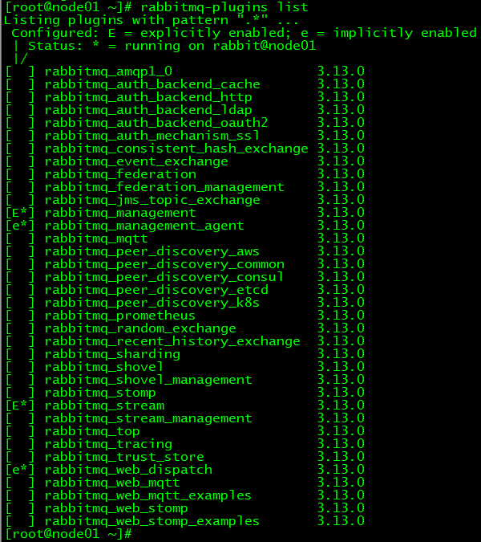
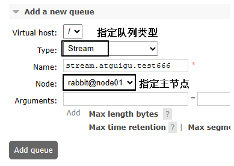
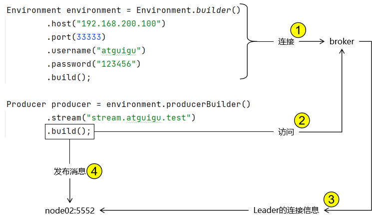
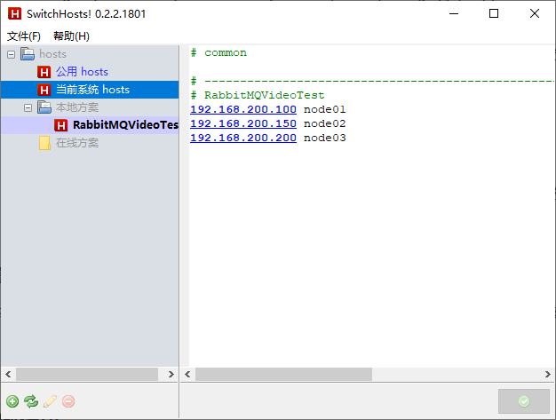
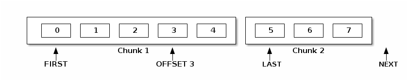

‌RabbitMQ的Stream队列‌是一种高性能、可持久化、可复制的队列类型，特别适用于需要高性能和大量消息处理的场景。Stream队列的设计目标是提供高吞吐量、非破坏性消费、只追加写入的日志功能。

Stream队列的特点：

1. ‌高性能‌：Stream队列设计以性能为主要目标，能够处理大量消息而不影响系统性能。
2. 可持久化‌：消息默认是持久化的，确保在系统重启后消息不会丢失。
3. ‌可复制‌：支持消息的复制，确保在多个节点之间同步，提高系统的可靠性和可用性。
4. 非破坏性消费‌：允许消费者重复消费同一消息，适用于需要消息重试或重新处理的场景。
5. 只追加写入‌：消息只能追加到日志的末尾，不支持删除或修改，确保日志的一致性和完整性。

使用场景
1. 大型扇形分叉‌：当需要将相同的消息传递给多个订阅者时，Stream队列允许任意数量的使用者以非破坏性的方式消费来自同一队列的相同消息，无需为每个消费者绑定一个专用队列。
2. 重放（时间旅行）‌：由于Stream队列支持非破坏性消费，消费者可以在日志中的任何点连接并从那里读取消息，实现消息的重放功能。
3.  高吞吐量‌：适用于需要高吞吐量的场景，能够处理大量消息而不影响系统性能。
4.  大量积压工作‌：适用于需要处理大量积压工作的场景，Stream队列能够保留未过期的消息，直到被消费


# 一、启用插件

> <span style="color:blue;font-weight:bolder;">说明</span>：只有启用了Stream插件，才能使用流式队列的完整功能

在集群每个节点中依次执行如下操作：

```shell
# 启用Stream插件
rabbitmq-plugins enable rabbitmq_stream

# 重启rabbit应用
rabbitmqctl stop_app
rabbitmqctl start_app

# 查看插件状态
rabbitmq-plugins list
```




# 二、负载均衡

在文件/etc/haproxy/haproxy.cfg末尾追加：

```text
frontend rabbitmq_stream_frontend
bind 192.168.200.100:33333
mode tcp
default_backend rabbitmq_stream_backend

backend rabbitmq_stream_backend
mode tcp
balance roundrobin
server rabbitmq1 192.168.200.100:5552 check
server rabbitmq2 192.168.200.150:5552 check
server rabbitmq3 192.168.200.200:5552 check
```


# 三、Java代码

## 1、引入依赖
Stream 专属 Java 客户端官方网址：https://github.com/rabbitmq/rabbitmq-stream-java-client

<br/>

Stream 专属 Java 客户端官方文档网址：https://rabbitmq.github.io/rabbitmq-stream-java-client/stable/htmlsingle/

```xml
<dependencies>
    <dependency>
        <groupId>com.rabbitmq</groupId>
        <artifactId>stream-client</artifactId>
        <version>0.15.0</version>
    </dependency>

    <dependency>
        <groupId>org.slf4j</groupId>
        <artifactId>slf4j-api</artifactId>
        <version>1.7.30</version>
    </dependency>
    <dependency>
        <groupId>ch.qos.logback</groupId>
        <artifactId>logback-classic</artifactId>
        <version>1.2.3</version>
    </dependency>
</dependencies>
```


## 2、创建Stream

>  <span style="color:blue;font-weight:bolder;">说明</span>：不需要创建交换机


### ①代码方式创建

```java
Environment environment = Environment.builder()
        .host("192.168.200.100")
        .port(33333)
        .username("atguigu")
        .password("123456")
        .build();

environment.streamCreator().stream("stream.atguigu.test2").create();

environment.close();
```


### ②ManagementUI创建



## 3、生产者端程序

### ①内部机制说明

#### [1]官方文档

> Internally, the `Environment` will query the broker to find out about the topology of the stream and will create or re-use a connection to publish to the leader node of the stream.

翻译：

> 在内部，Environment将查询broker以了解流的拓扑结构，并将创建或重用连接以发布到流的 leader 节点。


#### [2]解析

- 在 Environment 中封装的连接信息仅负责连接到 broker
- Producer 在构建对象时会访问 broker 拉取集群中 Leader 的连接信息
- 将来实际访问的是集群中的 Leader 节点
- Leader 的连接信息格式是：节点名称:端口号




#### [3]配置

为了让本机的应用程序知道 Leader 节点名称对应的 IP 地址，我们需要在本地配置 hosts 文件，建立从节点名称到 IP 地址的映射关系




### ②示例代码

```java
Environment environment = Environment.builder()
        .host("192.168.200.100")
        .port(33333)
        .username("atguigu")
        .password("123456")
        .build();

Producer producer = environment.producerBuilder()
        .stream("stream.atguigu.test")
        .build();

byte[] messagePayload = "hello rabbit stream".getBytes(StandardCharsets.UTF_8);

CountDownLatch countDownLatch = new CountDownLatch(1);

producer.send(
        producer.messageBuilder().addData(messagePayload).build(),
        confirmationStatus -> {
            if (confirmationStatus.isConfirmed()) {
                System.out.println("[生产者端]the message made it to the broker");
            } else {
                System.out.println("[生产者端]the message did not make it to the broker");
            }

            countDownLatch.countDown();
        });

countDownLatch.await();

producer.close();

environment.close();
```


## 4、消费端程序

```java
Environment environment = Environment.builder()
        .host("192.168.200.100")
        .port(33333)
        .username("atguigu")
        .password("123456")
        .build();

environment.consumerBuilder()
        .stream("stream.atguigu.test")
        .name("stream.atguigu.test.consumer")
        .autoTrackingStrategy()
        .builder()
        .messageHandler((offset, message) -> {
            byte[] bodyAsBinary = message.getBodyAsBinary();
            String messageContent = new String(bodyAsBinary);
            System.out.println("[消费者端]messageContent = " + messageContent + " Offset=" + offset.offset());
        })
        .build();
```


# 四、指定偏移量消费

## 1、偏移量




## 2、官方文档说明

> The offset is the place in the stream where the consumer starts consuming from. The possible values for the offset parameter are the following:
>
> - OffsetSpecification.<span style="color:blue;font-weight:bolder;">first()</span>: starting from the first available offset. If the stream has not been [truncated](https://rabbitmq.github.io/rabbitmq-stream-java-client/stable/htmlsingle/#limiting-the-size-of-a-stream), this means the beginning of the stream (offset 0).
> - OffsetSpecification.<span style="color:blue;font-weight:bolder;">last()</span>: starting from the end of the stream and returning the last [chunk](https://rabbitmq.github.io/rabbitmq-stream-java-client/stable/htmlsingle/#chunk-definition) of messages immediately (if the stream is not empty).
> - OffsetSpecification.<span style="color:blue;font-weight:bolder;">next()</span>: starting from the next offset to be written. Contrary to `OffsetSpecification.last()`, consuming with `OffsetSpecification.next()` will not return anything if no-one is publishing to the stream. The broker will start sending messages to the consumer when messages are published to the stream.
> - OffsetSpecification.<span style="color:blue;font-weight:bolder;">offset(offset)</span>: starting from the specified offset. 0 means consuming from the beginning of the stream (first messages). The client can also specify any number, for example the offset where it left off in a previous incarnation of the application.
> - OffsetSpecification.<span style="color:blue;font-weight:bolder;">timestamp(timestamp)</span>: starting from the messages stored after the specified timestamp. Note consumers can receive messages published a bit before the specified timestamp. Application code can filter out those messages if necessary.


## 3、指定Offset消费

```java
Environment environment = Environment.builder()
        .host("192.168.200.100")
        .port(33333)
        .username("atguigu")
        .password("123456")
        .build();

CountDownLatch countDownLatch = new CountDownLatch(1);

Consumer consumer = environment.consumerBuilder()
        .stream("stream.atguigu.test")
        .offset(OffsetSpecification.first())
        .messageHandler((offset, message) -> {
            byte[] bodyAsBinary = message.getBodyAsBinary();
            String messageContent = new String(bodyAsBinary);
            System.out.println("[消费者端]messageContent = " + messageContent);
            countDownLatch.countDown();
        })
        .build();

countDownLatch.await();

consumer.close();
```


## 4、对比

- autoTrackingStrategy 方式：始终监听Stream中的新消息（狗狗看家，忠于职守）
- 指定偏移量方式：针对指定偏移量的消息消费之后就停止（狗狗叼飞盘，叼回来就完）
