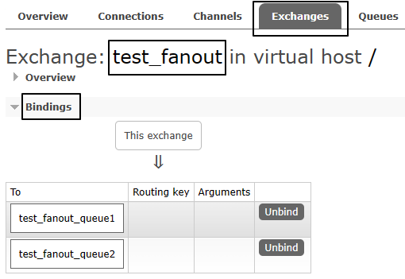

发布订阅模式中有一个交换机的概念，交换机和队列绑定，生产者生产消息发送到交换机，而交换机本身不会存储数据，通过广播的方式会将每一条消息发送到和他绑定的所有队列，由消费者去消费队列中的消息，多个消费者绑定同一个队列的消费者之间是竞争关系。


# 一、生产者代码

```java
package com.atguigu.rabbitmq.fanout;  
  
import com.atguigu.rabbitmq.util.ConnectionUtil;  
import com.rabbitmq.client.BuiltinExchangeType;  
import com.rabbitmq.client.Channel;  
import com.rabbitmq.client.Connection;  
import com.rabbitmq.client.ConnectionFactory;  
  
public class Producer {  
  
    public static void main(String[] args) throws Exception {  
  
      // 1、获取连接  
        Connection connection = ConnectionUtil.getConnection();  
  
      // 2、创建频道  
        Channel channel = connection.createChannel();  
  
        // 参数1. exchange：交换机名称  
        // 参数2. type：交换机类型  
        //     DIRECT("direct")：定向  
        //     FANOUT("fanout")：扇形（广播），发送消息到每一个与之绑定队列。  
        //     TOPIC("topic")：通配符的方式  
        //     HEADERS("headers")：参数匹配  
        // 参数3. durable：是否持久化  
        // 参数4. autoDelete：自动删除  
        // 参数5. internal：内部使用。一般false  
        // 参数6. arguments：其它参数  
        String exchangeName = "test_fanout";  
  
        // 3、创建交换机  
        channel.exchangeDeclare(exchangeName, BuiltinExchangeType.FANOUT,true,false,false,null);  
  
        // 4、创建队列  
        String queue1Name = "test_fanout_queue1";  
        String queue2Name = "test_fanout_queue2";  
  
        channel.queueDeclare(queue1Name,true,false,false,null);  
        channel.queueDeclare(queue2Name,true,false,false,null);  
  
        // 5、绑定队列和交换机  
      // 参数1. queue：队列名称  
      // 参数2. exchange：交换机名称  
      // 参数3. routingKey：路由键，绑定规则  
      //     如果交换机的类型为fanout，routingKey设置为""  
        channel.queueBind(queue1Name,exchangeName,"");  
        channel.queueBind(queue2Name,exchangeName,"");  
  
        String body = "日志信息：张三调用了findAll方法...日志级别：info...";  
  
        // 6、发送消息  
        channel.basicPublish(exchangeName,"",null,body.getBytes());  
  
        // 7、释放资源  
        channel.close();  
        connection.close();  
  
    }  
  
}
```


# 二、消费者代码

## 1、消费者1号

```java
package com.atguigu.rabbitmq.fanout;  
  
import com.atguigu.rabbitmq.util.ConnectionUtil;  
import com.rabbitmq.client.*;  
import java.io.IOException;  
  
public class Consumer1 {  
  
    public static void main(String[] args) throws Exception {  
  
        Connection connection = ConnectionUtil.getConnection();  
  
        Channel channel = connection.createChannel();  
  
        String queue1Name = "test_fanout_queue1";  
  
        channel.queueDeclare(queue1Name,true,false,false,null);  
  
        Consumer consumer = new DefaultConsumer(channel){  
  
            @Override  
            public void handleDelivery(String consumerTag, Envelope envelope, AMQP.BasicProperties properties, byte[] body) throws IOException {  
  
                System.out.println("body："+new String(body));  
                System.out.println("队列 1 消费者 1 将日志信息打印到控制台.....");  
  
            }  
  
        };  
  
        channel.basicConsume(queue1Name,true,consumer);  
  
    }  
  
}
```


## 2、消费者2号

```java
package com.atguigu.rabbitmq.fanout;  
  
import com.atguigu.rabbitmq.util.ConnectionUtil;  
import com.rabbitmq.client.*;  
import java.io.IOException;  
  
public class Consumer2 {  
  
    public static void main(String[] args) throws Exception {  
  
        Connection connection = ConnectionUtil.getConnection();  
  
        Channel channel = connection.createChannel();  
  
        String queue2Name = "test_fanout_queue2";  
  
        channel.queueDeclare(queue2Name,true,false,false,null);  
  
        Consumer consumer = new DefaultConsumer(channel){  
  
            @Override  
            public void handleDelivery(String consumerTag, Envelope envelope, AMQP.BasicProperties properties, byte[] body) throws IOException {  
  
                System.out.println("body："+new String(body));  
                System.out.println("队列 2 消费者 2 将日志信息打印到控制台.....");  
  
            }  
  
        };  
  
        channel.basicConsume(queue2Name,true,consumer);  
  
    }  
  
}
```


# 三、运行效果

还是先启动消费者，然后再运行生产者程序发送消息：


# 四、小结

交换机和队列的绑定关系如下图所示：



交换机需要与队列进行绑定，绑定之后；一个消息可以被多个消费者都收到。

**发布订阅模式与工作队列模式的区别：**

- 工作队列模式本质上是绑定默认交换机
- 发布订阅模式绑定指定交换机
- 监听同一个队列的消费端程序彼此之间是竞争关系
- 绑定同一个交换机的多个队列在发布订阅模式下，消息是广播的，每个队列都能接收到消息