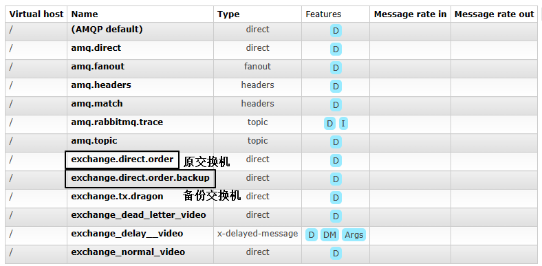
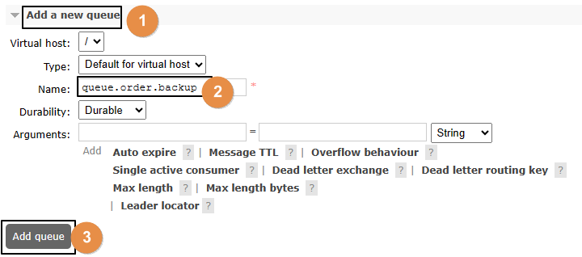
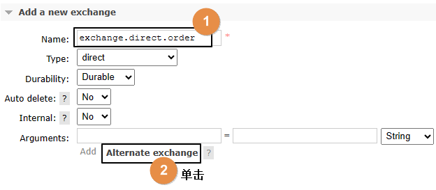
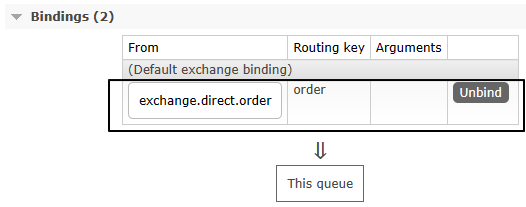

# 一、创建备份交换机

## 1、创建备份交换机

<span style="color:blue;font-weight:bolder;">注意</span>：备份交换机<span style="color:blue;font-weight:bolder;">一定</span>要选择<span style="color:blue;font-weight:bolder;">fanout类型</span>，因为原交换机转入备份交换机时并不会指定路由键





## 2、创建备份交换机要绑定的队列

### ①创建队列




### ②绑定交换机

<span style="color:blue;font-weight:bolder;">注意</span>：这里是要和备份交换机绑定


## 3、针对备份队列创建消费端监听器

```java
    public static final String EXCHANGE_DIRECT_BACKUP = "exchange.direct.order.backup";
    public static final String QUEUE_NAME_BACKUP  = "queue.order.backup";

    @RabbitListener(bindings = @QueueBinding(
            value = @Queue(value = QUEUE_NAME_BACKUP, durable = "true"),
            exchange = @Exchange(value = EXCHANGE_DIRECT_BACKUP),
            key = {""}
    ))
    public void processMessageBackup(String dateString,
                                     Message message,
                                     Channel channel) {
        log.info("BackUp: " + dateString);
    }
```


# 二、设定备份关系

## 1、原交换机删除

·


## 2、重新创建原交换机




## 3、原交换机重新绑定原队列





# 三、测试

- 启动消费者端
- 发送消息，但是路由键不对，于是转入备份交换机
