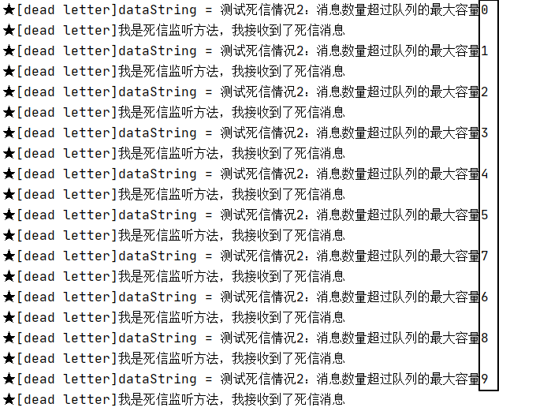

# 一、测试相关准备

## 1、创建死信交换机和死信队列

常规设定即可，没有特殊设置：

- 死信交换机：exchange.dead.letter.video
- 死信队列：queue.dead.letter.video
- 死信路由键：routing.key.dead.letter.video


## 2、创建正常交换机和正常队列

<span style="color:blue;font-weight:bolder;">注意</span>：一定要注意正常队列有诸多限定和设置，这样才能让无法处理的消息进入死信交换机


- 正常交换机：exchange.normal.video
- 正常队列：queue.normal.video
- 正常路由键：routing.key.normal.video


全部设置完成后参照如下细节：


## 3、Java代码中的相关常量声明

```java
public static final String EXCHANGE_NORMAL = "exchange.normal.video";  
public static final String EXCHANGE_DEAD_LETTER = "exchange.dead.letter.video";  
  
public static final String ROUTING_KEY_NORMAL = "routing.key.normal.video";  
public static final String ROUTING_KEY_DEAD_LETTER = "routing.key.dead.letter.video";  
  
public static final String QUEUE_NORMAL = "queue.normal.video";  
public static final String QUEUE_DEAD_LETTER = "queue.dead.letter.video";
```


# 二、消费端拒收消息

## 1、发送消息的代码

```java
@Test  
public void testSendMessageButReject() {  
    rabbitTemplate  
            .convertAndSend(  
                    EXCHANGE_NORMAL,  
                    ROUTING_KEY_NORMAL,  
                    "测试死信情况1：消息被拒绝");  
}
```


## 2、接收消息的代码

### ①监听正常队列

```java
@RabbitListener(queues = {QUEUE_NORMAL})
public void processMessageNormal(Message message, Channel channel) throws IOException {
    // 监听正常队列，但是拒绝消息
    log.info("★[normal]消息接收到，但我拒绝。");
    channel.basicReject(message.getMessageProperties().getDeliveryTag(), false);
}
```


### ②监听死信队列

```java
@RabbitListener(queues = {QUEUE_DEAD_LETTER})
public void processMessageDead(String dataString, Message message, Channel channel) throws IOException {  
    // 监听死信队列  
    log.info("★[dead letter]dataString = " + dataString);
    log.info("★[dead letter]我是死信监听方法，我接收到了死信消息");
    channel.basicAck(message.getMessageProperties().getDeliveryTag(), false);
}
```


## 3、执行结果


# 三、消息数量超过队列容纳极限

## 1、发送消息的代码

```java
@Test  
public void testSendMultiMessage() {  
    for (int i = 0; i < 20; i++) {  
        rabbitTemplate.convertAndSend(  
                EXCHANGE_NORMAL,  
                ROUTING_KEY_NORMAL,  
                "测试死信情况2：消息数量超过队列的最大容量" + i);  
    }  
}
```


## 2、接收消息的代码

消息接收代码不再拒绝消息：

```java
@RabbitListener(queues = {QUEUE_NORMAL})
public void processMessageNormal(Message message, Channel channel) throws IOException {
    // 监听正常队列
    log.info("★[normal]消息接收到。");
    channel.basicAck(message.getMessageProperties().getDeliveryTag(), false);
}
```

重启微服务使代码修改生效。


## 3、执行效果

正常队列的参数如下图所示：


生产者发送20条消息之后，消费端死信队列接收到前10条消息：




# 四、消息超时未消费

## 1、发送消息的代码

正常发送一条消息即可，所以使用第一个例子的代码。

```java
@Test
public void testSendMessageTimeout() {
    rabbitTemplate
            .convertAndSend(
                    EXCHANGE_NORMAL,
                    ROUTING_KEY_NORMAL,
                    "测试死信情况3：消息超时");
}
```


## 2、执行效果

队列参数生效：


因为没有消费端监听程序，所以消息未超时前滞留在队列中：


消息超时后，进入死信队列：


