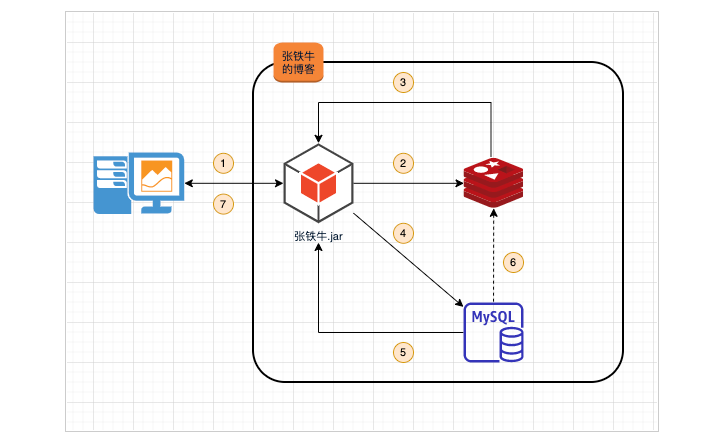
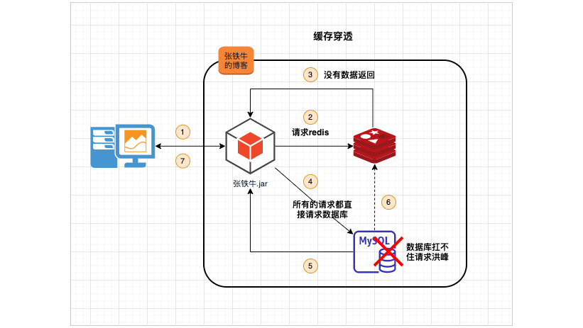
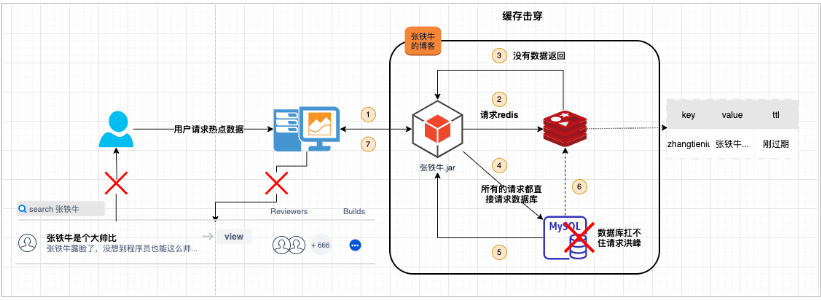
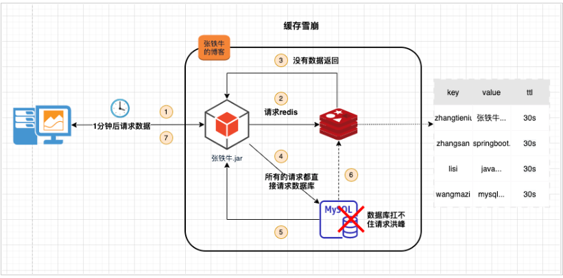

# Redis缓存击穿-穿透-雪崩

## 1. 缓存一般使用思路简介

1. 客户端请求服务
2. 服务去redis试着拿取数据。
3. redis将数据返回给服务，如果返回的结果有数据则执行上图第七步，如果没有数据则继续向下执行。
4. 服务从数据库中查询数据。
5. 数据库将查询结果返回给服务。
6. 数据库返回数据则添加到redis中。
7. 请求数据返回给客户端。

## 2. 缓存穿透

### 2.1 描述

通过接口访问一个缓存和数据库都不存在的数据。

服务出于容错考虑，当请求从持久层查不到数据则不写入缓存，这将导致请求这个不存在的数据每次都要到持久层去查询，失去了缓存的意义。此时，缓存起不到保护后端持久层的意义，就像被穿透了一样。导致数据库存在被打挂的风险。

### 2.2 解决方案

1.接口请求参数的校验。对请求的接口进行鉴权，数据合法性的校验等；比如查询的userId不能是负值或者包含非法字符等。

2.当数据库返回空值时，将空值缓存到redis，并设置合理的过期时间。

3.**布隆过滤器**。使用布隆过滤器存储所有可能访问的 key，不存在的 key 直接被过滤，存在的 key 则再进一步查询缓存和数据库。

## 3. 缓存击穿

### 3.1 描述

某个热点 key，在缓存过期的一瞬间，同时有大量的请求打进来，由于此时缓存过期了，所以请求最终都会走到数据库，造成瞬时数据库请求量大、压力骤增，导致数据库存在被打挂的风险。

### 3.2 解决方案

1.加互斥锁。当热点key过期后，大量的请求涌入时，只有第一个请求能获取锁并阻塞，此时该请求查询数据库，并将查询结果写入redis后释放锁。后续的请求直接走缓存。

2.设置缓存不过期或者后台有线程一直给热点数据续期。

## 4. 缓存雪崩

### 4.1 描述

大量的热点数据过期时间相同，导致数据在同一时刻集体失效。造成瞬时数据库请求量大、压力骤增，引起雪崩，导致数据库存在被打挂的风险。

### 4.2 解决方案

1.**将热点数据的过期时间打散**。给热点数据设置过期时间时加个随机值。

2.加互斥锁。当热点key过期后，大量的请求涌入时，只有第一个请求能获取锁并阻塞，此时该请求查询数据库，并将查询结果写入redis后释放锁。后续的请求直接走缓存。

3.设置缓存不过期或者后台有线程一直给热点数据续期。