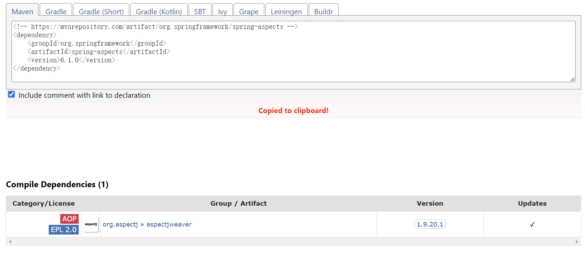
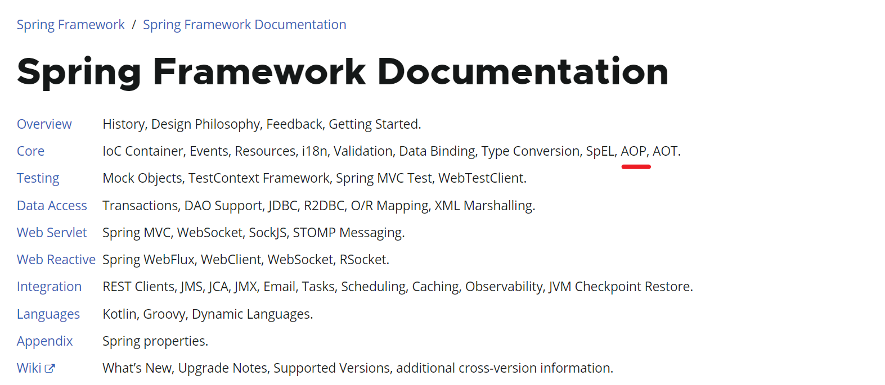
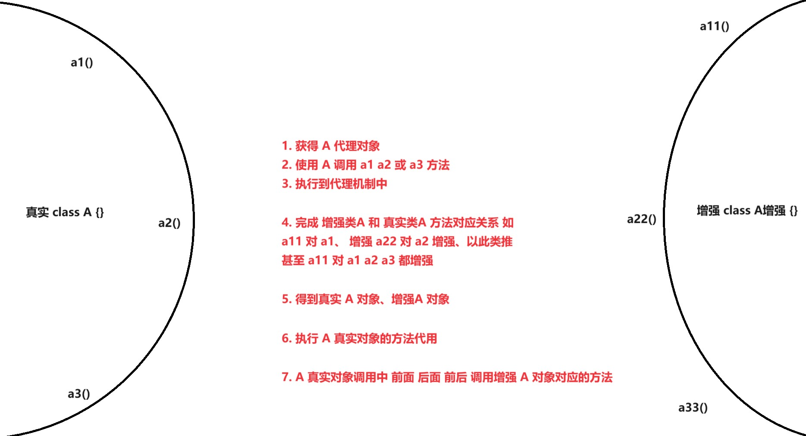
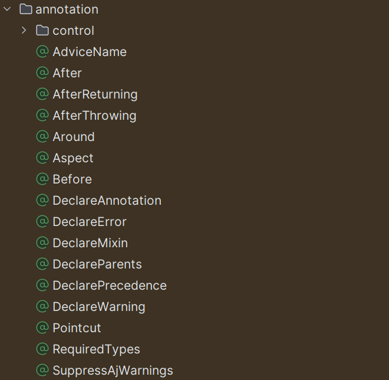

> === Aspect Oriented Programming (AOP) 意为面向切面编程

## 1. 概念机制


- 面向切面编程 是众多编程思想中的一种、面向过程、面向对象、面向切面

- 面向切面编程 一般主流使用为 **增强源代码 而不修改源代码的操作手段**
- 面向切面编程 在增强上可以做到 目标对象、增强手段可变、对代码零侵入


- 面向切面编程 常借助动态代理实现 如 Jdk[必须接口类型] | Cglib [还支持类]


- 增强源代码 而不修改源代码的操作手段还有 装饰者设计模式
- 装饰者模式 对代码有较强的侵入性、有强烈的代码结构要求、顶层接口类设计


- **Spring 完成对 AOP 基础抽象和基于**XML**的运用 使用注解方式 依赖 AspectJ**


+ **pom.xml [此坐标为spring整合AspectJ]**

    ```xml
    <!-- spring 对基础 aop 的封装及实现 同时也是 spring 框架必须的基础模块 -->
    <dependency>
        <groupId>org.springframework</groupId>
        <artifactId>spring-aop</artifactId>
        <version>6.1.0</version>
    </dependency>
    
    
    <!-- spring 对 aspectj 的整合 -->
    <dependency>
        <groupId>org.springframework</groupId>
        <artifactId>spring-aspects</artifactId>
        <version>6.1.0</version>
    </dependency>
    ```

    

    

+ dependency

    

    

+ AOP 功能属于 Spring 核心模块部分

    

## 2. 动态代理逻辑

> === 示例为JDK动态代理、JDK动态代理只能代理接口类型
>
> Cglib 支持接口和类 类型 其 API 的机制及执行过程 类似于 Jdk 动态代理

+ Application

    ```java
    import java.lang.reflect.InvocationHandler;
    import java.lang.reflect.Method;
    import java.lang.reflect.Proxy;
    
    interface A {
        void something(String arg);
    }
    
    public class Application {
        public static void main(String[] args) {
    
            ClassLoader classLoader = A.class.getClassLoader();
    
            Class<?>[] classes = {A.class};
    
            InvocationHandler handler = new InvocationHandler() {
    
                @Override
                public Object invoke(Object proxy, Method method, Object[] args) throws Throwable {
    
                    // 1. proxy  代理对象
                    // 2. method 代理对象当前调用的方法
                    // 3. args   代理对象当前调用的方法的参数
    
                    System.out.println(method.getName());
                    System.out.println(args[0]);
    
                    // 4. 增强手段往往 在此处完成 如获取当前 代理对象对应的真实的对象
    
                    // 5. 利用真实对象和当前代理对象调用的方法
    
                    // 6. 完成对真实对象 以及调用方法的反射操作
    
                    // 7. 类型 返回值 = method.invoke(真实对象)
    
                    // 8. 再做点儿什么 ...
    
                    // 9. 如 Spring 事务管理会在此 获取事务专用的 Connection 对象
                    //    反射真实对象的当前调用方法 并传入该 Connection
                    //    使得多条 SQL 语句都能使用这个 Connection 来完成事务控制
                    //    并检测上反射操作是否抛出异常 若抛出则回滚事务
                                    
                    
                    return null;
                }
            };
    
            A a = (A) Proxy.newProxyInstance(classLoader, classes, handler);
    
            // 代理对象调用方法时
            // 由于 A 接口的方法并没有实现 因此会执行到 InvocationHandler
    
            a.something("A");
    
        }
    }
    ```

## 3. 动态代理使用手段




== 动态代理使用手段逻辑过程 ==


1. `真实类型 class TargetA { a1()  a2()  a3()  }`
2. `增强类型 class AdviceA { a11() a22() a33() }`
3. `利用某种配置手段完成 a11 对应 a1 增强 依次类推、甚至 a11 对 a1 a2 a2 都增强`
4. `获得 TargetA 的代理对象 ProxyTargetA proxy`
5. `使用 proxy 调用 proxy.a1() 方法`
6. `执行到代理机制中: InvocationHandler`
7. `创建 真实类型 TargetA a & 增强类型 AdviceA aa`
8. `反射 a 和 a1() 方法执行 a1.invoke(a)`
9. `调用 a1.invoke(a) 前 | 后 | 既前又后 调用 aa.a11() 完成增强`
10. `可见 从始至终 增强的完成 对 TargetA 没有任何要求`


- Spring 使用 Aspectj 要求完成增强类和目标类方法的对应关系以及指定执行顺序

### 3.1 专业术语

- JointPoint: 连接点 TargetA { a1()  a2()  a3() } a1 a2 a2 这些方法
- Pointcut  : 切入点 TargetA { a1() } 和 AdviceA { a11() } 关系
- Advice    : 增强建议及过程 如 a11() 先于 a1() 调用


## 4. AspectJ

> === Spring 已完成对 Aspectj 整合、可直接使用 Aspectj 注解完成 AOP

### 01. 环境

- **pom.xml**

~~~xml
<dependency>
    <groupId>org.springframework</groupId>
    <artifactId>spring-context</artifactId>
    <version>6.1.0</version>
</dependency>

<dependency>
    <groupId>org.springframework</groupId>
    <artifactId>spring-aspects</artifactId>
    <version>6.1.0</version>
</dependency>
~~~

- **SpringContextConfiguration.java [spring 上下文配置]**

~~~java
package org.example.spring.conf;


import org.springframework.context.annotation.ComponentScan;
import org.springframework.context.annotation.Configuration;

@Configuration
@ComponentScan(basePackages = "org.example.spring")
public class SpringContextConfiguration {
    
}
~~~

- **AspectJConfiguration.java 开启 aspectj 代理**

~~~java
package org.example.spring.conf;

import org.springframework.context.annotation.Configuration;
import org.springframework.context.annotation.EnableAspectJAutoProxy;

@Configuration
@EnableAspectJAutoProxy
public class AspectJConfiguration {
}
~~~

### 02. 运用


> === 目标类 UserService

- **UserService.java**

~~~java
package org.example.spring.service;


import org.springframework.stereotype.Service;

@Service
public class UserService {

    public void userService1() {
        System.out.println("userService1...");
    }

    public void userService2(String phone) {
        System.out.println("userService2..." + phone);
    }

}
~~~

> === 增强类 UserServiceAdvice

- @Component 同样需要放入容器 因为 spring 需要该增强对象
- @Aspect 表明为增强手段类 该注解是必须的
- @Before("表达式完成对目标对象方法关联映射") 表示增强方法在目标对象方法前先调用


- **UserServiceAdvice.java**

~~~java
package org.example.spring.service;


import org.aspectj.lang.annotation.Aspect;
import org.aspectj.lang.annotation.Before;
import org.springframework.stereotype.Component;


@Component
@Aspect
public class UserServiceAdvice {

    @Before("execution(* org.example.spring.service.UserService.userService1())")
    public void userServiceAdvice1() {
        System.out.println("userServiceAdvice1...");
    }

    public void userServiceAdvice2() {
        System.out.println("userServiceAdvice2...");
    }
}
~~~

- **Application.java**

~~~java
package org.example.spring.api;

import org.example.spring.conf.SpringContextConfiguration;
import org.example.spring.service.UserService;
import org.springframework.context.annotation.AnnotationConfigApplicationContext;

public class Application {

    public static void main(String[] args) {
        AnnotationConfigApplicationContext context = 
                new AnnotationConfigApplicationContext(SpringContextConfiguration.class);

        UserService userService = context.getBean(UserService.class);

        userService.userService1();

        context.close();

    }

}
~~~

- **Console [可见增强方法 userServiceAdvice1 主动在前完成调用]**

~~~apl
userServiceAdvice1...

userService1...
~~~

### 03. 表达式说明


> === execution(权限 包.类.方法名称(参数列表)) | 对应位置 * 表示任意 参数任意是 ..

- execution(* org.example.spring.service.UserService.userService1())
- execution(表达式) 是固定写法
- execution(权限 包.类.方法())


- execution(* 包.类.方法名())   任意权限的指定无参方法

- execution(* 包.类.*())       任意权限的任意无参方法

- execution(* 包.类.*(..))     任意权限的任意参数格式及类型方法

- execution(* 包.类.*(int))    任意权限的任意名称但有一个 int参数 方法

    


### 04. 通知注解


> === org.aspectj.lang.annotation 包中提供大量通知注解

- 其中最常用注解
- @Before 前置增强
- @After  后置增强 [开发最常用通知手段]
- @Around 环绕增强

+ 

+ 图例

    

### 05. @After 


> === @After 后置增强在目标方法调用之后 调用增强

- **UserServiceAdvice.java**

~~~java
package org.example.spring.service;


import org.aspectj.lang.annotation.After;
import org.aspectj.lang.annotation.Aspect;
import org.aspectj.lang.annotation.Before;
import org.springframework.stereotype.Component;


@Component
@Aspect
public class UserServiceAdvice {

    // @Before("execution(* org.example.spring.service.UserService.userService1())")
    @After("execution(* org.example.spring.service.UserService.userService1())")
    public void userServiceAdvice1() {
        System.out.println("userServiceAdvice1...");
    }

    public void userServiceAdvice2() {
        System.out.println("userServiceAdvice2...");
    }
}
~~~

### 06. @Around


> === @After 环绕增强在目标方法调用前后 都会调用增强


- **UserServiceAdvice.java**

~~~java
package org.example.spring.service;


import org.aspectj.lang.ProceedingJoinPoint;
import org.aspectj.lang.annotation.After;
import org.aspectj.lang.annotation.Around;
import org.aspectj.lang.annotation.Aspect;
import org.aspectj.lang.annotation.Before;
import org.springframework.stereotype.Component;


@Component
@Aspect
public class UserServiceAdvice {

    // @Before("execution(* org.example.spring.service.UserService.userService1())")
    // @After("execution(* org.example.spring.service.UserService.userService1())")
    // public void userServiceAdvice1() {
    //     System.out.println("userServiceAdvice1...");
    // }


    @Around("execution(* org.example.spring.service.UserService.userService1())")
    public void userServiceAdvice1(ProceedingJoinPoint point) throws Throwable {
        System.out.println("userServiceAdvice1...");

        // 调用目标方法
        point.proceed(); // 此处的返回值是目标方法的返回值

        System.out.println("userServiceAdvice1...");
    }

    public void userServiceAdvice2() {
        System.out.println("userServiceAdvice2...");
    }
}
~~~

### 07. 参数拦截


> === AOP 在开发中最常用场景为 后置增强并伴随参数拦截

- 如 用户某个功能完成后 对其后置增强获取 手机号 下发短信之类


- execution(* *.*.*.*.UserService.userService2(String)) && args(phone)
- 目标方法参数 增强方法参数 表达式中参数应当写为一致


- **UserServiceAdvice.java**

~~~java
package org.example.spring.service;


import org.aspectj.lang.ProceedingJoinPoint;
import org.aspectj.lang.annotation.After;
import org.aspectj.lang.annotation.Around;
import org.aspectj.lang.annotation.Aspect;
import org.aspectj.lang.annotation.Before;
import org.springframework.stereotype.Component;


@Component
@Aspect
public class UserServiceAdvice {

    @After(
        value = "execution(* *.*.*.*.UserService.userService2(String)) && args(phone)", 
        argNames = "phone"
    )
    
    public void userServiceAdvice2(String phone) {
        System.out.println("userServiceAdvice2..." + phone);
    }
    
}
~~~

- **Console**

~~~ABAP
userService2...173****8888

userServiceAdvice2...173****8888
~~~