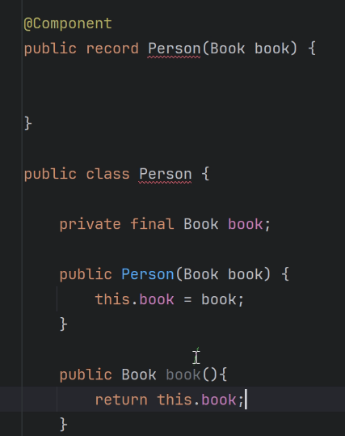
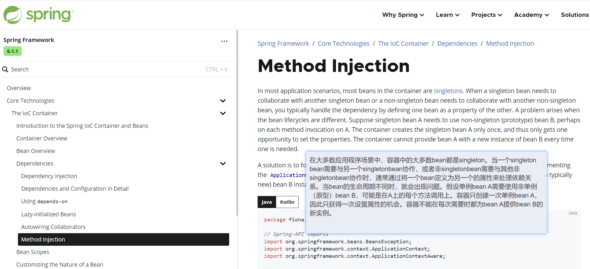
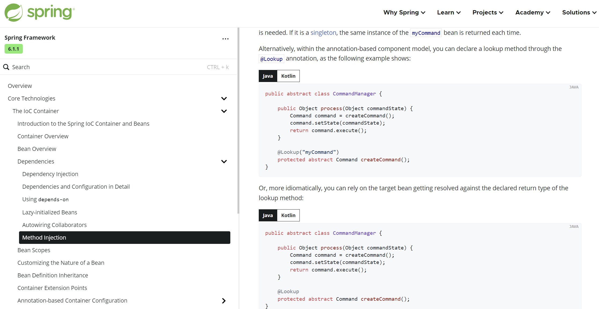

> === Dependency Injection (DI) 依赖注入

# 1. 依赖注入机制及其运用

+ 依赖注入是指  将容器的对象作为值，传递给容器的另外的对象的属性
+ 示例 容器 class B{}  赋值给  class A{private B b;} 中的 B 属性

== 依赖注入使用方式 ==

- [x] 容器对象 构造方法注入
- [x] 容器对象 Setter方法注入
- [x] 容器对象 属性注入 [不被推荐 不符合面向对象规范]
- [x] 容器@Bean方法 参数注入
- [x] 容器@Bean方法 调用注入

> === 注入形式上分为类型注入和名称注入【一般使用类型注入即可】
>
> 
>
> === 以下是注入示例

- **pom.xml**

~~~xml
<dependency>
    <groupId>org.springframework</groupId>
    <artifactId>spring-context</artifactId>
    <version>6.1.0</version>
</dependency>
~~~

- **SpringContextConfiguration.java**

~~~java
package org.example.spring.conf;

import org.springframework.context.annotation.ComponentScan;
import org.springframework.context.annotation.Configuration;

@Configuration
@ComponentScan(basePackages = "org.example.spring")
public class SpringContextConfiguration {
}
~~~

- **Application.java**

~~~java
package org.example.spring.api;

import org.example.spring.conf.SpringContextConfiguration;
import org.springframework.context.annotation.AnnotationConfigApplicationContext;

public class Application {
    public static void main(String[] args) {
        AnnotationConfigApplicationContext context =
                new AnnotationConfigApplicationContext(SpringContextConfiguration.class);

        // 操作容器
        
        context.close();
    }
}
~~~

#### 01. 构造方法注入

> === 将容器对象通过构造方法注入给其他容器对象的属性

- **Person.java**

~~~java
package org.example.spring.entity;

import org.springframework.stereotype.Component;

// @Component
// public class Person {
//     private Book book;
//
//     public Person(Book book) {
//         this.book = book;
//     }
//
//     public Book getBook() {
//         return book;
//     }
//
//     @Override
//     public String toString() {
//         return "Person{" +
//                 "book=" + book +
//                 '}';
//     }
//
// }

@Component
// jdk14 提供了record类，方便注入
public record Person(Book book) {
	 
}
~~~

以下两种方式是相等的：

- **Book.java**

~~~java
package org.example.spring.entity;

import org.springframework.stereotype.Component;

@Component
public class Book {
    @Override
    public String toString() {
        return "Book{}";
    }
}
~~~

#### 02. Setter方法注入

> === Setter方法注入 必须配合 @Autowired 注解通知 Spring 注入

- **Apple.java**

~~~java
package org.example.spring.entity;

import org.springframework.stereotype.Component;

@Component
public class Apple {
    @Override
    public String toString() {
        return "Apple{}";
    }
}
~~~

- **Student.java**

~~~java
package org.example.spring.entity;

import org.springframework.beans.factory.annotation.Autowired;
import org.springframework.stereotype.Component;

@Component
public class Student {

    private Apple apple;

    public Apple getApple() {
        return apple;
    }

    // 需要使用 @Autowired 通知spring需要注入Apple
    @Autowired
    public void setApple(Apple apple) {
        this.apple = apple;
    }

    @Override
    public String toString() {
        return "Student{" +
                "apple=" + apple +
                '}';
    }
}
~~~

#### 03. 属性注入

> === 属性注入 必须配合 @Autowired 注解通知 Spring 注入

- 属性注入不符合面向对象规范、对象私有化成员不应该被外部知悉和访问

- **Role.java**

~~~java
package org.example.spring.entity;

import org.springframework.stereotype.Component;

@Component
public class Role {
    @Override
    public String toString() {
        return "Role{}";
    }
}
~~~

- **User.java**

~~~java
package org.example.spring.entity;

import org.springframework.beans.factory.annotation.Autowired;
import org.springframework.stereotype.Component;

@Component
public class User {

    // 不推荐
    @Autowired
    private Role role;

    @Override
    public String toString() {
        return "User{" +
                "role=" + role +
                '}';
    }

}
~~~

#### 04. @Bean方法参数注入

> === @Bean注解的方法参数可以自动注入、不需要 @Autowired 注解

- **SysUser.java**

~~~java
package org.example.spring.entity;

public class SysUser {
    private Role role;

    public void setRole(Role role) {
        this.role = role;
    }

    public Role getRole() {
        return role;
    }

    @Override
    public String toString() {
        return "SysUser{" +
                "role=" + role +
                '}';
    }
}
~~~

- **SpringContextConfiguration.java**

~~~java
package org.example.spring.conf;

import org.example.spring.entity.Role;
import org.example.spring.entity.SysUser;
import org.springframework.beans.factory.annotation.Autowired;
import org.springframework.context.annotation.Bean;
import org.springframework.context.annotation.ComponentScan;
import org.springframework.context.annotation.Configuration;

@Configuration
@ComponentScan(basePackages = "org.example.spring")
public class SpringContextConfiguration {

    @Bean
    public SysUser sysUser(Role role){
        SysUser sysUser = new SysUser();
        sysUser.setRole(role);
        return sysUser;
    }

}
~~~

#### 05. @Bean方法调用注入

> === 调用 @Bean 注解的方法得到其返回值进行注入 Spring 自动完成

- **SpringContextConfiguration.java**

~~~java
package org.example.spring.conf;

import org.example.spring.entity.Role;
import org.example.spring.entity.SysUser;
import org.springframework.beans.factory.annotation.Autowired;
import org.springframework.context.annotation.Bean;
import org.springframework.context.annotation.ComponentScan;
import org.springframework.context.annotation.Configuration;

@Configuration
@ComponentScan(basePackages = "org.example.spring")
public class SpringContextConfiguration {

    @Bean
    public Role role() {
        return new Role();
    }

    // @Bean
    // public SysUser sysUser(Role role) {
    //     SysUser sysUser = new SysUser();
    //     sysUser.setRole(role);
    //     return sysUser;
    // }

    @Bean
    public SysUser sysUser() {
        SysUser sysUser = new SysUser();
        sysUser.setRole(this.role());
        return sysUser;
    }

}
~~~

# 2. 类型注入冲突解决

> === 当同类型多个对象在容器中进行注入时、Spring 会因无法确认使用那个对象而抛出异常 

- 问题

- record Computer(Usb usb)
    - Usb{}
        - Usb2
        - Usb3

==解决方式==

1. 缩小注入类型
2. @Primary   声明总是注入该类型
3. @Qualifier 指定容器对象 ID 进行注入

> === 示例代码

~~~java
package org.example.spring.service;

import org.springframework.stereotype.Component;

@Component
public record Computer(Usb usb) {
}

public interface Usb {
}

@Component
public class Usb2 implements Usb {
    @Override
    public String toString() {
        return "Usb2{}";
    }
}

@Component
public class Usb3 implements Usb {
    @Override
    public String toString() {
        return "Usb3{}";
    }
}
~~~

#### 01. 缩小类型

- **Computer.java**

~~~java
package org.example.spring.service;

import org.springframework.stereotype.Component;

@Component
public record Computer(Usb2 usb) {
}
~~~

#### 02. @Primary

> === @Primary 注解于同类型的其中一个对象上、总是注入该类型时总是注入该对象

- @Primary 可配合 @Component .. @Bean 注解于类 或 @Bean方法

- **Usb2.java**

~~~java
package org.example.spring.service;

import org.springframework.context.annotation.Primary;
import org.springframework.stereotype.Component;

@Component
@Primary
public class Usb2 implements Usb {
    @Override
    public String toString() {
        return "Usb2{}";
    }
}
~~~

#### 03. @Qualifier

> === @Qualifier("容器对象ID") 可注解于类、@Bean 方法、参数等、属性

- @Qualifier 是唯一一个指定 容器对象ID 进行注入的手段、否则 Spring 皆为类型注入
- @Qualifier 作用于指定注入的地方

- Computer

~~~java
package org.example.spring.service;

import org.springframework.beans.factory.annotation.Qualifier;
import org.springframework.stereotype.Component;

@Component
public record Computer(@Qualifier("usb3") Usb usb) {
}
~~~

#### 04. 类型注入优点

1. 类型注入不一定产生冲突、有冲突时解决一下即可
2. 容器对象ID 总是需要 声明 注入容器对象ID、会增加开发者负担
3. 使用容器对象、在逻辑上是关心其类型

# 3. 单例多例注入问题

> === 一般情况下 容器可以根据一般逻辑按照对象单多例正确完成注入

#### 01. 逻辑说明

- 依赖注入单多例依赖关系的四种逻辑情况如下

- [x] 单例A -> 单例B  
- [ ] 单例A -> 多例B  [该情况 Spring 无法自动且正确完成]
- [x] 多例A -> 单例B
- [x] 多例A -> 多例B

+ 官方说明

    

#### 02. 解决方式

> === @Lookup 注解的方法会通知 Spring 强制覆盖并完成自动注入

- **B.java**

~~~java
package org.example.spring.service;

import org.springframework.context.annotation.Scope;
import org.springframework.stereotype.Component;
import org.springframework.beans.factory.config.ConfigurableBeanFactory;

@Component
@Scope(ConfigurableBeanFactory.SCOPE_PROTOTYPE)
public class B {

}
~~~

- **A.java**

~~~java
package org.example.spring.service;

import org.springframework.beans.factory.annotation.Autowired;
import org.springframework.beans.factory.annotation.Lookup;
import org.springframework.stereotype.Component;

@Component
public class A {

    private B b;

    // 无法正确工作
    @Autowired
    public void setB(B b) {
        this.b = b;
    }

    public B getB() {
        return b;
    }

    // Spring 将覆盖该方法 每次从容器中取出 新的 B 的实例
    @Lookup
    public B getContainerPrototypeB() {
        return null;
    }

}
~~~

- **Application.java**

~~~java
package org.example.spring.api;

import org.example.spring.conf.SpringContextConfiguration;
import org.example.spring.service.A;
import org.example.spring.service.B;

import org.springframework.context.annotation.AnnotationConfigApplicationContext;

public class Application {
    public static void main(String[] args) {
        
        AnnotationConfigApplicationContext context = 
            new AnnotationConfigApplicationContext(SpringContextConfiguration.class);

        A a1  = context.getBean(A.class);
        A a2  = context.getBean(A.class);
        
        B b11 = context.getBean(B.class);
        B b22 = context.getBean(B.class);

        System.out.println(a1 == a2);					// true  A 是单例
        
        System.out.println(b11 == b22);					// false B 是多例

        System.out.println(a1.getB() == a1.getB());		// true A 未完成B多例注入 B 是单例

        B b1 = a1.getContainerPrototypeB();
        B b2 = a1.getContainerPrototypeB();

        System.out.println(b1);			// toString 不同对象 hashcode 不同
        System.out.println(b2);			// toString 不同对象 hashcode 不同

        System.out.println(b1 == b2);	// false @Lookup 注解生效 b1 b2 是不同实例

        context.close();

    }
}
~~~

- **Console**

~~~apl
true

false

true

org.example.spring.service.B@5f683daf

org.example.spring.service.B@78ffe6dc

false
~~~

- **官网示例**

# 4. 循环依赖

> === 循环依赖 是指容器对象互相依赖注入的问题 [应当避免该设计]

#### 01. 问题说明

- 循环依赖场景: **record C(D d) {} / record D(C c) {}**

- **C.java**

~~~java
package org.example.spring.service;

import org.springframework.stereotype.Component;

@Component
public class C {
    private D d;

    public C(D d) {
        this.d = d;
    }

    public D getD() {
        return d;
    }
}
~~~

- **D.java**

~~~java
package org.example.spring.service;

import org.springframework.stereotype.Component;

@Component
public class D {

    private C c;

    public D(C c) {
        this.c = c;
    }

    public String message() {
        return "D";
    }
}
~~~

- **Console 容器中获取 C | D 对象时 Spring 将抛出异常**

~~~ABAP

警告: Exception encountered during context initialization - cancelling refresh attempt: org.springframework.beans.factory.UnsatisfiedDependencyException: Error creating bean with name 'c' defined in file [D:\vite-project\spring-di\target\classes\org\example\spring\service\C.class]: Unsatisfied dependency expressed through constructor parameter 0: Error creating bean with name 'd' defined in file [D:\vite-project\spring-di\target\classes\org\example\spring\service\D.class]: Unsatisfied dependency expressed through constructor parameter 0: Error creating bean with name 'c': 

Requested bean is currently in creation: Is there an unresolvable circular reference?

~~~

#### 02. 解决方式

> === 循环依赖主要有两种解决方式 1. @Lazy 注解构造方法、2. 改为其它注入方式

1. 当依赖注入方式为构造方法注入时 使用 @Lazy 注解构造方法
2. 将构造方法注入 改为 Setter 方法注入 Spring 可正确完成

- **C.java**

~~~java
package org.example.spring.service;

import org.springframework.context.annotation.Lazy;
import org.springframework.stereotype.Component;

@Component
public class C {
    private D d;

    @Lazy
    public C(D d) {
        this.d = d;
    }

    public D getD() {
        return d;
    }
}
~~~

- **D.java**

~~~java
package org.example.spring.service;

import org.springframework.context.annotation.Lazy;
import org.springframework.stereotype.Component;

@Component
public class C {
    private D d;

    @Lazy
    public C(D d) {
        this.d = d;
    }

    public D getD() {
        return d;
    }
}
~~~

> === Setter 注入方式的逻辑是: 先创建容器对象 再进行注入

- **C.java**

~~~java
package org.example.spring.service;

import org.springframework.beans.factory.annotation.Autowired;
import org.springframework.stereotype.Component;

@Component
public class C {
    private D d;

    @Autowired
    public void setD(D d) {
        this.d = d;
    }

    public D getD() {
        return d;
    }
}
~~~

- **D.java**

~~~java
package org.example.spring.service;

import org.springframework.beans.factory.annotation.Autowired;
import org.springframework.stereotype.Component;

@Component
public class D {

    private C c;

    @Autowired
    public void setC(C c) {
        this.c = c;
    }

    public String message() {
        return "D";
    }
}
~~~

