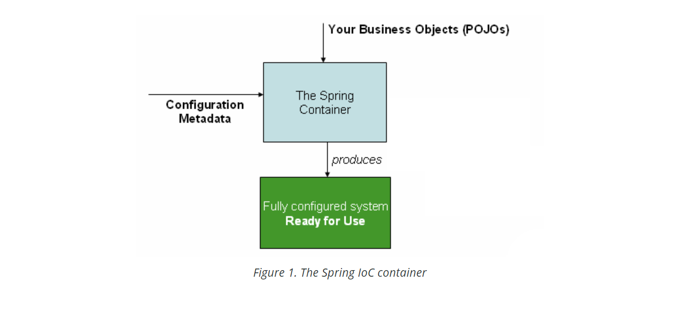
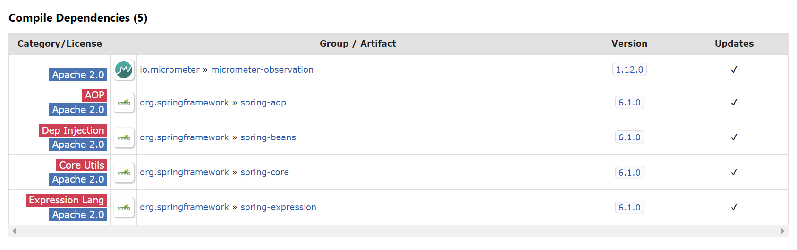
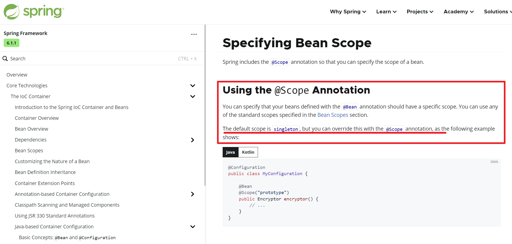

> === Inversion of Control (IoC) 控制反转、将对象的创建交给 Spring

### 2.01 IOC容器优点

- [x] 控制对象的单例、多例

- [x] 控制对象的生命周期、初始化、销毁

- [x] 控制对象的代理机制、获取代理对象

- [x] 管理对象间依赖关系

- 特殊概念: 放入 Spring 容器的对象 特称为 **Bean**

- **Spring 容器逻辑示意**

### 2.02 环境搭建

> === Spring 框架核心坐标: AOP、CORE、BEANS、EXPRESSION、CONTEXT

- **pom.xml**

~~~XML
<dependency>
    <groupId>org.springframework</groupId>
    <artifactId>spring-context</artifactId>
    <version>6.1.0</version>
</dependency>
~~~

### 2.03 容器API

> === 容器API 主要包括: 声明配置、注解容器对象、容器上下文扫描、容器入口

1. @Configuration 声明 spring 注解配置类
2. @ComponentScan(basePackages = "")  扫描指定包及子包
3. @Component("user") 将类放入 spring 容器
4. ClassPathXmlApplicationContext     基于 xml  配置的上下文容器入口
5. AnnotationConfigApplicationContext 基于 java 配置的上下文容器入口
6. GenericApplicationContext          通用配置 上下文容器入口

- **SpringContextConfiguration.java**

~~~java
package org.example.spring.conf;

import org.springframework.context.annotation.ComponentScan;
import org.springframework.context.annotation.Configuration;

@Configuration
@ComponentScan(basePackages = "org.example.spring")
public class SpringContextConfiguration {
}
~~~

- **User.java**

~~~java
package org.example.spring.entity;

import org.springframework.stereotype.Component;

// @Component // user
@Component("user")
public class User {

    private String username;

    @Override
    public String toString() {
        return "User{" +
                "username='" + username + '\'' +
                '}';
    }
}

~~~

- **Application.java**

~~~java
package org.example.spring.api;

import org.example.spring.SpringContextConfiguration;
import org.example.spring.entity.User;
import org.springframework.context.annotation.AnnotationConfigApplicationContext;

public class Application {
    public static void main(String[] args) {
        AnnotationConfigApplicationContext context = 
            new AnnotationConfigApplicationContext(SpringContextConfiguration.class);

        // User user = context.getBean(User.class);
        // System.out.println("user = " + user);

        System.out.println("context.getBean(\"user\") = " + context.getBean("user"));

        context.close();
    }
}

~~~

### 2.04 容器注解

> === **@Component、@Service、@Repository**

- **Spring 容器可使用 @Component、@Service、@Repository 注解类放入容器**

- @Component
- @Service
- @Repository 使用方式完全一致、仅语义区别

- **UserService.java**

~~~java
package org.example.spring.service;

import org.springframework.stereotype.Component;
import org.springframework.stereotype.Repository;
import org.springframework.stereotype.Service;

// @Component
@Service
// @Repository
public class UserService {
    @Override
    public String toString() {
        return "UserService{}";
    }
}
~~~

- **UserDao.java**

~~~java
package org.example.spring.dao;

import org.springframework.stereotype.Repository;

@Repository
public class UserDao {
    @Override
    public String toString() {
        return "UserDao{}";
    }
}

~~~

### 2.05 @Bean

> === @Bean 用于复杂对象放入容器、或者第三方类对象放入容器

- @Bean 默认会将方法名称作为放入容器对象的 ID 值
- @Bean(name = "dataSource") name 属性可指定 容器对象 ID 值

- **POM.XML**

~~~XML
<dependency>
    <groupId>com.zaxxer</groupId>
    <artifactId>HikariCP</artifactId>
    <version>5.1.0</version>
</dependency>

<dependency>
    <groupId>com.mysql</groupId>
    <artifactId>mysql-connector-j</artifactId>
    <version>8.0.33</version>
</dependency>
~~~

- **DataSourceConfiguration.java**

~~~java
package org.example.spring.conf;

import com.zaxxer.hikari.HikariDataSource;
import org.springframework.context.annotation.Bean;
import org.springframework.context.annotation.Configuration;

@Configuration
public class DataSourceConfiguration {

    @Bean(name = "dataSource")
    // @Bean
    public HikariDataSource hikariDataSource() {
        HikariDataSource hikariDataSource = new HikariDataSource();

        hikariDataSource.setDriverClassName("com.mysql.cj.jdbc.Driver");
        
        String jdbcUrl 
            = "jdbc:mysql://127.0.0.1:3306/legou?serverTimezone=Asia/Shanghai";
        
        hikariDataSource.setJdbcUrl(jdbcUrl);
        hikariDataSource.setUsername("root");
        hikariDataSource.setPassword("root");

        return hikariDataSource;
    }

}
~~~

### 2.06 @Scope

> === @Scope 用于配合 @Component、@Service、@Bean 指定容器对象生命周期

- Spring 容器对象默认是单实例的、可通过 @Scope 进行控制

- @Scope value 属性取值有以下
- ConfigurableBeanFactory.SCOPE_SINGLETON  单例（默认）
- ConfigurableBeanFactory.SCOPE_PROTOTYPE  多例
- WebApplicationContext.SCOPE_REQUEST 生命周期属于一次请求中
- WebApplicationContext.SCOPE_SESSION 生命周期属于一次会话中

- **官网说明**

> === 代码示例

- **Person.java**

~~~java
package org.example.spring.entity;

import org.springframework.beans.factory.config.ConfigurableBeanFactory;
import org.springframework.context.annotation.Scope;
import org.springframework.stereotype.Component;

// @Component
// @Scope("prototype")
// @Scope(ConfigurableBeanFactory.SCOPE_PROTOTYPE)
public class Person {
}

~~~

- **SpringContextConfiguration.java**

~~~java
package org.example.spring.conf;

import org.example.spring.entity.Person;
import org.springframework.beans.factory.config.ConfigurableBeanFactory;
import org.springframework.context.annotation.Bean;
import org.springframework.context.annotation.ComponentScan;
import org.springframework.context.annotation.Configuration;
import org.springframework.context.annotation.Scope;

@Configuration
@ComponentScan(basePackages = "org.example.spring")
public class SpringContextConfiguration {

    @Bean
    @Scope(ConfigurableBeanFactory.SCOPE_PROTOTYPE)
    public Person person() {
        return new Person();
    }

}
~~~

- **Application.java**

~~~java
package org.example.spring.api;

import org.example.spring.conf.SpringContextConfiguration;

import org.springframework.context.annotation.AnnotationConfigApplicationContext;
import org.springframework.context.annotation.Scope;

public class Application {
    public static void main(String[] args)  {
        
        AnnotationConfigApplicationContext context = 
            
            new AnnotationConfigApplicationContext(SpringContextConfiguration.class);

        Person person1 = context.getBean(Person.class);
        Person person2 = context.getBean(Person.class);

        System.out.println(person1 == person2);

        context.close();
    }
}
~~~

### 2.07 @Bean 生命周期控制

> === **org.springframework.context.annotation.Bean**

- **Bean.java**

~~~java
package org.springframework.context.annotation;

import java.lang.annotation.Documented;
import java.lang.annotation.ElementType;
import java.lang.annotation.Retention;
import java.lang.annotation.RetentionPolicy;
import java.lang.annotation.Target;

import org.springframework.beans.factory.support.AbstractBeanDefinition;
import org.springframework.core.annotation.AliasFor;

@Target({ElementType.METHOD, ElementType.ANNOTATION_TYPE})
@Retention(RetentionPolicy.RUNTIME)
@Documented
public @interface Bean {

    @AliasFor("name")
    String[] value() default {};

    @AliasFor("value")
    String[] name() default {};

    boolean autowireCandidate() default true;

    String initMethod() default "";
    
    String destroyMethod() default AbstractBeanDefinition.INFER_METHOD;

}

~~~

- **Student.java**

~~~java
package org.example.spring.entity;

public class Student {

    public void init() {
        System.out.println("init...");
    }

    public void destroy() {
        System.out.println("destroy...");
    }

}
~~~

- **SpringContextConfiguration.java**

~~~java
package org.example.spring.conf;

import org.example.spring.entity.Person;
import org.example.spring.entity.Student;
import org.springframework.beans.factory.config.ConfigurableBeanFactory;
import org.springframework.context.annotation.Bean;
import org.springframework.context.annotation.ComponentScan;
import org.springframework.context.annotation.Configuration;
import org.springframework.context.annotation.Scope;

@Configuration
@ComponentScan(basePackages = "org.example.spring")
public class SpringContextConfiguration {

    @Bean
    @Scope(ConfigurableBeanFactory.SCOPE_PROTOTYPE)
    public Person person() {
        return new Person();
    }

    @Bean(initMethod = "init", destroyMethod = "destroy")
    public Student student() {
        return new Student();
    }

}
~~~

### 2.08 @Value

> === @Value 注解用于给容器对象注入属性值、可使用 ${} 表达式、或调用API

- @Value("直接赋值")
- @Value("#{解析表达式}")
- @Value("${获取上下文对象或变量}")
- @Value 常配合 @PropertySource 读取 properties 配置并注入值

- **Foo.java**

~~~java
package org.example.spring.entity;

import org.springframework.beans.factory.annotation.Value;
import org.springframework.stereotype.Component;

import java.util.Arrays;
import java.util.List;
import java.util.Map;
import java.util.Set;

@Component
public class Foo {

    @Value("我爱你中国")
    private String string;

    @Value("#{T(java.lang.Math).random()}")
    private Double number;

    @Value("1, 2, 3")
    private String[] array;

    @Value("11, 22, 33")
    private List<String> list;

    @Value("111, 222, 333")
    private Set<String> set;

    @Value("#{{k1: 'v1', k2: 'v2'}}")
    private Map<String, String> map;

    @Override
    public String toString() {
        return "Foo{" +
                "string='" + string + '\'' +
                ", number=" + number +
                ", array=" + Arrays.toString(array) +
                ", list=" + list +
                ", set=" + set +
                ", map=" + map +
                '}';
    }
}
~~~

### 2.09 @PropertySource

> === @PropertySource 用于读取 Java 标准 properties 配置文件

- @PropertySource("classpath:properties文件路径")
- @PropertySource 常 配合 @Value 读取配置文件并注入键值

- **src/main/resources/hikaricp.properties**

~~~properties
hikaricp.driverClassName=com.mysql.cj.jdbc.Driver
hikaricp.jdbcUrl=jdbc:mysql://127.0.0.1:3306/legou?serverTimezone=Asia/Shanghai
hikaricp.username=root
hikaricp.password=root
~~~

- **DataSourceConfiguration.java**

~~~java
package org.example.spring.conf;

import com.zaxxer.hikari.HikariDataSource;
import org.springframework.beans.factory.annotation.Value;
import org.springframework.context.annotation.Bean;
import org.springframework.context.annotation.Configuration;
import org.springframework.context.annotation.PropertySource;

@Configuration
@PropertySource(value = "classpath:hikaricp.properties", ignoreResourceNotFound = true)
public class DataSourceConfiguration {

    @Value("${hikaricp.driverClassName}")
    private String driverClassName;

    @Value("${hikaricp.jdbcUrl}")
    private String jdbcUrl;

    @Value("${hikaricp.username}")
    private String username;

    @Value("${hikaricp.password}")
    private String password;

    @Bean(name = "dataSource")
    public HikariDataSource hikariDataSource() {
        
        HikariDataSource hikariDataSource = new HikariDataSource();

        System.out.println("driverClassName = " + driverClassName);
        System.out.println("jdbcUrl = " + jdbcUrl);
        System.out.println("username = " + username);
        System.out.println("password = " + password);
       

        hikariDataSource.setDriverClassName(driverClassName);
        hikariDataSource.setJdbcUrl(jdbcUrl);
        hikariDataSource.setUsername(username);
        hikariDataSource.setPassword(password);

        return hikariDataSource;
    }

}
~~~

### 2.10 Condition

> === org.springframework.context.annotation.Condition 

- Condition 接口用于实现条件控制 Bean 是否放入 Spring 容器
- matches 方法返回 true 则表示放入、否则不放入
- matches 方法参数 ConditionContext 可获取当前 Spring 上下文
- @Conditional 注解用于指定 Condition 接口实现类
- @Conditional 注解是 SpringBoot 框架实现自动装配的核心原理

- **Condition.java**

~~~java
package org.springframework.context.annotation;

import org.springframework.beans.factory.config.BeanFactoryPostProcessor;
import org.springframework.core.type.AnnotatedTypeMetadata;

@FunctionalInterface
public interface Condition {
    
    boolean matches(ConditionContext context, AnnotatedTypeMetadata metadata);
    
}
~~~

> === 此处示例通过 properties 配置控制对象是否放入容器

- **src/main/resources/application.properties**

~~~properties
global.custom.apple.create=true
~~~

- **Apple.java**

~~~java
package org.example.spring.entity;

public class Apple {
    @Override
    public String toString() {
        return "Apple{}";
    }
}
~~~

- **AppleCondition.java**

~~~java
package org.example.spring.condition;

import org.springframework.context.annotation.Condition;
import org.springframework.context.annotation.ConditionContext;
import org.springframework.core.env.Environment;
import org.springframework.core.type.AnnotatedTypeMetadata;

public class AppleCondition implements Condition {

    @Override
    public boolean matches(ConditionContext context, AnnotatedTypeMetadata metadata) {

        // 1. 获取 spring 环境
        Environment environment = context.getEnvironment();
        String createKey = "global.custom.apple.create";

        // 2. 获取 global.custom.apple.create 上下文 key
        Boolean property = environment.getProperty(createKey, boolean.class);

        // 3. 返回 key 对应值
        return Boolean.TRUE.equals(property);
    }
}
~~~

- **SpringContextConfiguration.java**

~~~java
package org.example.spring.conf;

import org.example.spring.entity.Apple;
import org.example.spring.entity.Person;
import org.example.spring.entity.Student;
import org.example.spring.ondition.AppleCondition;
import org.springframework.beans.factory.config.ConfigurableBeanFactory;
import org.springframework.context.annotation.*;

@Configuration
@ComponentScan(basePackages = "org.example.spring")
@PropertySource(value = "classpath:application.properties")
public class SpringContextConfiguration {

    @Bean
    @Conditional(AppleCondition.class)
    public Apple apple() {
        return new Apple();
    }

}
~~~

- **Application.java**

~~~java
AnnotationConfigApplicationContext context...
    
Apple apple = context.getBean(Apple.class);
System.out.println(apple);
~~~

- **Console**

~~~properties
global.custom.apple.create=true   # 可注入spring容器，可获得 Apple 对象
global.custom.apple.create=false  # 未注入spring容器

~~~
