# SpringMVC

>  SpringMVC 是 Spring 框架针对 Web 提供的技术支持模块、并不是独立的框架,专门针对WEB的功能

## 1. 机制说明

### 1.1 环境

+ spring-web  完成对 web 的抽象和基础实现

+ spring-webmvc 完成对 servlet-api 规范的封装

+ pom.xml

    ```xml
    <!-- https://mvnrepository.com/artifact/org.springframework/spring-webmvc -->
    <dependency>
        <groupId>org.springframework</groupId>
        <artifactId>spring-webmvc</artifactId>
        <version>6.1.10</version>
    </dependency>
    
    ```

+ maven

    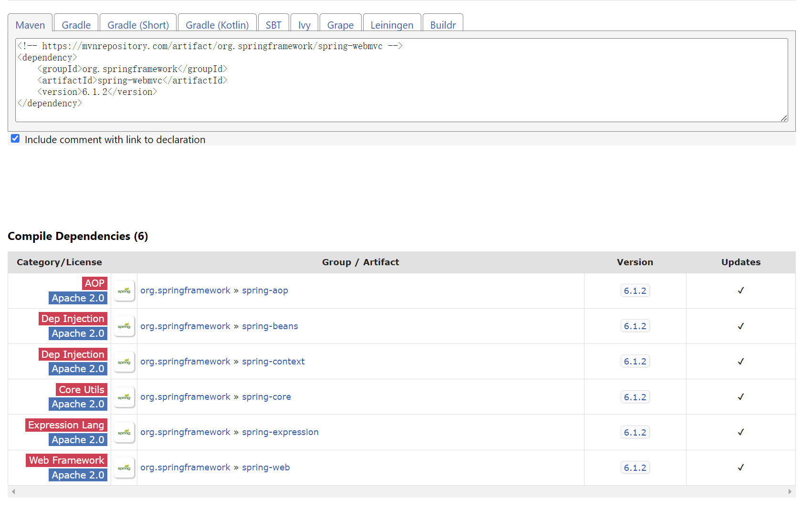

### 1.2 DispatcherServlet

> DispatcherServlet 是 SpringMVC 抽象的 Servlet 实现


1. DispatcherServlet 通常 URL 配置为 /* 用于拦截整个项目中的请求
2. DispatcherServlet 拦截 URL 后、会将 URL 匹配 Controller 类中的 URL 注解方法
3. 匹配 URL 方法完成后、SpringMVC 会提取 URL 中的参数、再对方法进行反射
4. 并在解析 URL 参数过程中、预留了可插拔的参数校验手段
5. 反射 URL 方法执行的过程中、预留了可插拔的拦截器手段、用于控制该执行过程
6. URL 方法执行拿到结果后、还会检查 URL 方法配置、再决定以什么方式返回给客户端
7. 返回方式有 视图页面跳转、请求转发、重定向、返回 JSON 数据 等
8. 在整个拦截 URL 执行的过程中 被全局 try 捕获异常、异常还提供全局异常处理

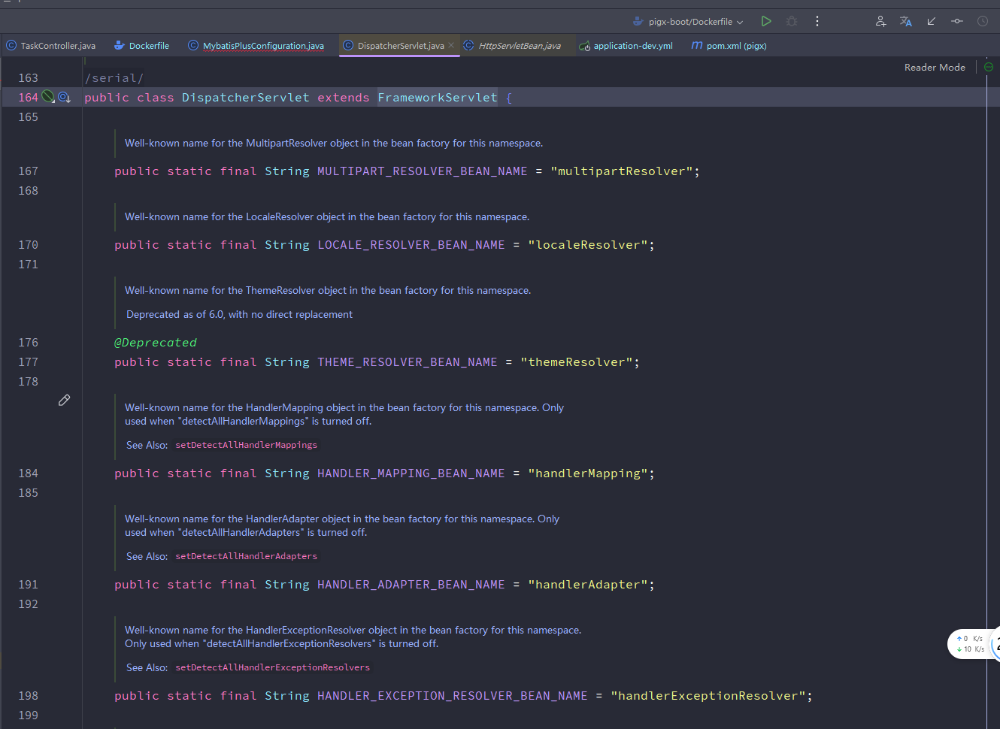

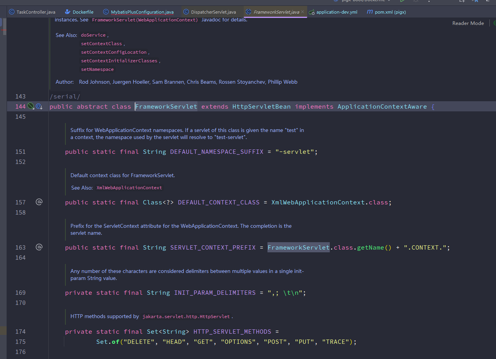

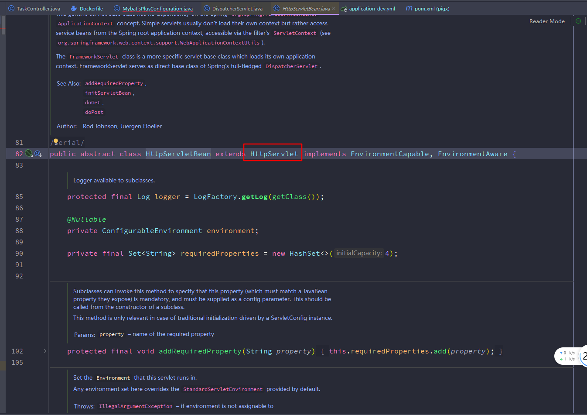

### 1.3 启动逻辑

> SpringServletContainerInitialize类用于监听容器启动，用于引导spring运行

- [x] SpringServletContainerInitializer 实现接口 ServletContainerInitializer
- [x] SpringServletContainerInitializer 注解 WebApplicationInitializer
- [x] AbstractAnnotationConfigDispatcherServletInitializer 实现 WebApplicationInitializer 

+ **关键代码**

    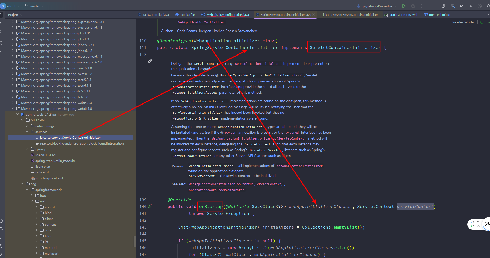

+ 关键逻辑

    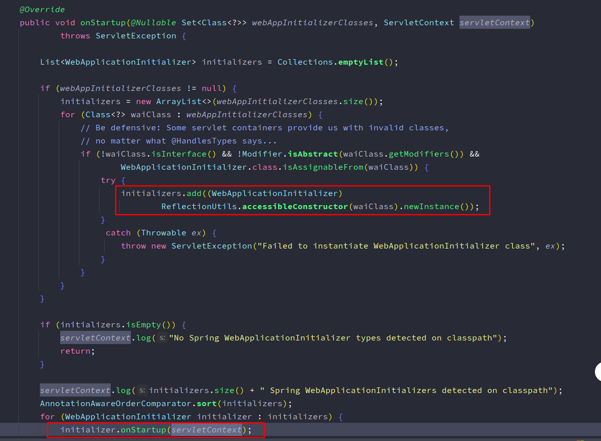


### 1.4 JSON

> SpringMVC若配置URL方法返回值为JSON时，默认会使用Jackson

+ SpringMVC 是直接使用 Jackson 基础常用 Api、将 URL 方法返回值处理返回

+ 一般不用过多考虑 SpringMVC & Jackson 版本对应问题

+ pom.xml

    ```xml
    <dependency>
        <groupId>com.fasterxml.jackson.core</groupId>
        <artifactId>jackson-databind</artifactId>
        <version>2.16.1</version>
    </dependency>
    
    <!--        <dependency>-->
    <!--            <groupId>com.fasterxml.jackson.core</groupId>-->
    <!--            <artifactId>jackson-annotations</artifactId>-->
    <!--            <version>2.16.1</version>-->
    <!--        </dependency>-->
    
    <!--        <dependency>-->
    <!--            <groupId>com.fasterxml.jackson.core</groupId>-->
    <!--            <artifactId>jackson-core</artifactId>-->
    <!--            <version>2.16.1</version>-->
    <!--        </dependency>-->
    
    <!-- 选择 jackson 对 java8 time 类型支持 -->    
    <dependency>
        <groupId>com.fasterxml.jackson.datatype</groupId>
        <artifactId>jackson-datatype-jsr310</artifactId>
        <version>2.16.1</version>
    </dependency>
    
    <!-- 选择 jackson 对 java8 stream 等 类型支持 -->   
    <dependency>
        <groupId>com.fasterxml.jackson.datatype</groupId>
        <artifactId>jackson-datatype-jdk8</artifactId>
        <version>2.16.1</version>
    </dependency>
    
    <!-- 选择 jackson 对 类构造方法参数名 方法参数名 反射支持 -->    
    <dependency>
        <groupId>com.fasterxml.jackson.module</groupId>
        <artifactId>jackson-module-parameter-names</artifactId>
        <version>2.16.1</version>
    </dependency>
    ```


## 2. **Web上下文**

> SpringMVC将从DispatchServlet注册开始引导Spring上下文初始化

### 2.1 上下文关系

+ **官网**

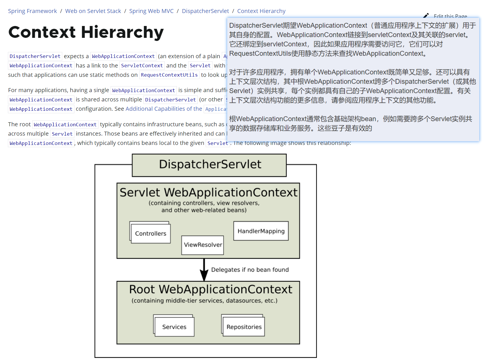

### 2.2 上下文入口

> AbstractAnnotationConfigDispatcherServletInitializer 提供三个方法


- getRootConfigClasses 读取公共的 ROOT 上下文配置 [通常不需要]


- getServletConfigClasses 从 DispatcherServlet 开始建立上下文

    - 会得到 WebApplicationContext 上下文

        - 扫描到 @Service @Repository 组件时 会形成子 Root 上下文
        - [x] ROOT 上下文被 WebApplicationContext 隔离小黑屋  逻辑
        - [x] ROOT 不应获取 WebApplicationContext 上下文组件  逻辑
        - [x] WebApplicationContext 正常获取 ROOT 上下文组件  逻辑

        

- getServletMappings 为 DispatcherServlet 绑定 URL 

- **AbstractAnnotationConfigDispatcherServletInitializer.java**

    ```java
    public class XyzWebAppInitializer extends AbstractAnnotationConfigDispatcherServletInitializer {
    
    	@Override
    	protected Class<?>[] getRootConfigClasses() {
    		return new Class<?>[] { RootConfig.class };
    	}
    
    	@Override
    	protected Class<?>[] getServletConfigClasses() {
    		return new Class<?>[] { App1Config.class };
    	}
    
    	@Override
    	protected String[] getServletMappings() {
    		return new String[] { "/*" };
    	}
       
    }
    ```

- 关键代码

    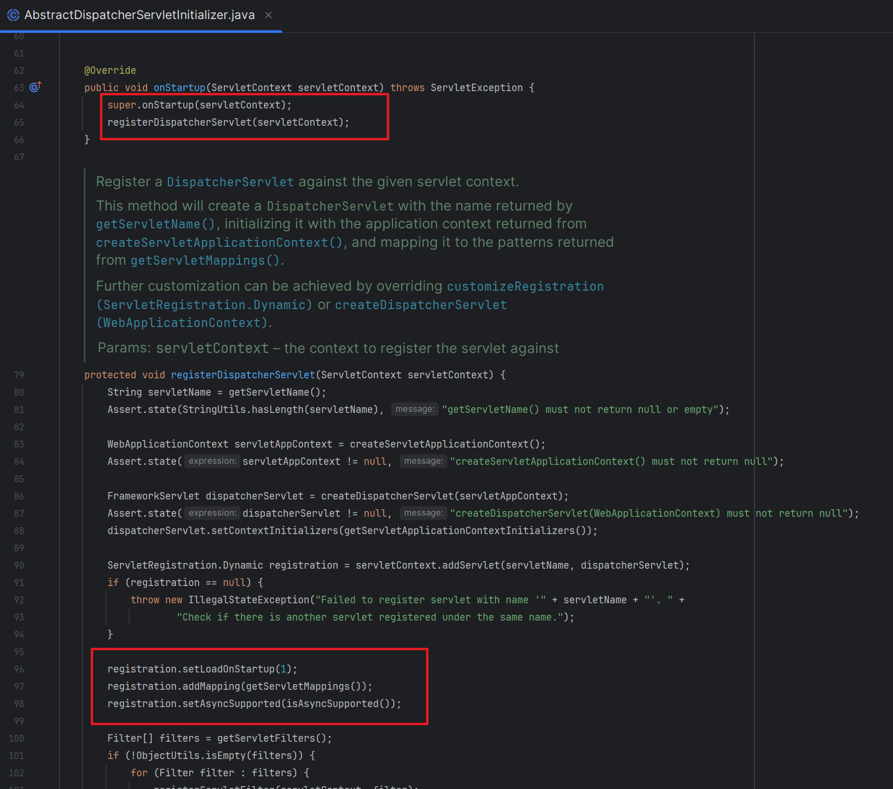


## 3. **整合**

### 3.1 环境

+ **pom.xml**

    ```xml
    <?xml version="1.0" encoding="UTF-8"?>
    <project xmlns="http://maven.apache.org/POM/4.0.0"
             xmlns:xsi="http://www.w3.org/2001/XMLSchema-instance"
             xsi:schemaLocation="http://maven.apache.org/POM/4.0.0 
                                 https://maven.apache.org/xsd/maven-4.0.0.xsd">
        
        <modelVersion>4.0.0</modelVersion>
    
        <groupId>com.example</groupId>
        <artifactId>spring-webmvc</artifactId>
        <version>1.0-SNAPSHOT</version>
        <name>spring-webmvc</name>
        <packaging>war</packaging>
    
        <properties>
            <project.build.sourceEncoding>UTF-8</project.build.sourceEncoding>
            <maven.compiler.target>17</maven.compiler.target>
            <maven.compiler.source>17</maven.compiler.source>
            <junit.version>5.9.2</junit.version>
        </properties>
    
        <dependencies>
            <dependency>
                <groupId>jakarta.servlet</groupId>
                <artifactId>jakarta.servlet-api</artifactId>
                <version>6.0.0</version>
                <scope>provided</scope>
            </dependency>
    
            <dependency>
                <groupId>org.springframework</groupId>
                <artifactId>spring-webmvc</artifactId>
                <version>6.1.2</version>
            </dependency>
    
            <dependency>
                <groupId>com.fasterxml.jackson.core</groupId>
                <artifactId>jackson-databind</artifactId>
                <version>2.16.1</version>
            </dependency>
    
            <dependency>
                <groupId>com.fasterxml.jackson.datatype</groupId>
                <artifactId>jackson-datatype-jsr310</artifactId>
                <version>2.16.1</version>
            </dependency>
    
            <dependency>
                <groupId>com.fasterxml.jackson.datatype</groupId>
                <artifactId>jackson-datatype-jdk8</artifactId>
                <version>2.16.1</version>
            </dependency>
    
            <dependency>
                <groupId>com.fasterxml.jackson.module</groupId>
                <artifactId>jackson-module-parameter-names</artifactId>
                <version>2.16.1</version>
            </dependency>
    
        </dependencies>
    
        <build>
            <plugins>
                <plugin>
                    <groupId>org.apache.maven.plugins</groupId>
                    <artifactId>maven-war-plugin</artifactId>
                    <version>3.3.2</version>
                </plugin>
                <plugin>
                    <groupId>org.codehaus.cargo</groupId>
                    <artifactId>cargo-maven3-plugin</artifactId>
                    <version>1.10.10</version>
                    <configuration>
                        <container>
                            <containerId>tomcat10x</containerId>
                            <type>embedded</type>
                        </container>
                        <deployables>
                            <deployable>
                                <type>war</type>
                                <location>
                                    ${project.build.directory}/${project.build.finalName}.war
                                </location>
                                <properties>
                                    <context>/spring-webmvc</context>
                                </properties>
                            </deployable>
                        </deployables>
                    </configuration>
                </plugin>
            </plugins>
        </build>
    </project>
    ```

### 3.2 配置

+ **SystemConfigDispatcherServletInitializer.java**

    ```java
    package com.example.mvc.conf;
    
    import org.springframework.web.servlet.support.AbstractAnnotationConfigDispatcherServletInitializer;
    
    public class SystemConfigDispatcherServletInitializer extends AbstractAnnotationConfigDispatcherServletInitializer {
        @Override
        protected Class<?>[] getRootConfigClasses() {
            return null;
        }
    
        @Override
        protected Class<?>[] getServletConfigClasses() {
            return new Class[]{SpringWebContextConfiguration.class};
        }
    
        @Override
        protected String[] getServletMappings() {
            return new String[]{"/*"};
        }
    }
    ```

+ **SpringWebContextConfiguration.java**

    ```java
    package com.example.mvc.conf;
    
    
    import org.springframework.context.annotation.ComponentScan;
    import org.springframework.context.annotation.Configuration;
    import org.springframework.web.servlet.config.annotation.EnableWebMvc;
    
    @Configuration
    @ComponentScan(basePackages = "com.example.mvc")
    
    // 1. 识别 Web 相关注解
    // 2. 为 DispatcherServlet 注册相关组件到容器中
    @EnableWebMvc
    public class SpringWebContextConfiguration {
    }
    ```

+ **UserController.java**

    ```java
    package com.example.mvc.controller;
    
    
    import org.springframework.web.bind.annotation.GetMapping;
    import org.springframework.web.bind.annotation.RestController;
    
    import java.util.Collections;
    import java.util.Map;
    
    // 只标识该类为响应约定类 返回类型由 视图解析器 或 方法上约定注解指定
    // @Controller
    
    // 标识该类为响应约定类 类中所有方法的返回值都转为 JSON 进行响应
    @RestController
    public class UserController {
    
        @GetMapping("/api/v1/anonymous/user/welcome")
        public Map<String, String> welcome() {
            return Collections.singletonMap("welcome", "springMVC");
        }
    
    }
    ```

## 4. URL注解

> SpringMVC主要提供以下注解用于绑定URL与方法的映射关系

- @RequestMapping -- 类上为总 URL | 方法上为 方法次 URL 默认接收 GET 请求
- @GetMapping     -- 只能在方法上 只接收 GET  请求
- @PostMapping    -- 只能在方法上 只接收 POST 请求
- @XxxMapping     -- 只能在方法上 接收 PTU | DELETE 等对应请求


* **Usage**

    ```java
    package com.example.mvc.controller;
    
    
    import org.springframework.web.bind.annotation.GetMapping;
    import org.springframework.web.bind.annotation.PostMapping;
    import org.springframework.web.bind.annotation.RequestMapping;
    import org.springframework.web.bind.annotation.RequestMethod;
    import org.springframework.web.bind.annotation.RestController;
    
    import java.util.Collections;
    import java.util.Map;
    
    @RestController
    @RequestMapping("/api/v1/anonymous")
    public class UrlController {
    
        // 127.0.0.1:8080/spring-webmvc/api/v1/anonymous/url1
        @RequestMapping(value = "/url1", method = RequestMethod.GET)
        public Map<String, String> url1() {
            return Collections.singletonMap("url", "url1");
        }
    
        // 127.0.0.1:8080/spring-webmvc/api/v1/anonymous/url2
        @GetMapping(value = "/url2")
        public Map<String, String> url2() {
            return Collections.singletonMap("url", "url2");
        }
    
        // 127.0.0.1:8080/spring-webmvc/api/v1/anonymous/url3
        @PostMapping(value = "/url3")
        public Map<String, String> url3() {
            return Collections.singletonMap("url", "url3");
        }
    
        // 127.0.0.1:8080/spring-webmvc/api/v1/anonymous
        @GetMapping
        public Map<String, String> url4() {
            return Collections.singletonMap("url", "url4");
        }
    }
    ```

## 5. 参数处理

> SpringMVC 将 URL 参数解析后可将其指定传递给当前 对应 URL 方法的参数

- SpringMVC 要求 URL 参数名称对应 URL 方法参数名称

- SpringMVC 支持对参数进行基础格式化和自定义格式化 @DateTimeFormat 可格式日期时间

    - 参数接收格式化 和 URL 方法返回值格式化没半毛钱关系 各是各
    - 如参数日期格式化是 SpringMVC | 方法返回值对象中的日期是 Jackson API

- SpringMVC 支持 @RequestParam("URL 参数名") 指定注入给注解参数变量

- SpringMVC 支持以对象成员方式接收参数

- SpringMVC 解析参数时可插拔参数校验、支持 Bean validation 规范

- SpringMVC 默认只接收表单格式数据、如果参数是 JSON 必须使用 @RequestBody 注解方法参数

- **Usage**

    ```java
    package com.example.mvc.controller;
    
    
    import com.example.mvc.controller.request.RequestUserBody;
    import org.springframework.format.annotation.DateTimeFormat;
    import org.springframework.web.bind.annotation.GetMapping;
    import org.springframework.web.bind.annotation.RequestBody;
    import org.springframework.web.bind.annotation.RequestMapping;
    import org.springframework.web.bind.annotation.RestController;
    
    import java.time.LocalDateTime;
    import java.util.Map;
    
    @RestController
    @RequestMapping("/api/v1/anonymous/param")
    public class ParamController {
    
    
        // 127.0.0.1:8080/spring-webmvc/api/v1/anonymous/param/url1?username=admin&gender=1&datetime=2024-01-02 16:29:48
        @GetMapping("/url1")
        public Map<String, Object> url1(String username,
                                        int gender,
                                        @DateTimeFormat(pattern = "yyyy-MM-dd HH:mm:ss")
                                        LocalDateTime datetime){
            return Map.of("username", username, "gender", gender, "datetime", datetime);
        }
    
        @GetMapping("/url2")
        public Map<String, Object> url2(RequestUserBody user){
            return Map.of("user", user);
        }
    
        // url json
        @GetMapping("/url3")
        public Map<String, Object> url3(@RequestBody RequestUserBody user){
            return Map.of("user", user);
        }
    
    }
    ```

- **RequestUserBody.java**

    ```java
    package com.example.mvc.controller.request;
    
    import com.fasterxml.jackson.annotation.JsonFormat;
    import lombok.Data;
    import org.springframework.format.annotation.DateTimeFormat;
    
    import java.time.LocalDateTime;
    
    @Data
    public class RequestUserBody {
    
        private String username;
        private int gender;
    
        @DateTimeFormat(pattern = "yyyy-MM-dd HH:mm:ss")
        @JsonFormat(pattern = "yyyy-MM-dd HH:mm:ss")
        private LocalDateTime datetime;
    
    }
    ```

## 6. 占位参数

> 占位参数是对restful风格URL的支持

- url: get/user?username=admin | restful /get/user/admin

- springmvc restful url: /get/user/{username}

- @PathVariable("占位参数名称")

- **PathVariableController.java**

    ```java
    package com.example.mvc.controller;
    
    
    import org.springframework.web.bind.annotation.GetMapping;
    import org.springframework.web.bind.annotation.PathVariable;
    import org.springframework.web.bind.annotation.RequestMapping;
    import org.springframework.web.bind.annotation.RestController;
    
    import java.util.Map;
    
    @RestController
    @RequestMapping("/api/v1/anonymous/users")
    public class PathVariableController {
    
    
        // GET 127.0.0.1:8080/spring-webmvc/api/v1/anonymous/users/admin
        @GetMapping("/{username}")
        public Map<String, Object> url(@PathVariable("username") String username){
            return Map.of("username", username);
        }
    
    }
    ```

## 7. 统一视图

> 统一视图 使得全站总是返回统一的数据结构，更有利于系统的维护

+ **JsonHelper.java**

    ```java
    package com.example.mvc.json;
    
    import com.fasterxml.jackson.core.JsonProcessingException;
    import com.fasterxml.jackson.databind.ObjectMapper;
    import com.fasterxml.jackson.datatype.jdk8.Jdk8Module;
    import com.fasterxml.jackson.datatype.jsr310.JavaTimeModule;
    import com.fasterxml.jackson.module.paramnames.ParameterNamesModule;
    import jakarta.servlet.http.HttpServletResponse;
    
    import java.io.IOException;
    import java.io.PrintWriter;
    import java.util.Objects;
    
    public final class JsonHelper {
        private JsonHelper() {
    
        }
    
        public final static ObjectMapper OBJECT_MAPPER = new ObjectMapper();
    
        static {
            OBJECT_MAPPER
                    .registerModule(new JavaTimeModule())
                    .registerModule(new Jdk8Module())
                    .registerModule(new ParameterNamesModule());
        }
    
        public static String toJSON(Object object) {
            Objects.requireNonNull(object);
            try {
                return OBJECT_MAPPER.writeValueAsString(object);
            } catch (JsonProcessingException e) {
                throw new RuntimeException(e);
            }
        }
    
        public static void responseToClient(HttpServletResponse response, Object object){
            response.setContentType("application/json");
            response.setCharacterEncoding("utf-8");
            try {
                PrintWriter writer = response.getWriter();
                writer.println(toJSON(object));
                writer.close();
            } catch (IOException e) {
                throw new RuntimeException(e);
            }
        }
    
    }
    ```

+ **JsonBody.java**

    ```java
    package com.example.mvc.controller.view;
    
    import com.example.mvc.json.JsonHelper;
    import jakarta.servlet.http.HttpServletResponse;
    
    import java.util.HashMap;
    import java.util.Map;
    
    public class JsonBody {
    
        // 状态码
        private int code;
    
        public void setCode(int code) {
            this.code = code;
        }
    
        public int getCode() {
            return code;
        }
    
        // 请求结果状态
        private boolean success;
    
        public void setSuccess(boolean success) {
            this.success = success;
        }
    
        public boolean isSuccess() {
            return success;
        }
    
        // 请求操作描述
        private String description;
    
        public void setDescription(String description) {
            this.description = description;
        }
    
        public String getDescription() {
            return description;
        }
    
        // 响应数据结构
        private Map<String, Object> context;
    
        public void setContext(Map<String, Object> context) {
            this.context = context;
        }
    
        public Map<String, Object> getContext() {
            return context;
        }
    
        private JsonBody(int code, boolean success, String description) {
            this.code = code;
            this.success = success;
            this.description = description;
        }
    
        private JsonBody() {
            this(0, false, "");
        }
    
        public static JsonBody success(int code, String description) {
            return new JsonBody(code, true, description);
        }
    
        public static JsonBody failed(int code, String description) {
            return new JsonBody(code, false, description);
        }
    
        public void toClient(HttpServletResponse response) {
            JsonHelper.responseToClient(response, this);
        }
    
    
        public JsonBody add(String key, Object value) {
            if (context == null) {
                context = new HashMap<>();
            }
            context.put(key, value);
    
            return this;
        }
    
    }
    ```


## 8. 全局异常

> 全局异常是因为DispatcherServlet拦截了当此请求

- 对于一次 request 请求后续发生的所有异常都能被 DispatcherServlet 捕获
- @ControllerAdvice     -- 声明类 为 Controller 对应异常处理类
- @RestControllerAdvice -- 声明类 为 Controller 对应异常处理类
- @ExceptionHandler     -- 处理具体异常


+ **GlobalExceptionHandler.java**

    ```java
    package com.example.mvc.exception;
    
    
    import com.example.mvc.controller.view.JsonBody;
    import org.springframework.web.bind.annotation.ExceptionHandler;
    import org.springframework.web.bind.annotation.RestControllerAdvice;
    
    @RestControllerAdvice
    public class GlobalExceptionHandler {
    
        @ExceptionHandler(ArithmeticException.class)
        public JsonBody handleArithmeticException(ArithmeticException e){
            return JsonBody.failed(500, "出问题了").add("error", e.getMessage());
        }
    
        @ExceptionHandler(Exception.class)
        public JsonBody handleException(Exception e){
            return JsonBody.failed(500, "服务器打盹儿了...");
        }
    
    }
    ```

+ **api设计手段**

    ```java
    package com.example.mvc.service;
    
    import com.example.mvc.controller.UserController;
    import com.example.mvc.exception.UsernameNotFoundException;
    import org.springframework.beans.factory.annotation.Autowired;
    import org.springframework.stereotype.Service;
    
    @Service
    public class UserService {
    
        @Override
        public String toString() {
            return "UserService{}";
        }
    
        public void login(String username, String password) {
            if (username == null || password == null) {
                throw new UsernameNotFoundException("cause By : can not found username = " + username);
            }
        }
    
    }
    ```


## 9. **数据校验**

> 数据校验总是校验外部来源的数据

- springMVC 提供内置校验手段 & **支持 Bean 校验规范**
- Spring 容器可配置 LocalValidatorFactoryBean 来指定校验接口
- LocalValidatorFactoryBean 能够自动找到 Bean 规范实现
- Bean Validation 支持对象 | 方法参数 | 分组 等复杂校验 请参考规范 [与spring无关]

### 9.1 环境

```xml
<dependency>
    <groupId>org.hibernate.validator</groupId>
    <artifactId>hibernate-validator</artifactId>
    <version>8.0.1.Final</version>
</dependency>
```

+ dependency

    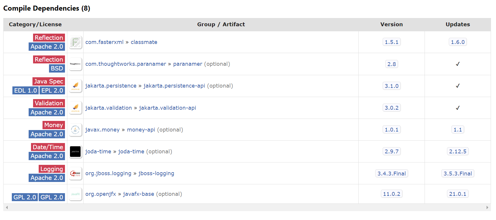

### 9.2 配置

> LocalValidatorFactoryBean 

+ **LocalValidatorFactoryBean.java**

    ```java
    package com.example.mvc.conf;
    
    
    import org.springframework.context.annotation.Bean;
    import org.springframework.context.annotation.Configuration;
    import org.springframework.validation.beanvalidation.LocalValidatorFactoryBean;
    
    @Configuration
    public class HibernateValidatorConfiguration {
    
        @Bean
        public LocalValidatorFactoryBean validator() {
            return new LocalValidatorFactoryBean();
        }
    
    }
    ```

### 9.3 运用

> 校验类

+ **RequestUserBody.java**

    ```java
    package com.example.mvc.controller.request;
    
    import com.fasterxml.jackson.annotation.JsonFormat;
    
    import jakarta.validation.constraints.Max;
    import jakarta.validation.constraints.Min;
    import jakarta.validation.constraints.NotNull;
    import jakarta.validation.constraints.Pattern;
    
    import lombok.Data;
    import org.hibernate.validator.constraints.Length;
    import org.springframework.format.annotation.DateTimeFormat;
    
    import java.time.LocalDateTime;
    
    @Data
    public class RequestUserBody {
    
        @NotNull(message = "账号不能为空")
        @Length(min = 6, max = 12, message = "账号不符合格式")
        private String username;
    
        @Min(value = 0L, message = "性别不能小于0")
        @Max(value = 2L, message = "性别不能大于2")
        private int gender;
    
        @DateTimeFormat(pattern = "yyyy-MM-dd HH:mm:ss")
        @JsonFormat(pattern = "yyyy-MM-dd HH:mm:ss")
        private LocalDateTime datetime;
    
    
        @NotNull(message = "手机号不能为空")
        @Pattern(regexp = "1[3456789]\\d{9}")
        private String phone;
    
    }
    ```

+ **UserController.java**

    ```java
    package com.example.mvc.controller;
    
    
    import com.example.mvc.controller.request.RequestUserBody;
    import com.example.mvc.controller.view.JsonBody;
    import com.example.mvc.service.UserService;
    import org.springframework.validation.BindException;
    import org.springframework.validation.annotation.Validated;
    import org.springframework.web.bind.annotation.GetMapping;
    import org.springframework.web.bind.annotation.PathVariable;
    import org.springframework.web.bind.annotation.RestController;
    
    import java.time.LocalDateTime;
    import java.time.format.DateTimeFormatter;
    import java.util.Collections;
    import java.util.Map;
    
    @RestController
    public record UserController(UserService userService) {
    
        // 如果写成这样 校验不通过会抛出异常
        @GetMapping("/api/v1/anonymous/user/login")
        public JsonBody validator(@Validated RequestUserBody user) {
            return JsonBody.success(200, "校验通过").add("user", user);
        }
    
        // 如过校验通过 bindException == null 
        // 两个参数 不能交换顺序 如果校验不通过 bindException 不为空 线程不会断
        // @GetMapping("/api/v1/anonymous/user/login")
        // public JsonBody validator(@Validated RequestUserBody user, BindException bindException){
        //     return JsonBody.success(200, "校验通过").add("user", user);
        // }
    
    }
    ```

+ GlobalExceptionHandler.java

    ```java
    package com.example.mvc.exception;
    
    
    import com.example.mvc.controller.view.JsonBody;
    import org.springframework.validation.BindException;
    import org.springframework.validation.FieldError;
    import org.springframework.web.bind.annotation.ExceptionHandler;
    import org.springframework.web.bind.annotation.RestControllerAdvice;
    
    import java.util.List;
    
    
    @RestControllerAdvice
    public class GlobalExceptionHandler {
    
    
        @ExceptionHandler(ArithmeticException.class)
        public JsonBody handleArithmeticException(ArithmeticException e){
            return JsonBody.failed(500, "出问题了").add("error", e.getMessage());
        }
    
        @ExceptionHandler(Exception.class)
        public JsonBody handleException(Exception e){
            return JsonBody.failed(500, "服务器打盹儿了...").add("error", e.getMessage());
        }
    
    
        @ExceptionHandler(BindException.class)
        public JsonBody handleBindException(BindException bindException){
    
            // boolean hasErrors = bindException.hasErrors();
    
            JsonBody body = JsonBody.failed(400, "参数数据格式不正确");
    
            List<FieldError> fieldErrors = bindException.getFieldErrors();
            for (FieldError fieldError : fieldErrors) {
                String field = fieldError.getField();
                String message = fieldError.getDefaultMessage();
                body.add(field, message);
            }
    
            return body;
        }
    
    }
    ```

### 9.4 散参数校验

> @Validated 需要注解在 Controller 类上 & 抛出规范异常 ConstraintViolationException

+ HibernateValidatorConfiguration.java

    ```java
    package com.example.mvc.conf;
    
    
    import org.springframework.context.annotation.Bean;
    import org.springframework.context.annotation.Configuration;
    import org.springframework.validation.beanvalidation.LocalValidatorFactoryBean;
    import org.springframework.validation.beanvalidation.MethodValidationPostProcessor;
    
    @Configuration
    public class HibernateValidatorConfiguration {
    
        @Bean
        public LocalValidatorFactoryBean validator() {
            return new LocalValidatorFactoryBean();
        }
    
        @Bean
        public MethodValidationPostProcessor validationPostProcessor() {
            MethodValidationPostProcessor processor = new MethodValidationPostProcessor();
            
            // 将 ConstraintViolationException 转为 非法状态异常 没卵用 [拿不到校验信息]
            // processor.setAdaptConstraintViolations(true);
            return processor;
        }
    
    }
    ```

+ **UserController.java**

    ```java
    package com.example.mvc.controller;
    
    import com.example.mvc.controller.request.RequestUserBody;
    import com.example.mvc.controller.view.JsonBody;
    import com.example.mvc.service.UserService;
    import jakarta.validation.constraints.Max;
    import org.springframework.beans.factory.annotation.Autowired;
    import org.springframework.validation.annotation.Validated;
    import org.springframework.web.bind.annotation.GetMapping;
    import org.springframework.web.bind.annotation.RestController;
    
    
    @Validated
    @RestController
    public class UserController {
    
        private UserService userService;
    
        @Autowired
        public void setUserService(UserService userService) {
            this.userService = userService;
        }
    
        // 如果写成这样 校验不通过会抛出异常
        @GetMapping("/api/v1/anonymous/user/login")
        public JsonBody validator(@Validated RequestUserBody user) {
            return JsonBody.success(200, "校验通过").add("user", user);
        }
    
        @GetMapping("/api/v1/anonymous/user/login2")
        public JsonBody validator2(@Max(value = 180L, message = "宽度不能超过180px") int width,
                                   @Max(value = 80L,  message = "高度不能超过80px")  int height) {
            return JsonBody.success(200, "校验通过")
                    .add("width", width)
                    .add("height", height);
        }
    }
    ```

+ **GlobalExceptionHandler.java**

    ```java
    	package com.example.mvc.exception;
    
    
    import com.example.mvc.controller.view.JsonBody;
    import jakarta.validation.ConstraintViolation;
    import jakarta.validation.ConstraintViolationException;
    import jakarta.validation.Path;
    import org.springframework.validation.BindException;
    import org.springframework.validation.FieldError;
    import org.springframework.web.bind.annotation.ExceptionHandler;
    import org.springframework.web.bind.annotation.RestControllerAdvice;
    
    import java.util.Iterator;
    import java.util.List;
    import java.util.Set;
    
    
    @RestControllerAdvice
    public class GlobalExceptionHandler {
    
    
        @ExceptionHandler(ArithmeticException.class)
        public JsonBody handleArithmeticException(ArithmeticException e) {
            return JsonBody.failed(500, "出问题了").add("error", e.getMessage());
        }
    
        @ExceptionHandler(Exception.class)
        public JsonBody handleException(Exception e) {
            return JsonBody.failed(500, "服务器打盹儿了...").add("error", e.getMessage());
        }
    
        // ConstraintViolationException
        @ExceptionHandler(ConstraintViolationException.class)
        public JsonBody handleConstraintViolationException(ConstraintViolationException cve) {
    
            JsonBody body = JsonBody.failed(400, "散参数校验不通过");
            Set<ConstraintViolation<?>> constraintViolations = cve.getConstraintViolations();
            for (ConstraintViolation<?> constraintViolation : constraintViolations) {
                Path path = constraintViolation.getPropertyPath();
                Path.Node last = null;
                Iterator<Path.Node> iterator = path.iterator();
                for (Path.Node node : path) {
                    last = node;
                }
                String message = constraintViolation.getMessage();
                body.add(last.getName(), message);
            }
    
            return body;
        }
    
    
        @ExceptionHandler(BindException.class)
        public JsonBody handleBindException(BindException bindException) {
    
            // boolean hasErrors = bindException.hasErrors();
    
            JsonBody body = JsonBody.failed(400, "参数数据格式不正确");
    
            List<FieldError> fieldErrors = bindException.getFieldErrors();
            for (FieldError fieldError : fieldErrors) {
                String field = fieldError.getField();
                String message = fieldError.getDefaultMessage();
                body.add(field, message);
            }
    
            return body;
        }
    
    }
    ```

### 9.5 自定义注解校验

> 自定义注解校验是属于规范技术、和 spring 无关

+ Person.java

    ```java
    package com.example.mvc.entity;
    
    import com.example.mvc.validation.GenderValidation;
    import jakarta.validation.constraints.NotNull;
    import lombok.Data;
    
    @Data
    public class Person {
    
        @NotNull(message = "姓名不能为空")
        private String name;
    
        @NotNull(message = "性别不能为空")
        // @Pattern(regexp = "man|woman")
        @GenderValidation(message = "性别必须符合 [man | woman]")
        private String gender; // [man, woman]
    
    }
    ```

+ PersonController.java

    ```java
    package com.example.mvc.controller;
    
    
    import com.example.mvc.entity.Person;
    import com.example.mvc.controller.view.JsonBody;
    import org.springframework.validation.annotation.Validated;
    import org.springframework.web.bind.annotation.GetMapping;
    import org.springframework.web.bind.annotation.RequestMapping;
    import org.springframework.web.bind.annotation.RestController;
    
    @RestController
    @RequestMapping("/api/v1/anonymous/person")
    public class PersonController {
    
        @GetMapping
        public JsonBody person(@Validated Person person) {
            return JsonBody.success(200, "person").add("person", person);
        }
    
    }
    ```

+ GenderValidation.java 【自定义注解】

    ```java
    package com.example.mvc.validation;
    
    
    import jakarta.validation.Constraint;
    import jakarta.validation.Payload;
    
    import java.lang.annotation.ElementType;
    import java.lang.annotation.Retention;
    import java.lang.annotation.RetentionPolicy;
    import java.lang.annotation.Target;
    
    @Target({ElementType.FIELD, ElementType.METHOD})
    @Retention(RetentionPolicy.RUNTIME)
    @Constraint(validatedBy = GenderValidator.class)
    public @interface GenderValidation {
    
        String message() default "";
    
        Class<?>[] groups() default {};
    
        Class<? extends Payload>[] payload() default {};
    
    }
    ```

+ GenderValidator.java

    ```java
    package com.example.mvc.validation;
    
    import com.example.mvc.entity.Gender;
    import jakarta.validation.ConstraintValidator;
    import jakarta.validation.ConstraintValidatorContext;
    
    public class GenderValidator implements ConstraintValidator<GenderValidation, String> {
        @Override
        public boolean isValid(String genderValue, 
                               ConstraintValidatorContext constraintValidatorContext) {
            
    
            for (Gender gender : Gender.values()){
                if (gender.name().equalsIgnoreCase(genderValue)) {
                    return true;
                }
            }
    
            return false;
        }
    
        // private GenderValidation genderValidation;
        //
        // @Override
        // public void initialize(GenderValidation constraintAnnotation) {
        //     this.genderValidation = genderValidation;
        // }
    }
    ```

+ Gender.java

    ```java
    package com.example.mvc.entity;
    
    public enum Gender {
        MAN, WOMAN;
    }
    ```


## 10. Easy-Captcha

> Easy-Captcha 是用于生成验证码图片的 API、与 Servlet API 无关

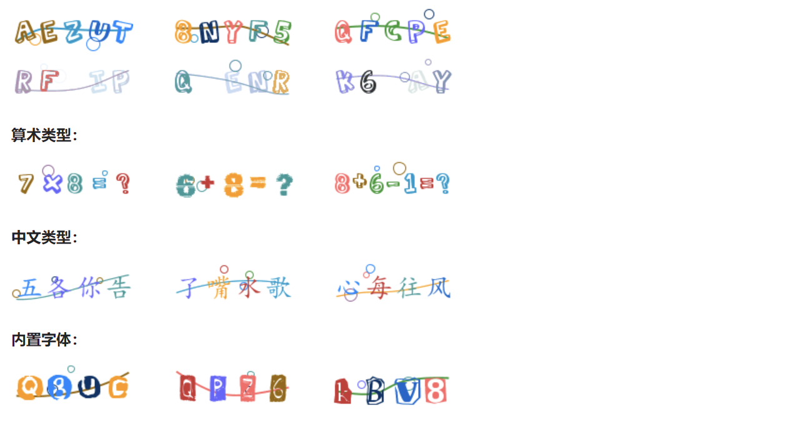

+ pom.xml

    ```xml
    <dependency>
        <groupId>com.github.whvcse</groupId>
        <artifactId>easy-captcha</artifactId>
        <version>1.6.2</version>
    </dependency>
    ```

+ http response header

    ```java
    response.setContentType("image/gif");
    response.setHeader("Pragma", "No-cache");
    response.setHeader("Cache-Control", "no-cache");
    response.setDateHeader("Expires", 0);
    ```

+ CaptchaController.java

    ```java
    package com.example.mvc.controller;
    
    
    import com.wf.captcha.ChineseCaptcha;
    import jakarta.servlet.http.HttpServletResponse;
    import jakarta.servlet.http.HttpSession;
    import org.springframework.web.bind.annotation.GetMapping;
    import org.springframework.web.bind.annotation.RequestMapping;
    import org.springframework.web.bind.annotation.RestController;
    
    import java.io.IOException;
    
    @RestController
    @RequestMapping("/api/v1/anonymous/captcha")
    public class CaptchaController {
    
        // 参数校验
        @GetMapping
        public void captcha(int width, 
                            int height, 
                            HttpServletResponse response, 
                            HttpSession session) {
            
            response.setContentType("image/gif");
            response.setHeader("Pragma", "No-cache");
            response.setHeader("Cache-Control", "no-cache");
            response.setDateHeader("Expires", 0);
    
            ChineseCaptcha chineseCaptcha = new ChineseCaptcha(width, height, 4);
            
            String text = chineseCaptcha.text();
            
            System.out.println("text============================= " + text);
    
            session.setAttribute("code", text);
    
            try {
                chineseCaptcha.out(response.getOutputStream());
            } catch (IOException e) {
                throw new RuntimeException(e);
            }
    
        }
    
    }
    ```

+ **CaptchaController.java** 前后端分离

    ```java
    @GetMapping
    public JsonBody captcha(int width, int height) {
        
        ChineseCaptcha chineseCaptcha = new ChineseCaptcha(width, height, 4);
        
        String text = chineseCaptcha.text();
        
        String clientId = UUID.randomUUID().toString();
    
        System.out.println("存储 text = " + text);
        System.out.println("存储 clientId = " + clientId);
    
    
        return JsonBody.success(200, "验证码")
                       .add("clientId", clientId)
                       .add("codeUrl", chineseCaptcha.toBase64());
    
    }
    ```

## 11. Filter

>  Filter 是 JAVA WEB 三大组件之一、执行优先级比 SpringMVC 高 [若是拦截到] 
>
> 尽量避免在 SpringMVC 环境去使用 Filter、可使用 SpringMVC 拦截实现相同功能

### 11.1 注册方式

> Filter 相比 Servlet 有**`四种`**注册方式   **web.xml | 注解 | API | 指定注册到 Servlet**

+ **web.xml**

    ```xml
    <filter>
        <filter-name>filterName</filter-name>
        <filter-class>x.y.z.filterName</filter-class>
    </filter>
    
    <filter-mapping>
        <filter-name>filterName</filter-name>
        <url-pattern>/*</url-pattern>
    </filter-mapping>
    ```

+ @WebFilter

    ```java
    package com.example.mvc.filter;
    
    import jakarta.servlet.FilterChain;
    import jakarta.servlet.ServletException;
    import jakarta.servlet.annotation.WebFilter;
    import jakarta.servlet.http.HttpFilter;
    import jakarta.servlet.http.HttpServletRequest;
    import jakarta.servlet.http.HttpServletResponse;
    
    import java.io.IOException;
    
    @WebFilter("/*")
    public class CustomFilter extends HttpFilter {
    
        @Override
        protected void doFilter(HttpServletRequest request, 
                                HttpServletResponse response, 
                                FilterChain chain) throws IOException, ServletException {
            
            super.doFilter(request, response, chain);
        }
    }
    ```

+ api

    ```java
    ServletContext servletContext = request.getServletContext();
            FilterRegistration.Dynamic registration = 
                servletContext.addFilter("filterName", "x.y.z.FilterName");
    
            registration.addMappingForUrlPatterns(拦截请求类型, true, "url");
    
    ```

+ **api [拦截指定名称的某个或多个 servlet]**

    ```java
    ServletContext servletContext = request.getServletContext();
            FilterRegistration.Dynamic registration = 
                servletContext.addFilter("filterName", "x.y.z.FilterName");
    
    registration.addMappingForServletNames(拦截请求类型, true, "指定拦截的servlet名称");
    ```

### 11.2 自定义注册

> 业务指定 Filter 自行注册即可 | SpringMVC 提供的 Filter [编码|跨域]

+ CustomFilter.java [自定义推荐]

    ```java
    package com.example.mvc.filter;
    
    import jakarta.servlet.FilterChain;
    import jakarta.servlet.FilterRegistration;
    import jakarta.servlet.ServletException;
    import jakarta.servlet.annotation.WebFilter;
    import jakarta.servlet.http.HttpFilter;
    import jakarta.servlet.http.HttpServletRequest;
    import jakarta.servlet.http.HttpServletResponse;
    
    import java.io.IOException;
    
    @WebFilter("/*")
    public class CustomFilter extends HttpFilter {
    
        @Override
        protected void doFilter(HttpServletRequest request,
                                HttpServletResponse response,
                                FilterChain chain) throws IOException, ServletException {
    
            System.out.println("do something...");
    
            super.doFilter(request, response, chain);
        }
    }
    ```

    

+ **SystemConfigDispatcherServletInitializer.java [springMVC 提供]**

    ```java
    package com.example.mvc.conf;
    
    import jakarta.servlet.Filter;
    import jakarta.servlet.ServletRegistration;
    import org.springframework.web.filter.CharacterEncodingFilter;
    import org.springframework.web.servlet.config.annotation.WebMvcConfigurer;
    import org.springframework.web.servlet.support.AbstractAnnotationConfigDispatcherServletInitializer;
    
    public class SystemConfigDispatcherServletInitializer extends AbstractAnnotationConfigDispatcherServletInitializer implements WebMvcConfigurer {
        @Override
        protected Class<?>[] getRootConfigClasses() {
            return null;
        }
    
        @Override
        protected Class<?>[] getServletConfigClasses() {
            return new Class[]{SpringWebContextConfiguration.class};
        }
    
        @Override
        protected String[] getServletMappings() {
            return new String[]{"/*"};
        }
    
    
        @Override
        protected Filter[] getServletFilters() {
            return new Filter[]{new CharacterEncodingFilter("UTF-8", true, true)};
        }
    }
    ```

+ `不好使` spring 不会认为 什么什么 然后帮你注册给 servlet 容器

    ```java
    @Bean
    public CustomFilter customFilter() {
        System.out.println("======================================++");
        return new CustomFilter();
    }
    ```

## 12. 拦截器

> SpringMVC拦截器是 DispatcherServlet 执行过程中的拦截机制，不是Filter

### 12.1 机制

+ HandlerInterceptor -- 接口：用于实现拦截功能
    + preHandle -- URL方法执行之前 【前置拦截】
    + postHandle -- URL方法反射执行之后，但未取得返回值做响应
    + afterCompletion -- 响应结束之后
+ Interceptor允许拦截指定URL、同时也可以指定排除URL，相比Filter更好用
+ Interceptor 只允许拦截 Controller URL 
+ 开发者尽量避免使用过多拦截器导致 DispatcherServlet 执行过程过于复杂
+ **`不要让拦截器有交叉逻辑、若是有交叉逻辑、请合并拦截器设计`**


+ 官网

    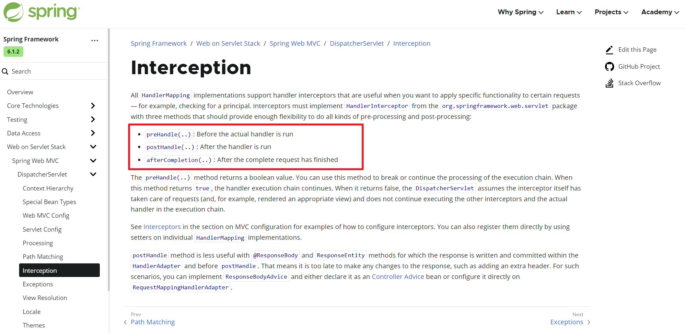


## 13. 文件上传和下载

> springMVC 提供 HTTP 协议处理相关的类封装、同时提供文件下载上传的支持

- org.springframework.http.HttpHeaders 响应头
- org.springframeword.http.MediaType   HTTP mine 类型
- springMVC 文件下载可直接使用 servlet-api、或者 ResponseEntity 类
- springMVC 文件上传可直接使用 servlet-api、或者 MultipartFile  类型接收文件


### 13.1 文件下载

+ FileDownloadController.java

    ```java
    package com.example.spring.controller;
    
    
    import jakarta.servlet.ServletOutputStream;
    import jakarta.servlet.http.HttpServletResponse;
    import org.springframework.http.HttpHeaders;
    import org.springframework.http.HttpStatus;
    import org.springframework.http.MediaType;
    import org.springframework.http.ResponseEntity;
    import org.springframework.web.bind.annotation.GetMapping;
    import org.springframework.web.bind.annotation.RequestMapping;
    import org.springframework.web.bind.annotation.RestController;
    
    import java.io.IOException;
    import java.net.URLEncoder;
    import java.nio.charset.StandardCharsets;
    import java.nio.file.Files;
    import java.nio.file.Path;
    import java.nio.file.Paths;
    import java.util.UUID;
    
    @RestController
    @RequestMapping("/api/v1/anonymous/file")
    public class FileDownloadController {
    
        @GetMapping("/download1")
        public void downloadByServerApi1(HttpServletResponse response) 
            throws IOException {
            // response.setContentType(MediaType.APPLICATION_OCTET_STREAM_VALUE);
    
            Path path = Paths.get("e:\\新建文本文档.txt");
    
            String filename = UUID.randomUUID().toString() + ".txt";
    
            String encode = URLEncoder.encode(filename, StandardCharsets.UTF_8);
    
            byte[] bytes = Files.readAllBytes(path);
    
            response.setContentType("application/octet-stream");
            response.setHeader("Content-Disposition", "attachment;filename=" + encode);
    
            ServletOutputStream out = response.getOutputStream();
            out.write(bytes);
    
        }
    
        @GetMapping("/download2")
        public ResponseEntity<byte[]> downloadByServerApi2() throws IOException {
    
            Path path = Paths.get("e:\\新建文本文档.txt");
            String filename = UUID.randomUUID().toString() + ".txt";
            String encode = URLEncoder.encode(filename, StandardCharsets.UTF_8);
            byte[] bytes = Files.readAllBytes(path);
    
            HttpHeaders httpHeaders = new HttpHeaders();
            httpHeaders.add(HttpHeaders.CONTENT_TYPE, MediaType.APPLICATION_OCTET_STREAM_VALUE);
            httpHeaders.add(HttpHeaders.CONTENT_DISPOSITION, "attachment;filename=" + encode);
    
            return new ResponseEntity<>(bytes, httpHeaders, HttpStatus.OK);
        }
    
    }
    ```

+ MultipartConfig.java

    ```java
    package com.example.spring.servlet;
    
    import jakarta.servlet.annotation.MultipartConfig;
    import jakarta.servlet.annotation.WebServlet;
    import jakarta.servlet.http.HttpServlet;
    
    @WebServlet(urlPatterns = "/name")
    @MultipartConfig(
            location = "",
            fileSizeThreshold = 0,
            maxFileSize = 2 * 1024 * 1024,
            maxRequestSize = 4 * 1024 * 1024
    )
    public class NameServlet extends HttpServlet {
        
    }
    ```

+ Api

    ```java
    package com.example.spring.servlet;
    
    import jakarta.servlet.MultipartConfigElement;
    import jakarta.servlet.ServletContext;
    import jakarta.servlet.ServletException;
    import jakarta.servlet.ServletRegistration;
    import jakarta.servlet.annotation.MultipartConfig;
    import jakarta.servlet.http.HttpServlet;
    import jakarta.servlet.http.HttpServletRequest;
    import jakarta.servlet.http.HttpServletResponse;
    
    import java.io.IOException;
    
    public class NameServlet extends HttpServlet {
    
        @Override
        protected void doGet(HttpServletRequest request, HttpServletResponse response) 
            throws ServletException, IOException {
            
            ServletContext servletContext = request.getServletContext();
            
            ServletRegistration.Dynamic dynamic = 
                    servletContext.addServlet("nameServlet", new NameServlet());
    
            dynamic.addMapping("/*");
            
            MultipartConfigElement multipartConfigElement = 
                    new MultipartConfigElement("", 2 * 1024, 2 * 1024, 0); 
            
            dynamic.setMultipartConfig(multipartConfigElement);
        }
    }
    ```

+ **DispatcherServlet 文件上传配置**

    ```java
    package com.example.spring.conf;
    
    import jakarta.servlet.MultipartConfigElement;
    import jakarta.servlet.ServletRegistration;
    import org.springframework.http.ResponseEntity;
    import org.springframework.web.servlet.support.AbstractAnnotationConfigDispatcherServletInitializer;
    
    public class SpringWebContextInitializer 
        extends AbstractAnnotationConfigDispatcherServletInitializer {
        
        @Override
        protected Class<?>[] getRootConfigClasses() {
            return null;
        }
    
        @Override
        protected Class<?>[] getServletConfigClasses() {
            return new Class<?>[]{SpringContextConfiguration.class};
        }
    
        @Override
        protected String[] getServletMappings() {
            return new String[]{"/*"};
        }
    
        @Override
        protected void customizeRegistration(ServletRegistration.Dynamic registration) {
            
            var multipartConfigElement =
                    new MultipartConfigElement("", 2 * 1024 * 1024, 2 * 1024 * 1024, 0);
    
            registration.setMultipartConfig(multipartConfigElement);
        }
    }
    ```

    > SpringMVC 处理静态资源有两种方式: DispatcherServlet 处理 | 交由 DefaultServlet

+ **配置静态资源处理**

    ```java
    WebMvcConfigurer.java
    
    @Override
    public void addResourceHandlers(ResourceHandlerRegistry registry) {
        registry.addResourceHandler("/resources/**")
                .addResourceLocations("/public", "/static");
    }
    
    // @Override
    // public void configureDefaultServletHandling(DefaultServletHandlerConfigurer configurer) {
    //     configurer.enable();
    //     configurer.enable("default");
    // }
    ```

+ FileUploadController.java

    ```java
    package com.example.spring.controller;
    
    
    import jakarta.servlet.ServletException;
    import jakarta.servlet.http.HttpServletRequest;
    import jakarta.servlet.http.Part;
    import org.springframework.web.bind.annotation.PostMapping;
    import org.springframework.web.bind.annotation.RequestMapping;
    import org.springframework.web.bind.annotation.RequestParam;
    import org.springframework.web.bind.annotation.RestController;
    import org.springframework.web.multipart.MultipartFile;
    
    import java.io.IOException;
    import java.io.InputStream;
    import java.nio.file.Files;
    import java.nio.file.Paths;
    
    @RestController
    @RequestMapping("/api/v1/anonymous/file")
    public class FileUploadController {
    
        @PostMapping("/upload1")
        public void uploadByServletApi(HttpServletRequest request) 
            throws ServletException, IOException {
    
            Part part = request.getPart("upload");
    
            String fileName = part.getSubmittedFileName();
            System.out.println("fileName = " + fileName);
    
            System.out.println("part.getContentType() = " + part.getContentType());
    
            InputStream in = part.getInputStream();
            byte[] bytes = new byte[in.available()];
            in.read(bytes);
    
            Files.write(Paths.get("e:\\" + fileName), bytes);
    
            System.out.println("上传成功...");
    
        }
    
        @PostMapping("/upload2")
        public void uploadBySpringMvcApi(@RequestParam("upload") 
                                         MultipartFile multipartFile) throws IOException {
    
            String contentType = multipartFile.getContentType();
            System.out.println("contentType = " + contentType);
    
            String originalFilename = multipartFile.getOriginalFilename();
            System.out.println("originalFilename = " + originalFilename);
    
            byte[] bytes = multipartFile.getBytes();
    
    
        }
    
    }
    ```

    
