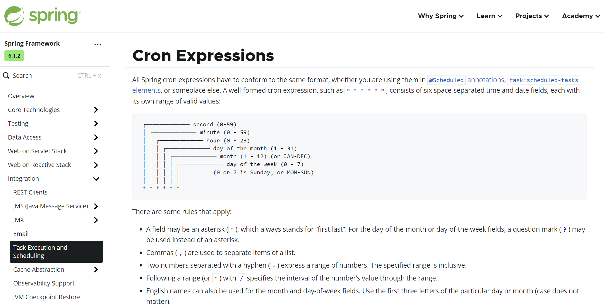
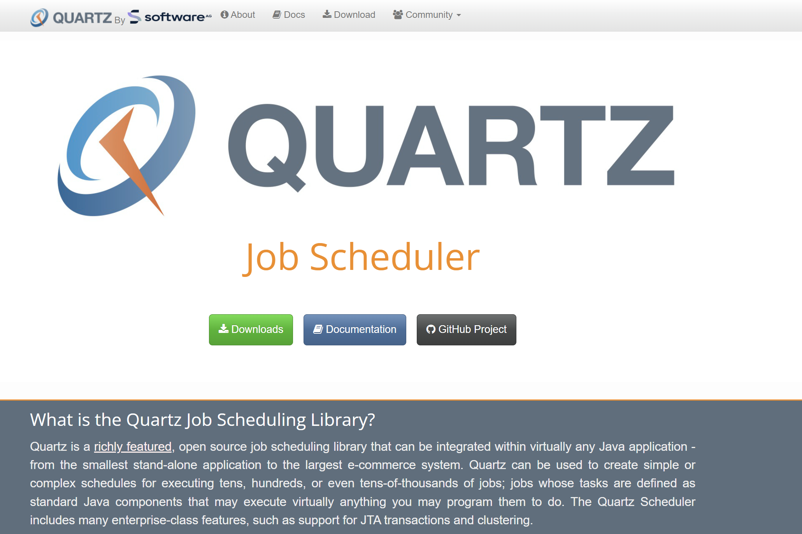

# Spring 定时任务

> === Java的定时任务数以千计，不用担心任何性能问题，一般项目也就几个定时任务

+ @EnableScheduling 注解开启定时任务、定时任务和异步任务没有关联关系

## 1. 配置

> === Spring 推荐为定时任务指定专门的线程池

- **SpringContextConfiguration.java**

~~~java
package org.example.spring.conf;

import org.springframework.context.annotation.Bean;
import org.springframework.context.annotation.ComponentScan;
import org.springframework.context.annotation.Configuration;
import org.springframework.scheduling.SchedulingTaskExecutor;
import org.springframework.scheduling.annotation.EnableScheduling;
import org.springframework.scheduling.concurrent.ThreadPoolTaskScheduler;

@Configuration
@ComponentScan(basePackages = "org.example.spring")
@EnableScheduling
public class SpringContextConfiguration {

    @Bean
    public ThreadPoolTaskScheduler taskScheduler() {
        
        ThreadPoolTaskScheduler scheduler = new ThreadPoolTaskScheduler();
        scheduler.setThreadNamePrefix("Scheduler-");
        scheduler.setPoolSize(3);

        return scheduler;
    }

}
~~~

## 2 应用

> === @Scheduled 指定定时方法、可指定延迟时间、执行间隔

- **ScheduledTaskService.java**

~~~java
package org.example.spring.service;

import org.springframework.scheduling.annotation.Scheduled;
import org.springframework.stereotype.Service;

import java.time.LocalDateTime;
import java.time.format.DateTimeFormatter;
import java.util.concurrent.TimeUnit;

@Service
public class ScheduledTaskService {

    public static final String PATTERN = "yyyy-MM-dd HH:mm:ss";
    public static final DateTimeFormatter FORMATTER = 
        DateTimeFormatter.ofPattern(PATTERN);
	
    // 不要再对该方法进行调用
    @Scheduled(initialDelay = 0, fixedDelay = 1, timeUnit = TimeUnit.SECONDS)
    public void task() {

        System.out.println(Thread.currentThread().getName());
        System.out.println(LocalDateTime.now().format(FORMATTER));
    }

}
~~~

## 3 CronExpressions

> === Cron 表达式可更精确间隔、日期执行定时器

- **规则**

~~~
 ┌───────────── second (0-59)
 │ ┌───────────── minute (0 - 59)
 │ │ ┌───────────── hour (0 - 23)
 │ │ │ ┌───────────── day of the month (1 - 31)
 │ │ │ │ ┌───────────── month (1 - 12) (or JAN-DEC)
 │ │ │ │ │ ┌───────────── day of the week (0 - 7)
 │ │ │ │ │ │          (0 or 7 is Sunday, or MON-SUN)
 │ │ │ │ │ │
 * * * * * *
~~~

1. `*` 表示任意  【20 * * * * *    】 每次 在 20 秒时执行
2. `,` 表示多值  【1,5,7 * * * * * 】 每次 1 5 7 秒执行
3. `-` 表示范围  【1-9 * * * * *   】 每次 1 到 9 秒之间按秒执行一次
4. `/` 表示步长  【* */30 * * * *  】 每隔 30 分钟执行一次
5. `?` 占位冲突  【0 0 10 L * ?    】 每个月最后一天的 10点 执行一次

- **ScheduledTaskService.java**

~~~java
package org.example.spring.service;

import org.springframework.scheduling.annotation.Scheduled;
import org.springframework.stereotype.Service;

import java.time.LocalDateTime;
import java.time.format.DateTimeFormatter;
import java.util.concurrent.TimeUnit;

@Service
public class ScheduledTaskService {

    public static final String PATTERN = "yyyy-MM-dd HH:mm:ss";
    public static final DateTimeFormatter FORMATTER = 
        DateTimeFormatter.ofPattern(PATTERN);

    // @Scheduled(initialDelay = 0, fixedDelay = 1, timeUnit = TimeUnit.SECONDS)
    @Scheduled(cron = "*/3 * * * * *")
    public void task() {

        System.out.println(Thread.currentThread().getName());
        System.out.println(LocalDateTime.now().format(FORMATTER));
    }

}
~~~

## 4 Quartz

> === 官网: https://www.quartz-scheduler.org/

- Spring 环境中使用 Quartz 分为两种: 使用原生 API | 使用整合 API

### 01. 概念

- Quartz 提供对定时任务的管理 如: 分组、多个触发器去触发任务、删除任务等

- **官网**

    

### 02. 环境

- **pom.xml**

~~~xml
<!-- 环境 -->
<dependency>
    <groupId>org.quartz-scheduler</groupId>
    <artifactId>quartz</artifactId>
    <version>2.5.0-rc1</version>
</dependency>

<!-- spring 对 第三方技术封装支持 包括  quartz -->
<dependency>
    <groupId>org.springframework</groupId>
    <artifactId>spring-context-support</artifactId>
    <version>6.1.0</version>
</dependency>

<!--  quartz 可进行数据库存储、对 spring-tx 事务管理模板有依赖 -->
<dependency>
    <groupId>org.springframework</groupId>
    <artifactId>spring-jdbc</artifactId>
    <version>6.1.0</version>
</dependency>
~~~

### 03. 整合

> === 仅为 Spring 对 Quartz 整合使用

- **CustomJob.java [任务]**

~~~java
package org.example.spring.quartz;

import org.quartz.JobExecutionContext;
import org.quartz.JobExecutionException;
import org.springframework.scheduling.quartz.QuartzJobBean;
import org.springframework.stereotype.Component;

import java.time.LocalDateTime;
import java.time.format.DateTimeFormatter;

@Component
public class CustomJob extends QuartzJobBean {

    private int timeout;

    public void setTimeout(int timeout) {
        this.timeout = timeout;
    }

    public int getTimeout() {
        return timeout;
    }

    public static final String PATTERN = "yyyy-MM-dd HH:mm:ss";
    
    public static final DateTimeFormatter FORMATTER = 
        DateTimeFormatter.ofPattern(PATTERN);

    @Override
    protected void executeInternal(JobExecutionContext context) throws JobExecutionException {
        System.out.println(Thread.currentThread().getName());
        System.out.println(LocalDateTime.now().format(FORMATTER));
    }
}
~~~

- **QuartzConfiguration.java [触发器 | 执行器]**

~~~java
package org.example.spring.quartz;

import org.springframework.context.annotation.Bean;
import org.springframework.context.annotation.Configuration;
import org.springframework.scheduling.concurrent.ThreadPoolTaskScheduler;
import org.springframework.scheduling.quartz.CronTriggerFactoryBean;
import org.springframework.scheduling.quartz.JobDetailFactoryBean;
import org.springframework.scheduling.quartz.SchedulerFactoryBean;

import java.util.Objects;

@Configuration
public class QuartzConfiguration {

    @Bean
    public JobDetailFactoryBean jobDetailFactoryBean() {
        JobDetailFactoryBean jobDetail = new JobDetailFactoryBean();
        jobDetail.setName("customJob");
        jobDetail.setGroup("GROUP_ONE");
        jobDetail.getJobDataMap().put("timeout", 5);
        jobDetail.setJobClass(CustomJob.class);
        return jobDetail;
    }

    @Bean
    public CronTriggerFactoryBean cronTriggerFactoryBean(JobDetailFactoryBean jobDetail) {
        CronTriggerFactoryBean cronTrigger = new CronTriggerFactoryBean();
        cronTrigger.setGroup("GROUP_ONE");
        cronTrigger.setCronExpression("*/2 * * * * ?");
        cronTrigger.setJobDetail(Objects.requireNonNull(jobDetail.getObject()));
        cronTrigger.setName("customJobOfCronTrigger");
        return cronTrigger;
    }

    @Bean
    public SchedulerFactoryBean schedulerFactoryBean(CronTriggerFactoryBean trigger,
                                                     ThreadPoolTaskScheduler taskScheduler){
        SchedulerFactoryBean scheduler = new SchedulerFactoryBean();
        scheduler.setTaskExecutor(taskScheduler);
        scheduler.setTriggers(trigger.getObject());
        return scheduler;
    }

}
~~~

- **Application.java**

~~~java
package org.example.spring.api;

import org.example.spring.conf.SpringContextConfiguration;
import org.quartz.JobKey;
import org.quartz.Scheduler;
import org.springframework.context.annotation.AnnotationConfigApplicationContext;
import org.springframework.scheduling.quartz.SchedulerFactoryBean;

public class Application {
    public static void main(String[] args) throws Exception {
        AnnotationConfigApplicationContext context =
                new AnnotationConfigApplicationContext(SpringContextConfiguration.class);

        SchedulerFactoryBean schedulerFactoryBean = 
            context.getBean(SchedulerFactoryBean.class);

        Thread.sleep(10000);
        
        // 此处能走到 Quartz 的 API 中 就可进行 Quartz 的管控了
        Scheduler scheduler = schedulerFactoryBean.getScheduler();

        System.out.println("...main...");
        scheduler.deleteJob(new JobKey("customJob", "GROUP_ONE"));

        // context.close();

    }
}
~~~

