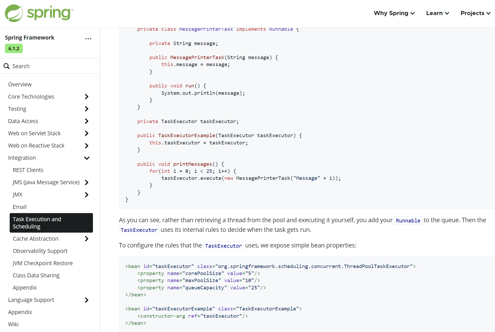

> === Spring 异步任务就是开启一个新的线程去执行其它耗时任务

+ Spring 异步分为常规异步 和 servlet 异步【他是要通知 容器是否执行完毕】

+ 官方手册截图

    

## 1. 容器对象异步

> === @EnableAsync 开启异步任务、AsyncConfigurer 配置异步任务使用的线程池

### 1.1 配置

+ SpringContextConfiguration.java

    ```java
    package org.example.spring.conf;
    
    import jdk.swing.interop.DispatcherWrapper;
    import org.springframework.context.annotation.Bean;
    import org.springframework.context.annotation.ComponentScan;
    import org.springframework.context.annotation.Configuration;
    import org.springframework.core.task.SimpleAsyncTaskExecutor;
    import org.springframework.scheduling.annotation.EnableAsync;
    import org.springframework.scheduling.concurrent.ThreadPoolTaskExecutor;
    
    
    @Configuration
    @ComponentScan(basePackages = "org.example.spring")
    @EnableAsync
    public class SpringContextConfiguration {
    
    
        // @Bean
        // public AsyncConfigurer asyncConfigurer() {
        //
        //     return new AsyncConfigurer() {
        //         @Override
        //         public Executor getAsyncExecutor() {
        //             ThreadPoolTaskExecutor taskExecutor = new ThreadPoolTaskExecutor();
        //             taskExecutor.setThreadNamePrefix("Async-");
        //             taskExecutor.setCorePoolSize(3);
        //             taskExecutor.initialize();
        //             return taskExecutor;
        //         }
        //     };
        // }
    
    
        @Bean
        public ThreadPoolTaskExecutor taskExecutor() {
            ThreadPoolTaskExecutor taskExecutor = new ThreadPoolTaskExecutor();
            taskExecutor.setThreadNamePrefix("Async-");
            taskExecutor.setCorePoolSize(3);
            taskExecutor.initialize();
            return taskExecutor;
        }
    
    }
    ```

### 1.2 应用

+ TaskService.java

    ```java
    package org.example.spring.service;
    
    
    import org.springframework.scheduling.annotation.Async;
    import org.springframework.stereotype.Service;
    
    @Service
    public class TaskService {
    
        @Async
        public void task() {
    
            System.out.println("Thread.currentThread().getName() = " 
                    + Thread.currentThread().getName());
    
            for (int i = 0; i < 10; i++) {
                System.out.println("i = " + i);
            }
        }
    
    }
    ```

    

## 2. DispatcherServlet

