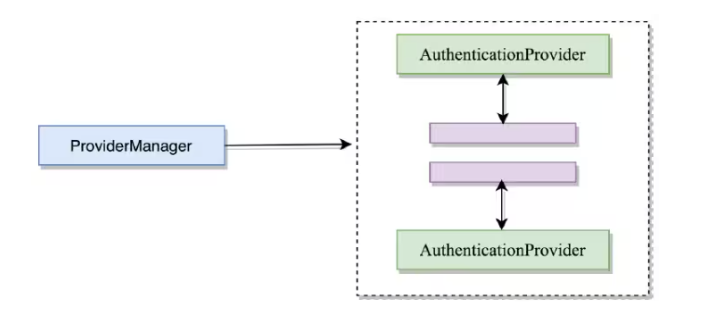

# SpringSecurity

> [!note]
>
> 1. SpringSecurity是一个功能强大且可高度定制的身份验证和访问控制框架，是基于Spring的应用程序的实施标准。
> 2. SpringSecurity是一个专注为应用程序提供身份验证和授权的框架。与所有Spring项目一样，SpringScurity的真正强大之处在于可以轻松扩展以满足自定义的要求

- [x] **官方文档：** https://spring.io/projects/spring-security#overview
- [x] **功能**：
    1. 身份认证（authentication）：身份认证是验证`谁正在访问系统资源`，判断用户是否为合法用户。认证用户的常见方式是要求用户输入用户名和密码。
    2. 授权（authorization）：用户进行身份认证后，系统会控制`谁能访问哪些资源`，这个过程叫做授权。用户无法访问没有权限的资源。
    3. 防御常见攻击（protection against common attacks）：CSRF、HTTP Headers、HTTP Requests

## **1. SCI**

> === AbstractSecurityWebApplicationInitializer是 Spring Security提供的SCI

- [x]  AbstractSecurityWebApplicationInitializer引导 SpringSecurity 过滤链注册 

+ **AbstractSecurityWebApplicationInitializer**

    ```java
    public abstract class AbstractSecurityWebApplicationInitializer implements WebApplicationInitializer {
        private static final String SERVLET_CONTEXT_PREFIX = "org.springframework.web.servlet.FrameworkServlet.CONTEXT.";
        public static final String DEFAULT_FILTER_NAME = "springSecurityFilterChain";
        private final Class<?>[] configurationClasses;
    
        protected AbstractSecurityWebApplicationInitializer() {
            this.configurationClasses = null;
        }
    
        protected AbstractSecurityWebApplicationInitializer(Class<?>... configurationClasses) {
            this.configurationClasses = configurationClasses;
        }
    
        public final void onStartup(ServletContext servletContext) {
            this.beforeSpringSecurityFilterChain(servletContext);
            if (this.configurationClasses != null) {
                AnnotationConfigWebApplicationContext rootAppContext = new AnnotationConfigWebApplicationContext();
                rootAppContext.register(this.configurationClasses);
                servletContext.addListener(new ContextLoaderListener(rootAppContext));
            }
    
            if (this.enableHttpSessionEventPublisher()) {
                servletContext.addListener("org.springframework.security.web.session.HttpSessionEventPublisher");
            }
    
            servletContext.setSessionTrackingModes(this.getSessionTrackingModes());
            this.insertSpringSecurityFilterChain(servletContext);
            this.afterSpringSecurityFilterChain(servletContext);
        }
    
        protected boolean enableHttpSessionEventPublisher() {
            return false;
        }
    
        private void insertSpringSecurityFilterChain(ServletContext servletContext) {
            String filterName = "springSecurityFilterChain";
            DelegatingFilterProxy springSecurityFilterChain = new DelegatingFilterProxy(filterName);
            String contextAttribute = this.getWebApplicationContextAttribute();
            if (contextAttribute != null) {
                springSecurityFilterChain.setContextAttribute(contextAttribute);
            }
    
            this.registerFilter(servletContext, true, filterName, springSecurityFilterChain);
        }
    
        protected final void insertFilters(ServletContext servletContext, Filter... filters) {
            this.registerFilters(servletContext, true, filters);
        }
    
        protected final void appendFilters(ServletContext servletContext, Filter... filters) {
            this.registerFilters(servletContext, false, filters);
        }
    
        private void registerFilters(ServletContext servletContext, boolean insertBeforeOtherFilters, Filter... filters) {
            Assert.notEmpty(filters, "filters cannot be null or empty");
            Filter[] var4 = filters;
            int var5 = filters.length;
    
            for(int var6 = 0; var6 < var5; ++var6) {
                Filter filter = var4[var6];
                Assert.notNull(filter, () -> {
                    return "filters cannot contain null values. Got " + Arrays.asList(filters);
                });
                String filterName = Conventions.getVariableName(filter);
                this.registerFilter(servletContext, insertBeforeOtherFilters, filterName, filter);
            }
    
        }
    
        private void registerFilter(ServletContext servletContext, boolean insertBeforeOtherFilters, String filterName, Filter filter) {
            FilterRegistration.Dynamic registration = servletContext.addFilter(filterName, filter);
            Assert.state(registration != null, () -> {
                return "Duplicate Filter registration for '" + filterName + "'. Check to ensure the Filter is only configured once.";
            });
            registration.setAsyncSupported(this.isAsyncSecuritySupported());
            EnumSet<DispatcherType> dispatcherTypes = this.getSecurityDispatcherTypes();
            registration.addMappingForUrlPatterns(dispatcherTypes, !insertBeforeOtherFilters, new String[]{"/*"});
        }
    
        private String getWebApplicationContextAttribute() {
            String dispatcherServletName = this.getDispatcherWebApplicationContextSuffix();
            return dispatcherServletName == null ? null : "org.springframework.web.servlet.FrameworkServlet.CONTEXT." + dispatcherServletName;
        }
    
        protected Set<SessionTrackingMode> getSessionTrackingModes() {
            return EnumSet.of(SessionTrackingMode.COOKIE);
        }
    
        protected String getDispatcherWebApplicationContextSuffix() {
            return null;
        }
    
        protected void beforeSpringSecurityFilterChain(ServletContext servletContext) {
        }
    
        protected void afterSpringSecurityFilterChain(ServletContext servletContext) {
        }
    
        protected EnumSet<DispatcherType> getSecurityDispatcherTypes() {
            return EnumSet.of(DispatcherType.REQUEST, DispatcherType.ERROR, DispatcherType.ASYNC, DispatcherType.FORWARD, DispatcherType.INCLUDE);
        }
    
        protected boolean isAsyncSecuritySupported() {
            return true;
        }
    }
    
    ```

+ **SpringWebSecurityConfiguration**

    ```java
    @Configuration
    @EnableWebSecurity
    public class SpringWebSecurityConfiguration {
        // 默认配置
        // @Bean
        // public SecurityFilterChain securityFilterChain(HttpSecurity http) throws Exception {
        // http.authorizeHttpRequests((requests) -> requests.anyRequest().authenticated());
        // http.formLogin(withDefaults());
        // http.httpBasic(withDefaults());
        // return http.build();
        // }
    }
    ```

+ **SpringWebSecurityInitializer**

    ```java
    package com.exmaple.web;
    import org.springframework.security.web.context.AbstractSecurityWebApplicationInitializer;
    public class SpringWebSecurityInitializer
        extends AbstractSecurityWebApplicationInitializer {
        public SpringWebSecurityInitializer() {
            super(SpringWebSecurityConfiguration.class);
        }
    }
    ```

## 2. 密码学

> === 密码加密主要分为 对称加密 和  非对称加密

- [x] 对称加密：使用相同的密钥进行加密和解密
- [x] 非对称加密：使用一对密钥，公钥用于加密 & 私钥用于解密
- [x] MD5 (Message-Digest Algorithm) 常用于密码加密策略的控制及实现

### **2.1 散列算法策略**

#### **2.1.1 特征**

1. MD5 不可逆 不可根据运算结果 反推计算值（但是呢需要防止彩虹表）
2. MD5 多次运算相同计算值  总是得到相同的结果  不同计算值总是得到不同的结果 【算法稳定】

#### **2.1.2 策略**

1. 根据 MD5 算法特征 需要为计算值加入随即盐 及 MD5(计算值 + 随即盐) = 计算结果
2. 无法进行逆运算 即 校验需要二次加密 计算值比对两次结果

+ 逻辑

    ```tex
    加密
    	原始值A1 + 随机盐 => 运算结果A11
        
    校验
    	原始值A2 + 随机盐 => 运算结果A22
        
    比较
    	结果A11 <=> 结果A22 是否相同 即可得出 原始值A1 > 原始值A2 是否相同
        
    注意点
    	原始值A2 加密 需要获取 原始值A1 所使用 随机盐
    ```

    

### **2.2 MD5**

> === java.security.MessageDigest 提供散列算法实现

### **2.3 spring-security crypto**

> === spring-security-crypto 模块提供加密抽象及实现

## **3. RBAC权限模型**

> === 一般权限模型基于 RBAC(Role-Base Access Controller) 可以根据业务对以下五个表进行调整

+ user

    ```sql
    CREATE TABLE user (
        user_id INT PRIMARY KEY AUTO_INCREMENT,
        user_nickname VARCHAR(20),
        user_username VARCHAR(20) NOT NULL,
        user_password VARCHAR(128) NOT NULL,
        user_gender INT,
        user_phone VARCHAR(12) NOT NULL,
    );
    ```

    

+ role

    ```sql
    CREATE TABLE role (
        role_id INT PRIMARY KEY AUTO_INCREMENT,
        role_name VARCHAR(20)
    );
    ```

    

+ user_role

    ```sql
    CREATE TABLE user_role (
        ur_id INT PRIMARY KEY AUTO_INCREMENT,
        ur_user_id INT NOT NULL,
        ur_role_id INT NOT NULL
    );
    ```

    

+ permission

    ```sql
    CREATE TABLE permission (
        permission_id INT PRIMARY KEY AUTO_INCREMENT,
        permission_name VARCHAR(20) NOT NULL
    );
    ```

    

+ role_permission

    ```sql
    CREATE TABLE role_permission (
        rp_id INT PRIMARY KEY AUTO_INCREMENT,
        rp_role_id INT NOT NULL,
        rp_permission_idd INT NOT NULL,
    );
    ```

## 4. Spring Security 权限模型

> === Spring Security 权限模型由 UserDetails | GrantedAuthority 构成

- [x] org.springframework.security.core.GrantedAuthority : 角色权限
- [x] org.springframework.security.core.userDetails.UserDetails : 表示用户信息
- [x] org.springframework.security.core.userDetails.UserDetailsService : 获取用户信息

### 4.1 GrantedAuthority

> === 一个GrantedAuthority对象表示一个角色 | 权限 【Spring Security】 不区分权限角色

- [x] Spring Security 只有权限集合的概念 不区分你抽象的是角色还是权限，只是在乎你有没有


+ **GrantedAuthority**

    ```java
    public interface GrantedAuthority extends Serializable {
    	String getAuthority();
    }
    ```

    

### 4.2 UserDetails

> === Spring Security 权限模型中的用户信息

+ UserDetails

    ```java
    /*
     * Copyright 2004, 2005, 2006 Acegi Technology Pty Limited
     *
     * Licensed under the Apache License, Version 2.0 (the "License");
     * you may not use this file except in compliance with the License.
     * You may obtain a copy of the License at
     *
     *      https://www.apache.org/licenses/LICENSE-2.0
     *
     * Unless required by applicable law or agreed to in writing, software
     * distributed under the License is distributed on an "AS IS" BASIS,
     * WITHOUT WARRANTIES OR CONDITIONS OF ANY KIND, either express or implied.
     * See the License for the specific language governing permissions and
     * limitations under the License.
     */
    
    package org.springframework.security.core.userdetails;
    
    import java.io.Serializable;
    import java.util.Collection;
    
    import org.springframework.security.core.Authentication;
    import org.springframework.security.core.GrantedAuthority;
    
    /**
     * Provides core user information.
     *
     * <p>
     * Implementations are not used directly by Spring Security for security purposes. They
     * simply store user information which is later encapsulated into {@link Authentication}
     * objects. This allows non-security related user information (such as email addresses,
     * telephone numbers etc) to be stored in a convenient location.
     * <p>
     * Concrete implementations must take particular care to ensure the non-null contract
     * detailed for each method is enforced. See
     * {@link org.springframework.security.core.userdetails.User} for a reference
     * implementation (which you might like to extend or use in your code).
     *
     * @author Ben Alex
     * @see UserDetailsService
     * @see UserCache
     */
    public interface UserDetails extends Serializable {
    
    	/**
    	 * Returns the authorities granted to the user. Cannot return <code>null</code>.
    	 * @return the authorities, sorted by natural key (never <code>null</code>)
    	 */
    	Collection<? extends GrantedAuthority> getAuthorities();
    
    	/**
    	 * Returns the password used to authenticate the user.
    	 * @return the password
    	 */
    	String getPassword();
    
    	/**
    	 * Returns the username used to authenticate the user. Cannot return
    	 * <code>null</code>.
    	 * @return the username (never <code>null</code>)
    	 */
    	String getUsername();
    
    	/**
    	 * Indicates whether the user's account has expired. An expired account cannot be
    	 * authenticated.
    	 * @return <code>true</code> if the user's account is valid (ie non-expired),
    	 * <code>false</code> if no longer valid (ie expired)
    	 */
    	boolean isAccountNonExpired();
    
    	/**
    	 * Indicates whether the user is locked or unlocked. A locked user cannot be
    	 * authenticated.
    	 * @return <code>true</code> if the user is not locked, <code>false</code> otherwise
    	 */
    	boolean isAccountNonLocked();
    
    	/**
    	 * Indicates whether the user's credentials (password) has expired. Expired
    	 * credentials prevent authentication.
    	 * @return <code>true</code> if the user's credentials are valid (ie non-expired),
    	 * <code>false</code> if no longer valid (ie expired)
    	 */
    	boolean isCredentialsNonExpired();
    
    	/**
    	 * Indicates whether the user is enabled or disabled. A disabled user cannot be
    	 * authenticated.
    	 * @return <code>true</code> if the user is enabled, <code>false</code> otherwise
    	 */
    	boolean isEnabled();
    
    }
    
    ```

### 4.3 UserDetailsService

> === 根据用户名获取用户信息并转为 UserDetails 标准用户信息接口 [可不使用]

+ UserDetailsService 

    ```java
    package org.springframework.security.core.userdetails;
    
    /**
     * Core interface which loads user-specific data.
     * <p>
     * It is used throughout the framework as a user DAO and is the strategy used by the
     * {@link org.springframework.security.authentication.dao.DaoAuthenticationProvider
     * DaoAuthenticationProvider}.
     *
     * <p>
     * The interface requires only one read-only method, which simplifies support for new
     * data-access strategies.
     *
     * @author Ben Alex
     * @see org.springframework.security.authentication.dao.DaoAuthenticationProvider
     * @see UserDetails
     */
    public interface UserDetailsService {
    
    	/**
    	 * Locates the user based on the username. In the actual implementation, the search
    	 * may possibly be case sensitive, or case insensitive depending on how the
    	 * implementation instance is configured. In this case, the <code>UserDetails</code>
    	 * object that comes back may have a username that is of a different case than what
    	 * was actually requested..
    	 * @param username the username identifying the user whose data is required.
    	 * @return a fully populated user record (never <code>null</code>)
    	 * @throws UsernameNotFoundException if the user could not be found or the user has no
    	 * GrantedAuthority
    	 */
    	UserDetails loadUserByUsername(String username) throws UsernameNotFoundException;
    
    }
    
    ```

## 5. EnableXXXXXXBeanConfiguration注解


> === Spring框架给出两种 【动态】 装配Bean机制   选择式动态 | 运行时动态

- [x] 选择式动态 由 开发者主要通过 @Import 注解封装完成 【被选择Bean配置不要被扫描】
- [x] 运行时动态 由 Spring  @Conditional 条件注解完成，可在运行时决定装配 Bean


EnableXXXXBeanConfiguration可实现可插拔式配置

+ @EnableWebSecurity 

    @Import实现装配

    ```java
    @Retention(RetentionPolicy.RUNTIME)
    @Target(ElementType.TYPE)
    @Documented
    @Import({ WebSecurityConfiguration.class, SpringWebMvcImportSelector.class, OAuth2ImportSelector.class,
    		HttpSecurityConfiguration.class })
    @EnableGlobalAuthentication
    public @interface EnableWebSecurity {
    
    	/**
    	 * Controls debugging support for Spring Security. Default is false.
    	 * @return if true, enables debug support with Spring Security
    	 */
    	boolean debug() default false;
    
    }
    
    ```

    

## 6. 认证流程

> === 认证流程  是指用户登录之后记录登录标识，下次请求时根据会话跟踪获取用户信息的过程

服务器认证：

- [x] 资源服务器认证授权：负责保护资源并验证访问令牌
- [x] 认证服务器： 负责验证用户凭据并发放访问令牌

### 6.1 三个基本组件

#### 6.1.1 AuthenticationManager

> [!note]
>
> 认证管理器：定义了Spring Security 过滤器要如何执行过滤操作，AuthenticationManager 认证成功之后会返回一个Authenticationd对象，这个Authentication对象会被设置到SecurityContextHolder中。

#### 6.1.2 AuthenticationProvider

> [!note]
>
> Spring Security 支持多种不同的认证方式，不同的认证方式对应不同的身份类型，AuthenticationProvider就是针对不同的身份类型执行具体的身份认证。例如，常见的 DaoAuthenticationProvider 用来支持用户名/密码登录认证。
>
> - [x] authenticate方法用来执行具体的身份验证。
> - [x] supports方法用来判断当前AuthenticationProvider是否支持对应的身份类型。

#### 6.1.3 ProviderManager

ProviderManager 和 AuthenticationProvider 之间的关系




> [!note]
>
> 在Spring Security中，由于系统可能同时支持多种不同的认证方式，例如同时支持用户名 /密码认证、RememberMe认证、手机号码动态认证等，而不同的认证方式对应了不同的 AuthenticationProvider，所以一个完整的认证流程可能由多个AuthenticationProvider来提供。
>
>   多个AuthenticationProvider将组成一个列表，这个列表将由ProviderManager代理。换句话说，在 ProviderManager 中存在一个 AuthenticationProvider 列表，在 ProviderManager 中遍历列表中的每一个AuthenticationProvider去执行身份认证，最终得到认证结果。


### 6.2 流程

- [x] 当用户提交登录请求时，UsernamePasswordAuthenticationFilter会从当前请求 HttpServletRequest中提取出登录用户名/密码，然后创建出一个 UsernamePasswordAuthenticationToken 对象。
- [x] UsernamePasswordAuthenticationToken 对象将被传入 ProviderManager 中进行具体的认证操作。 
- [x] 如果认证失败，则SecurityContextHolder中相关信息将被清除，登录失败回调也会被调用。
- [x] 如果认证成功，则会进行登录信息存储、Session并发处理、登录成功事件发布以及登录成功方法回调等操作。

### 6.3 系统资源权限设计

> === 系统资源权限一般分为三种情况 【不受限】 【登录权限】 【角色权限】

