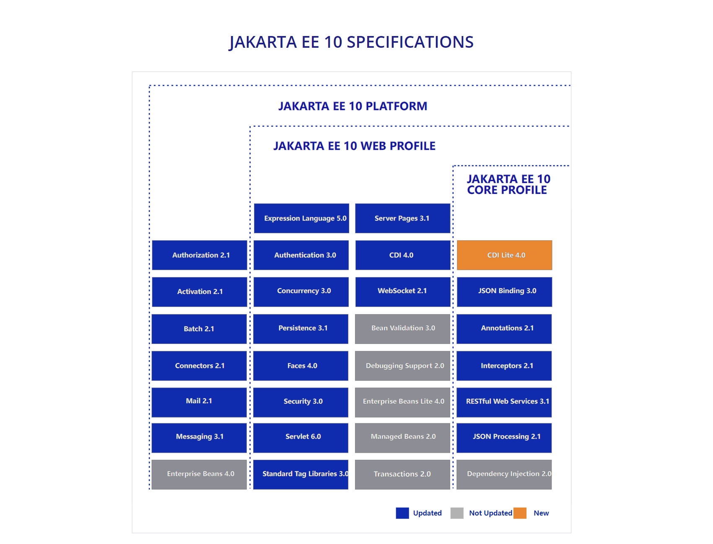
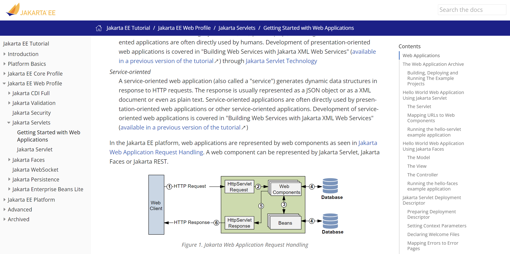
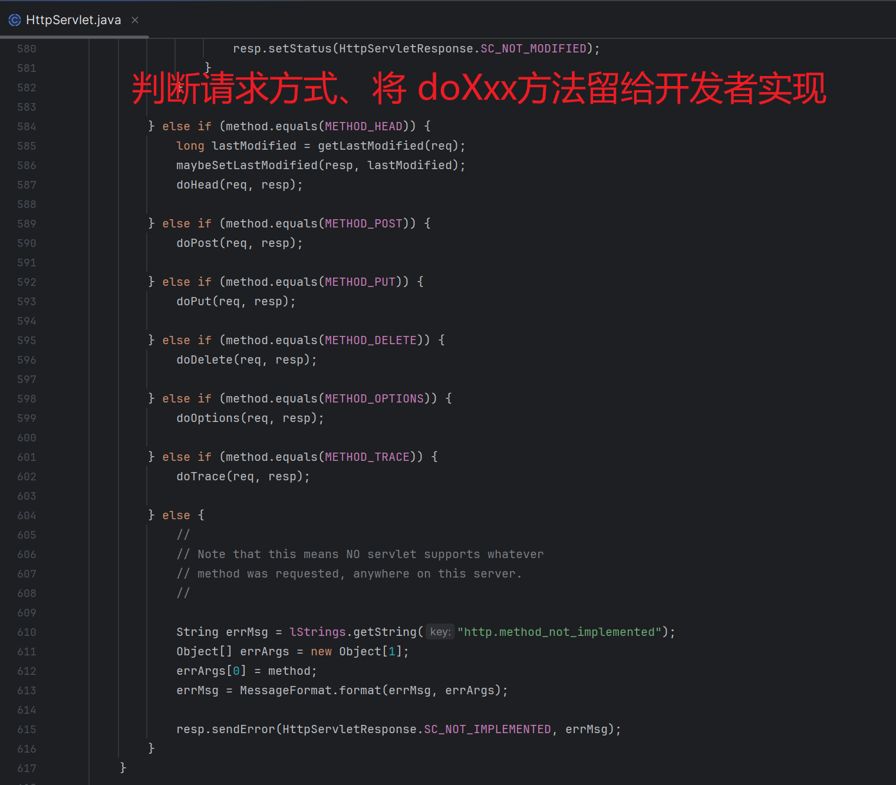

# jakarta servlet

> === Web项目主要由 Jakarta EE 规范 servlet.api 提供技术支持

+ jakarta EE 10 管理 servelt6.0 规范

    

## 1. 机制及项目结构

> === https://jakarta.ee/learn/docs/jakartaee-tutorial/current/web/webapp/webapp.html

+ servlet 执行流程

    

+ Servlet 约定 maven目录结构

    ```makefile
     |-- src
     |    -- main
     |         |-- java
     |         |    -- com
     |         |         -- example
     |         |              |-- controller
     |         |              |    -- Servlet.java
     |         |              |-- model
     |         |                   -- Bean.java
     |         |-- resources
     |         |    -- com
     |         |         -- example
     |         |              -- i18n
     |         |                   |-- text.properties
     |         |                   |-- text_en.properties
     |         |                   |-- text_es.properties
     |         -- `webapp
     |              |-- META-INF
     |              |    -- MANIFEST.MF
     |              |-- resources
     |              |    |-- css
     |              |    |    -- style.css
     |              |    |-- img
     |              |    |    -- logo.svg
     |              |    -- js
     |              |         -- script.js
     |              |-- `WEB-INF
     |              |    |-- beans.xml
     |              |    |-- faces-config.xml
     |              |    `-- web.xml
     |              |-- favicon.ico
     |              -- index.xhtml
     `-- pom.xml
    ```

+ Servlet 实现者 类加载顺序机制 加载实现者【自身需要类 | 项目第三方类 | 项目类】

+ Servelt3.0 起提供注解及API注册 Servelt | Filter 等组件不再需要 web.xml 文件

+ pom.xml

    ```xml
    <dependency>
        <groupId>jakarta.servlet</groupId>
        <artifactId>jakarta.servlet-api</artifactId>
        <version>6.0.0</version>
        <scope>provided</scope>
    </dependency>
    ```

    

## 2. 声明周期

> === servlet 接口中约定了 其 api 的执行机制

+ 官方：https://jakarta.ee/specifications/platform/10/apidocs/jakarta/servlet/servlet

+ jakarta.servelt.Servlet

    ```java
    package jakarta.servlet;
    
    import java.io.IOException;
    
    public interface Servlet {
        
        void init(ServletConfig servletConfig) throws ServletException;
    
        ServletConfig getServletConfig();
    
        void service(ServletRequest request, ServletResponse response) 
            throws ServletException, IOException;
    
        String getServletInfo();
    
        void destroy();
    }
    ```

    1. servlet 要求被 URL 绑定，以使得在访问URL时能映射到对应servlet
    2. init -- 当servlet对象被创建后进行调用并可获得其配置
    3. service -- 每次执行到该servlet时总是调用service方法并获得当前请求、相应对象
    4. destory -- 当servlet对象被销毁前调用 执行清理操作

## 3. HttpServlet

> === jakarta.servelt.http.HttpServlet 是对 Servlet HTTP 协议的实现

+ HttpServlet 将根据生命周期执行到 service 生命周期方法后

    - 根据当前请求方式
        - 执行
            - doGet
            - doPost
            - doPut
            - doDelete 
            - doXxx 一些列对应 HTTP 请求方式方法上

+ **核心代码执行机制**

    


## 4. Cargo

> === cargo 是maven官方提供的运行 jakarta EE Servlet.api 的容器插件

+ pom.xml

    ```xml
    <build>
        <plugins>
            <plugin>
                <groupId>org.apache.maven.plugins</groupId>
                <artifactId>maven-war-plugin</artifactId>
                <version>3.3.2</version>
            </plugin>
            <plugin>
                <groupId>org.codehaus.cargo</groupId>
                <artifactId>cargo-maven3-plugin</artifactId>
                <version>1.10.10</version>
                <configuration>
                    <container>
                        <containerId>tomcat10x</containerId>
                        <type>embedded</type>
                    </container>
                    <deployables>
                        <deployable>
                            <type>war</type>
                            <location>
                ${project.build.directory}/${project.build.finalName}.war
                            </location>
                            <properties>
                                <context>/web</context>
                            </properties>
                        </deployable>
                    </deployables>
                </configuration>
            </plugin>
    
        </plugins>
    </build>
    ```

    

+ **mvn [cargo 运行 war 项目 需先对 项目进行打包]**

    ```sh
    mvn clean package cargo:run
    ```

## 5. Servlet高级进阶

+ @GetUrlMapping

    ```java
    package com.example.controller.annotaction;
    
    import java.lang.annotation.ElementType;
    import java.lang.annotation.Retention;
    import java.lang.annotation.RetentionPolicy;
    import java.lang.annotation.Target;
    
    @Target(ElementType.METHOD)
    @Retention(RetentionPolicy.RUNTIME)
    public @interface GetUrlMapping {
        String url ();
    }
    ```

+ UserController.java

    ```java
    package com.example.controller;
    
    
    import com.example.controller.annotaction.GetUrlMapping;
    import jakarta.servlet.http.HttpServletRequest;
    import jakarta.servlet.http.HttpServletResponse;
    
    import java.util.HashMap;
    import java.util.Map;
    
    
    public class UserController  {
    
        @GetUrlMapping(url = "/user/login")
        public String login(HttpServletRequest request, 
                            HttpServletResponse response){
            System.out.println("login...");
    
            return "login";
        }
    
        @GetUrlMapping(url = "/user/register")
        public Map<String, String> register(HttpServletRequest request, 
                                            HttpServletResponse response){
            System.out.println("register...");
    
            Map<String, String> map = new HashMap<>();
    
            map.put("user", "register");
    
            return map;
        }
    
    }
    ```

+ BaseGetServlet.java

    ```java
    package com.example.springwebmvc;
    
    import com.example.controller.annotaction.GetUrlMapping;
    import com.example.util.JsonHelper;
    import jakarta.servlet.Servlet;
    import jakarta.servlet.ServletException;
    import jakarta.servlet.annotation.WebServlet;
    import jakarta.servlet.http.HttpServlet;
    import jakarta.servlet.http.HttpServletRequest;
    import jakarta.servlet.http.HttpServletResponse;
    
    import java.io.File;
    import java.io.IOException;
    import java.lang.reflect.Constructor;
    import java.lang.reflect.Method;
    import java.util.ArrayList;
    import java.util.List;
    
    
    @WebServlet(name = "BaseGetServlet", value = "/*")
    public class BaseGetServlet extends HttpServlet {
    
    
        @Override
        protected void doGet(HttpServletRequest request,
                             HttpServletResponse response) throws ServletException, IOException {
    
            String contextPath = request.getServletContext().getContextPath();
            String requestURI = request.getRequestURI();
            String URL = requestURI.substring(contextPath.length(), requestURI.length());
            System.out.println("URL = " + URL);
            
            // SpringMVC 会 解析参数作文章
    
            String path = "com/example/controller";
            File file = new File("src/main/java/" + path);
    
            List<Class<?>> classList = new ArrayList<>();
    
            File[] files = file.listFiles();
            for (File f : files) {
                if (f.isFile()) {
                    String className = f.getName().replace(".java", "");
                    String replace = path.replace('/', '.');
    
                    String classFullName = replace + "." + className;
                    System.out.println("classFullName = " + classFullName);
    
                    try {
                        Class<?> aClass = Class.forName(classFullName);
    
                        classList.add(aClass);
                    } catch (ClassNotFoundException e) {
                        throw new RuntimeException(e);
                    }
                }
            }
    
            for (Class<?> aClass : classList) {
    
                Method[] methods = aClass.getMethods();
                for (Method method : methods) {
                    GetUrlMapping urlMapping = method.getDeclaredAnnotation(GetUrlMapping.class);
    
                    if (urlMapping != null) {
                        if (urlMapping.url().equals(URL)) {
                            try {
    
                                // 反射目标类 创建对象
                                Constructor<?> constructor = aClass.getDeclaredConstructor();
                                Object o = constructor.newInstance();
    
    
                                // 前 （判断有没有拦截器 调用 before）
    
                                // 反射调用当前 URL 匹配的方法
                                // SpringMVC 支持任意参数
                                Object result = method.invoke(o, request, response);
    
                                // 后 （判断有没有拦截器 调用 after）
    
                                if (method.getReturnType() == void.class) {
                                    return;
                                }
    
                                // 根据目标方法的返回值写到客户端
                                JsonHelper.responseToWebClient(result, response, "UTF-8");
    
                                // 后后 （判断有没有拦截器 调用 afterAfter）
    
                                return;
    
                            } catch (Exception e) {
                                // 预留全局异常
                            }
                        }
                    }
    
                }
    
            }
    
        }
    }
    ```

## 6. Servlet注册方式

> Servlet支持 web.xml , 注解 、API三种方式

### 6.1 **web.xml**

```xml
<servlet>
    <servlet-name>servletName</servlet-name>
    <servlet-class>x.y.z.servletClassName</servlet-class>
</servlet>
<servlet-mapping>
    <servlet-name>servletName</servlet-name>
    <url-pattern>/url</url-pattern>
</servlet-mapping>
```

### 6.2 **@WebServlet**

```java
package com.example.ideamabenjavaweb;


import jakarta.servlet.annotation.WebServlet;
import jakarta.servlet.http.HttpServlet;
import jakarta.servlet.http.HttpServletRequest;
import jakarta.servlet.http.HttpServletResponse;

import java.io.IOException;

@WebServlet(name = "someoneServlet", value = "/someoneServlet")
public class SomeoneServlet extends HttpServlet {

    public void doGet(HttpServletRequest request, HttpServletResponse response) 
        throws IOException {
        
        // do something for handling get request...
        
    }

}
```

### 6.3 **ServletContext**

```java
package com.example.ideamabenjavaweb;


import jakarta.servlet.ServletContext;
import jakarta.servlet.ServletRegistration;
import jakarta.servlet.annotation.WebServlet;
import jakarta.servlet.http.HttpServlet;
import jakarta.servlet.http.HttpServletRequest;
import jakarta.servlet.http.HttpServletResponse;

import java.io.IOException;

@WebServlet(name = "someoneServlet", value = "/someoneServlet")
public class SomeoneServlet extends HttpServlet {

    public void doGet(HttpServletRequest request, HttpServletResponse response) 
        throws IOException {
        // 现实中这种方式没有用，多此一举
        ServletContext servletContext = request.getServletContext();

        ServletRegistration.Dynamic dynamic = 
            servletContext.addServlet("servletName", "servletClassName");
        
        dynamic.addMapping("/url");

    }

}
```

### 6.4 **ServletContainerInitializer.java**

```java
package jakarta.servlet;

import java.util.Set;

/**
 * Interface which allows a library/runtime to be notified of a web application's startup phase and perform any required
 * programmatic registration of servlets, filters, and listeners in response to it.
 *
 * <p>
 * Implementations of this interface may be annotated with {@link jakarta.servlet.annotation.HandlesTypes HandlesTypes},
 * in order to receive (at their {@link #onStartup} method) the Set of application classes that implement, extend, or
 * have been annotated with the class types specified by the annotation.
 * 
 * <p>
 * If an implementation of this interface does not use <tt>HandlesTypes</tt> annotation, or none of the application
 * classes match the ones specified by the annotation, the container must pass a <tt>null</tt> Set of classes to
 * {@link #onStartup}.
 *
 * <p>
 * When examining the classes of an application to see if they match any of the criteria specified by the
 * <tt>HandlesTypes</tt> annotation of a <tt>ServletContainerInitializer</tt>, the container may run into classloading
 * problems if any of the application's optional JAR files are missing. Because the container is not in a position to
 * decide whether these types of classloading failures will prevent the application from working correctly, it must
 * ignore them, while at the same time providing a configuration option that would log them.
 *
 * <p>
 * Implementations of this interface must be declared by a JAR file resource located inside the
 * <tt>META-INF/services</tt> directory and named for the fully qualified class name of this interface, and will be
 * discovered using the runtime's service provider lookup mechanism or a container specific mechanism that is
 * semantically equivalent to it. In either case, <tt>ServletContainerInitializer</tt> services from web fragment JAR
 * files excluded from an absolute ordering must be ignored, and the order in which these services are discovered must
 * follow the application's classloading delegation model.
 *
 * @see jakarta.servlet.annotation.HandlesTypes
 *
 * @since Servlet 3.0
 */
public interface ServletContainerInitializer {

    public void onStartup(Set<Class<?>> c, ServletContext ctx) throws ServletException;
}
```

### 6.5 **xyz.jar!\META-INF\services\jakarta.servlet.ServletContainerInitializer**

```java
org.springframework.web.ServletContainerInitializerImpl


@HandlesTypes(CustomServletContainerInitializer.class)
class ServletContainerInitializerImpl implements ServletContainerInitializer {
    
	public void onStartup(Set<Class<?>> c, ServletContext ctx) throws ServletException {
			
	}
}

interface CustomServletContainerInitializer {
    
    onStartup(ServletContext servletContext)
}
```


