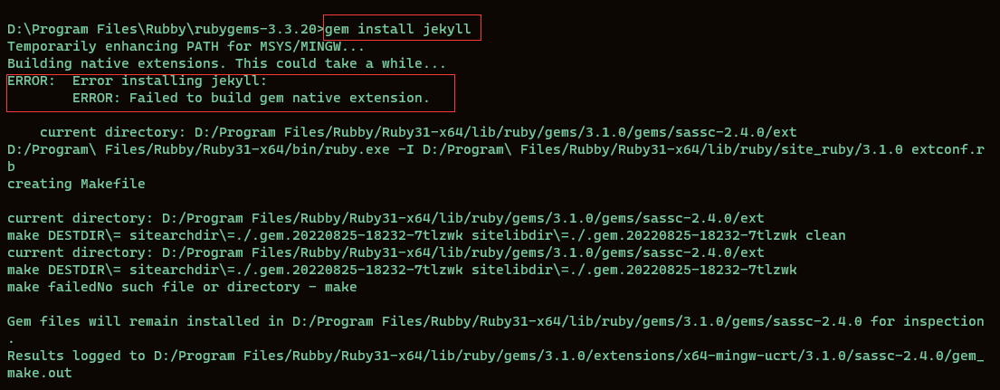

# 网站托管
在这里就不进行赘述
# 安装Jekyll
jekyll相当于一个编译工具，安装后可以通过jekyll创建一个网站模板，可以实时修改内容，并可以实时通过本地url预览修改
后的效果。然后推送到Github,访问自己的博客。
1. 安装[Ruby](https://rubyinstaller.org/)
2. 下载[RubyGems](https://rubygems.org/pages/download)下载完成后解压到你想安装的位置，然后打开命令行进入Ruby根目录，分为两步执行以下命令
``` bat
    ruby setup.rb

    gem install jekyll
```
如果出现以下错误则执行命令


``` bat
    输入ridk install，安装MSYS2 and MINGW development toolchain
```
3. 完成安装后，使用jekyll创建一个博客模板，打开命令行执行
   ``` bat
       jekyll new BlogTemplate
   
        cd BlogTemplate
   
        jekyll server
   ```
    如果出现以下错误则在模板中执行命令
    

    ``` bat
   
        bundle add webrick
   
    ```
    这是因为：从 Ruby 3.0 开始 webrick 已经不在绑定到 Ruby 中了,Ruby 3.0.0 Released 中的说明,webrick 需要手动进行添加。

4. 打开 http://127.0.0.1:4000/ 即可浏览刚刚创建的模板
