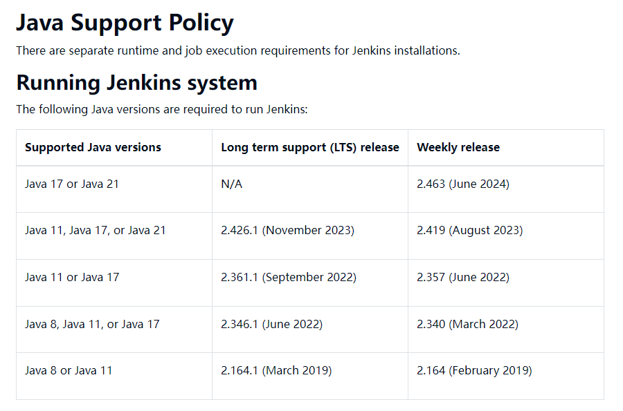

# jenkins的安装和删除

> Jenkins官网：https://www.jenkins.io/

## 1. 安装

### 1.1 前提条件

> Jenkins一个开源项目，是`基于Java`开发的一种持续集成工具,因此需要Java环境

Jenkins版本和Java版本对应关系如下图：https://www.jenkins.io/doc/book/platform-information/support-policy-java/



### 1.2 Jenkins yum安装

> 官网：https://www.jenkins.io/doc/book/installing/linux/

```sh
sudo wget -O /etc/yum.repos.d/jenkins.repo \
    https://pkg.jenkins.io/redhat-stable/jenkins.repo
    
sudo rpm --import https://pkg.jenkins.io/redhat-stable/jenkins.io-2023.key

sudo yum upgrade

# Add required dependencies for the jenkins package
sudo yum install fontconfig java-17-openjdk
sudo yum install jenkins
sudo systemctl daemon-reload

```


### 1.3 war包形式启动

> 支持以Java 的形式直接启动服务：阿里云下载地址：https://mirrors.aliyun.com/jenkins/war-stable/latest

```sh
java -jar jenkins.war --httpPort=9090


nohup java -jar  jenkins.war --httpPort=9090 > /dev/null 2>&1 &

```


## 2. 卸载

### 2.1 通过yum自动安装的卸载方式

```sh

sudo systemctl stop jenkins

sudo yum remove jenkins

-- 删除Jenkins相关的文件和目录（请注意，这将删除所有配置和数据，请确保你已经做了备份）
sudo rm -rf /var/cache/jenkins
sudo rm -rf /var/lib/jenkins
sudo rm -f /etc/sysconfig/jenkins
sudo rm -f /etc/systemd/system/jenkins.service

-- 删除Jenkins用户和组（这一步是可选的，只有在你确定不再需要这个用户的时候才执行）：
sudo userdel -r jenkins
sudo groupdel jenkins

-- 最后，重新加载systemd守护进程，以确保它没有再尝试运行Jenkins服务：
sudo systemctl daemon-reload

```

