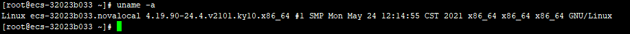
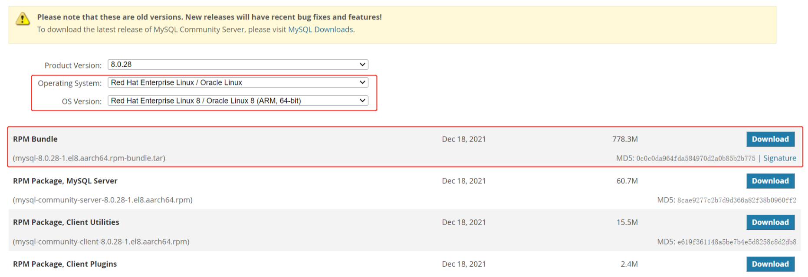
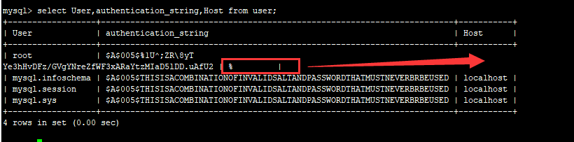

#### 查看麒麟操作系统版本

```sh
uname -a
```

如下图所示：



#### 下载对应架构的安装包!!!!!!***一定是对应架构***

下载地址：https://downloads.mysql.com/archives/community/



#### 检查是否自带Mysql   MariaDB

```SH
# 1. 查看是否自带mysql  mariaDb
rpm -qa | grep mysql
rpm -qa | grep mariadb

# 删除方式一（建议）将列出的mysql逐个删除
rpm -e --nodeps mysql-community-client-8.0.28-1.el8.aarch64
rpm -e --nodeps mysql-community-client-8.0.34-1.el8.aarch64
rpm -e --nodeps mysql-community-common-8.0.28-1.el8.aarch64
rpm -e --nodeps mysql-community-libs-8.0.28-1.el8.aarch64
rpm -e --nodeps mysql-community-icu-data-files-8.0.28-1.el8.aarch64
rpm -e --nodeps mysql-community-libs-8.0.34-1.el8.aarch64
rpm -e --nodeps mysql-community-server-8.0.34-1.el8.aarch64
rpm -e --nodeps mysql-community-client-plugins-8.0.28-1.el8.aarch64
rpm -e --nodeps mysql-community-server-8.0.28-1.el8.aarch64

# 如果存在则进行删除：删除方式二
yum -y remove mysql*
yum -y remove mariadb*

# 2. 再次检查
find / -name mysql
# 将列出的全部删除
rm -rf /usr/lib64/mysql
rm -rf /usr/share/selinux/targeted/default/active/modules/100/mysql
rm -rf /usr/share/selinux/ukmcs/default/active/modules/100/mysql
rm -rf /var/lib/selinux/targeted/active/modules/100/mysql
rm -rf /var/lib/selinux/ukmcs/active/modules/100/mysql
rm -rf /var/lib/selinux/ukmcs/tmp/modules/100/mysql
rm -rf /var/lib/mysql
rm -rf /var/lib/mysql/mysql

# 3. 如果之前安装过可以删除mysql log
/var/log/mysqld.log
```

#### 将下载好的安装包解压传至服务器，并依次执行如下命令

```sh
# 如果报错可以在后面加   --nodeps --force
rpm -ivh mysql-community-common-8.0.28-1.el8.aarch64.rpm
rpm -ivh mysql-community-client-plugins-8.0.28-1.el8.aarch64.rpm
rpm -ivh mysql-community-libs-8.0.28-1.el8.aarch64.rpm
rpm -ivh mysql-community-client-8.0.28-1.el8.aarch64.rpm
rpm -ivh mysql-community-icu-data-files-8.0.28-1.el8.aarch64.rpm
rpm -ivh mysql-community-server-8.0.28-1.el8.aarch64.rpm
```

#### 修改配置文件

```sh
vim /etc/my.cnf

# 在末尾补一行：1：数据库大小写不敏感， 0：数据库大小写敏感
lower_case_table_names=1

```

#### 初始化数据库

```sh
mysqld --initialize --console
```

#### 目录授权

```sh
chown -R mysql:mysql /var/lib/mysql/
```

#### 启动MySQL服务

```sh
systemctl start mysqld
```

#### 查看临时密码

```sh
cat /var/log/mysqld.log
```

#### 使用临时密码登录

```sh
mysql -u root -p
```

#### 修改临时密码

```sh
alter USER 'root'@'localhost' IDENTIFIED BY '需要设置的密码';
```

#### 编辑环境变量

```sh
# 打开配置文件
vim  /etc/profile
# 增加配置
export PATH=$PATH:/usr/bin/mysq
```

#### 开启远程访问MySQL服务，登录MySQL设置远程连接

```sql
-- 这个暂时废弃，也可作为参考
mysql
mysql>use mysql;
mysql>use mysql;                #打开mysql数据库
mysql>update user set host='localhost' where user='root';   #将host设置为localhost表示只能本地连接mysql
mysql>flush privileges;        #刷新权限表，使配置生效
```

1. 方式一：改表法

    ```sql
    -- 顾名思义,该方法就是直接修改更改"mysql"数据库里的"user"表里的"host"项，从"localhost"改为"%"
    update user set host='%' where user='root';
    ```

2. 方式二：授权法

    ```sql
    -- 通过GRANT命令可以赋予主机远程访问权限
    
    -- 赋予任何主机访问权限
    GRANT ALL PRIVILEGES ON *.* TO 'root'@'%' IDENTIFIED BY 'password' WITH GRANT OPTION;
    -- 允许指定主机（IP地址）访问权限
    RANT ALL PRIVILEGES ON *.* TO 'myuser'@'192.168.1.3' IDENTIFIED BY 'root' WITH GRANT OPTION;
    ```

刷新权限表

```sql
-- 通过GRANT命令赋权后,需要通过FLUSH PRIVILEGES刷新权限表使修改生效
flush privileges;
```

查看MySql远程访问权限配置

```sql
select User,authentication_string,Host from user;
```

效果如下图所示




#### 新建用户并赋予权限

```sql
-- 创建用户
create user '用户名'@'%' identified by '密码';
-- 赋予权限
GRANT ALL PRIVILEGES ON *.* TO '用户名'@'%'  WITH GRANT OPTION;
-- 刷新权限表
flush privileges
```


