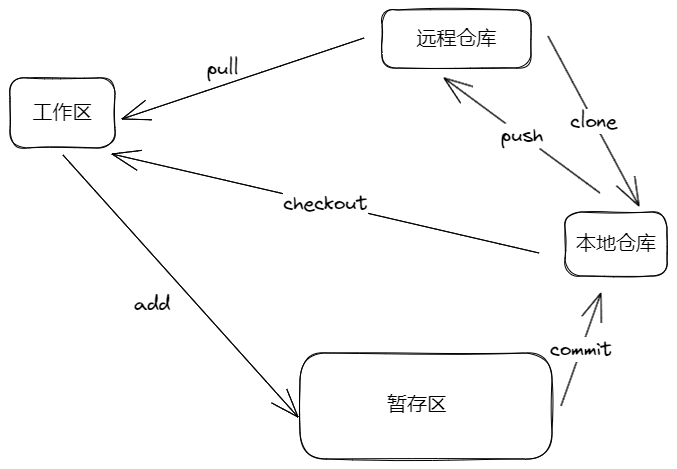

#### Git工作流程



1. 从远程仓库中克隆Git资源作为本地仓库。
2. 从本地仓库中checkout代码然后进行代码修改。
3. 在提交前先将代码提交到暂存区。
4. 提交修改。提交到本地仓库。本地仓库中保存修改的各个历史版本。
5. 在修改完成后，需要和团队成员共享代码，可以将代码push到远程仓库

#### 操作命令

1. 查看分支

   ```sh
   git branch
   ```

2. 增加分支

   ```sh
   git branch branch_新建分支名
   ```

3. 切换分支

   ```ssh
   git checkout branch_分支名
   ```

4. 合并分支（合并前要切换当前分支至master）

   ```sh
   git merge branch_1_将要融合分支
   ```

5. 删除分支

   ```sh
   git branch -d branch_1_将要删除的分支
   ```

6. 查看当前仓库管理的远程仓库信息

   ```sh
   git remote
   ```

7. 查看指定的远程仓库的详细信息

   ```sh
   git remote show origin
   ```

8. 第一次将本地分支推到远程仓库

   ```sh
   git push --set-upstream origin branch_1
   ```

9. 将本地分支推到远程分支

   ```sh
   git push <远程主机名> <本地分支名>:<远程分支名>
   ```

10. 将远程分支拉到本地分支

    ```sh
    git pull <远程主机名> <远程分支>:<本地分支>
    ```

11. 删除本地合并后的分支

    ```sh
    git branch -d branch_0
    ```

12. 删除本地未合并分支

    ```sh
    git branch -D branch_0
    ```

13. 删除远程分支

    ```sh
    git push origin  --delete branch_0
    ```

14. 进行清除工作区的改变

    ```sh
    git restore [filename]
    ```

15. 查看标签

    ```sh
    git tag
    ```

16. 打开标签

    ```sh
    git tag v1.0.0 打开标签
    ```

17. 将tag同步到远程服务器

    ```sh
    git push origin v1.0.0
    ```

    

