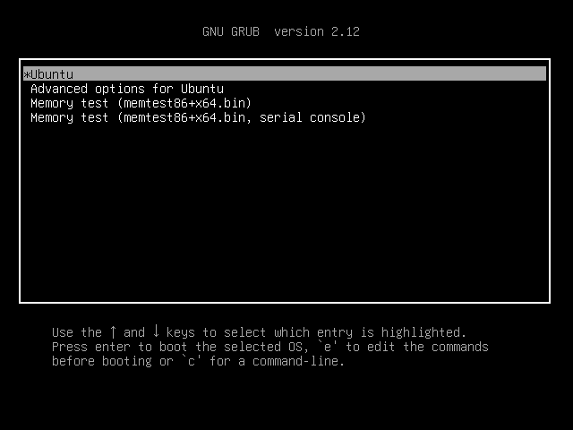
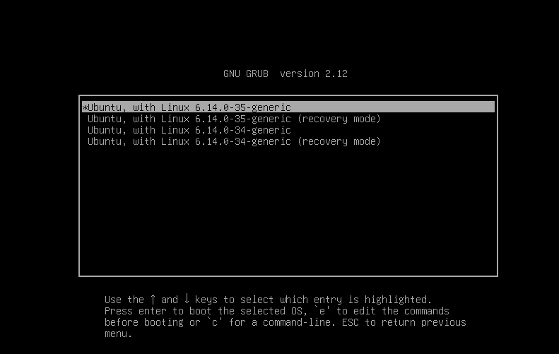
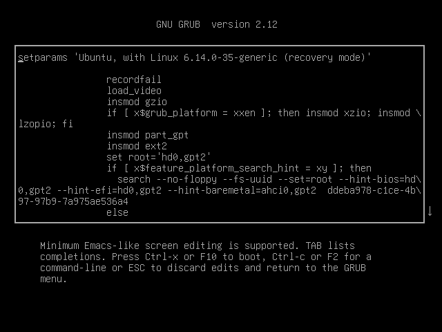
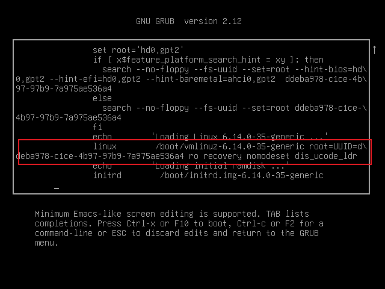
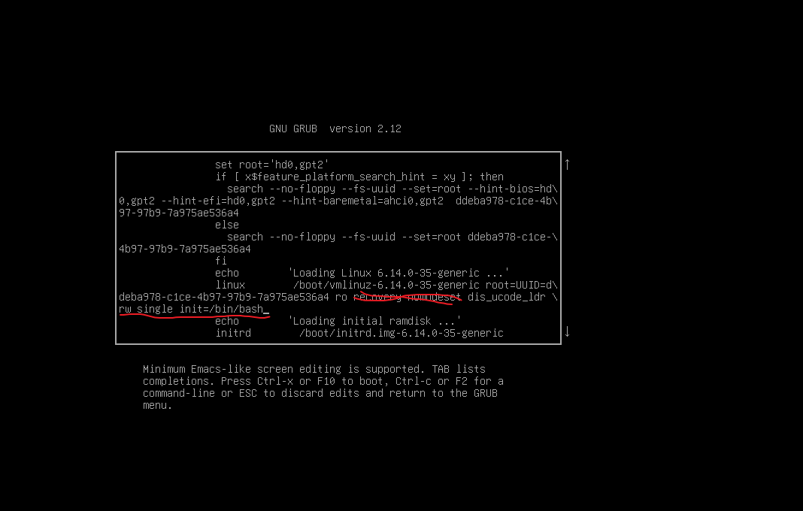

### 1. 重启系统，重启过程中长按`Shift`按键，出现如下界面

### 2 .选择 ``Advanced........`，`然后`Enter`

### 3. 选择内核版本高的 `recovery mode`模式的，然后按下`E` 按键

### 4. 找到 linux  /boot/vm.....开头的行

### 3. 修改命令参数

+ 删除recovery nomodeset
+ 在本行的最后面添加 rw single init=/bin/bash

### 4. 修改完之后按下ctrl+x重启就进入命令行界面了

例如修改密码    passwd root

然后输入密码就行了
